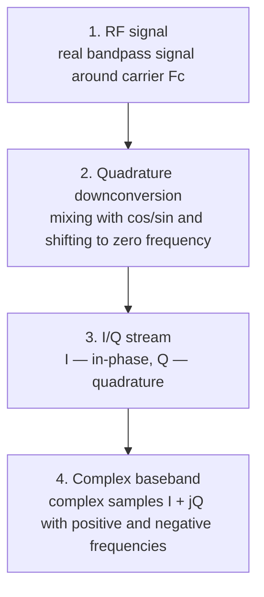

# 04. Real signal, complex baseband, and I/Q

## Purpose

In SDR it is almost always more convenient to work with the complex baseband
representation rather than with the real bandpass RF signal directly.

## Real vs complex

| Representation | What it stores | Key property |
|---|---|---|
| Real signal | real samples only | spectrum is conjugate-symmetric |
| Complex IQ | I and Q components | positive and negative frequencies are distinguishable |

## Why this matters

An SDR file contains no magic — just a sequence of I/Q samples. If the I and Q
channels are swapped, or if the sign of Q is inverted, the spectrum will appear
mirrored in frequency.

## Common mistakes

| Mistake | Symptom |
|---|---|
| I/Q swapped | spectrum mirrored |
| Q sign inverted | frequencies flip sign |
| Missing metadata | cannot determine the actual RF frequency |
| Real-only interpretation | sign of frequency is lost |

## Mini exercise

1. Generate a complex tone `exp(j·2π·f·t)`.
2. Plot its spectrum (should show a single peak at `+f`).
3. Invert the sign of Q.
4. Verify that the peak moves to `−f`.
