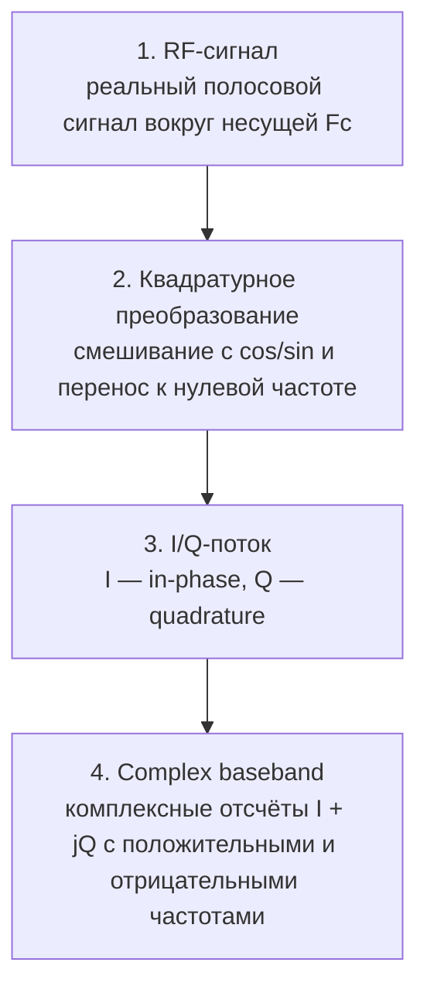

# 04. Real signal, complex baseband и I/Q

## Назначение

В SDR почти всегда удобно работать не с реальным полосовым RF-сигналом напрямую, а с комплексным baseband-представлением.

## Real vs complex

| Представление | Что хранит | Особенность |
|---|---|---|
| Real signal | только вещественные отсчёты | спектр симметричен |
| Complex IQ | I и Q компоненты | можно различать положительные и отрицательные частоты |

## Почему это важно

В SDR-файле обычно нет “магии”: это просто последовательность отсчётов I/Q. Если перепутать порядок I/Q или знак Q, спектр может стать зеркальным.

## Типовые ошибки

| Ошибка | Симптом |
|---|---|
| I/Q swapped | спектр зеркалится |
| Q sign inverted | частоты меняют знак |
| missing metadata | невозможно понять реальную RF-частоту |
| real-only interpretation | теряется знак частоты |

## Мини-задание

1. Сгенерировать комплексный тон `exp(j*2*pi*f*t)`.
2. Построить спектр.
3. Инвертировать знак Q.
4. Проверить, как изменилось положение пика.
