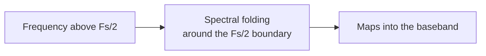

# 05. Aliasing and spectral images

## Idea

Aliasing is not simply an error — it is a predictable mapping of frequencies
from higher Nyquist zones into the baseband.



## Alias frequency formula

```text
f_alias = |f_signal − n × Fs|
```

where `n` is chosen so that `f_alias` falls in `[0, Fs/2)`.

## Spectral images

In a discrete-time system the spectrum repeats periodically with period `Fs`.
Any component at frequency `f` also appears at `f ± Fs`, `f ± 2Fs`, and so on.

## Practical significance

- a signal can look correct but appear at the wrong frequency;
- mirrored peaks may appear as spurious tones;
- interpretation without knowing `Fs` is impossible.

## Mini lab

1. Choose a sample rate `Fs`.
2. Generate a signal above `Fs/2`.
3. Calculate the predicted alias frequency.
4. Verify that the FFT peak matches the prediction.
