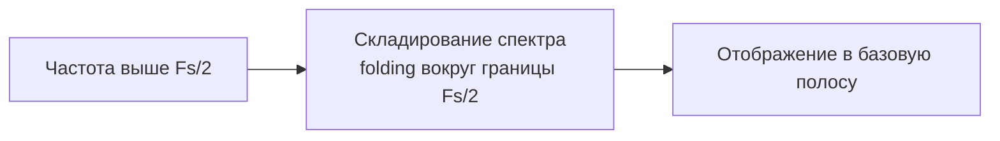

# 05. Aliasing и спектральные образы

## Идея

Aliasing — это не просто ошибка, а закономерное отображение частот из более высоких зон Найквиста в базовую.



## Формула alias-частоты

```text
f_alias = |f_signal - n * Fs|
```

## Спектральные образы

В дискретной системе спектр периодически повторяется с шагом Fs.

## Практическое значение

- сигнал может выглядеть “правильно”, но иметь неверную частоту;
- возможны зеркальные пики;
- интерпретация без знания Fs невозможна.

## Мини-лабораторная

1. Выбрать Fs.
2. Сгенерировать сигнал выше Fs/2.
3. Найти alias-частоту.
4. Проверить совпадение с FFT.
