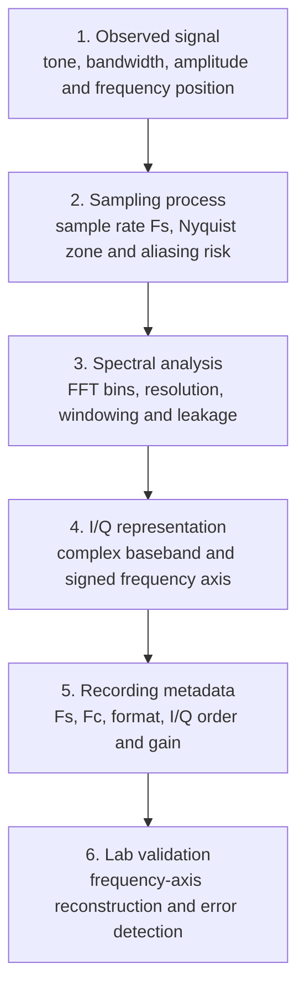

# Block 2. Signals, Spectrum, Sampling, and I/Q

## Purpose

Block 2 transforms the first received signal from Block 1 into engineering-grade data. The goal is to correctly interpret time-domain signals, spectra, frequency axes and IQ recordings.

## Why this block matters

If sampling rate, center frequency or IQ format are wrong, the spectrum may look correct visually but lead to incorrect engineering conclusions.

## Learning outcomes

After completing this block, the student can:

- distinguish RF frequency from baseband frequency;
- build a correct FFT frequency axis;
- relate sample rate, FFT size and resolution;
- explain aliasing and mirrored spectrum;
- detect DC offset and spectral leakage;
- document IQ recordings for reproducibility.

## Topics

1. Signal in time and frequency domain
2. Sampling and Nyquist
3. FFT and frequency axis
4. I/Q representation and complex baseband
5. Aliasing and spectral images
6. IQ metadata discipline
7. Lab 2.1 — frequency axis reconstruction

## Practical work

The student takes a known tone, builds time and frequency plots, and then intentionally changes Fs/Fc or metadata to observe incorrect interpretations.

## Engineering result

Outputs of the block:

- time-domain waveform;
- FFT with correct frequency axis;
- parameter table;
- short report describing interpretation errors.
