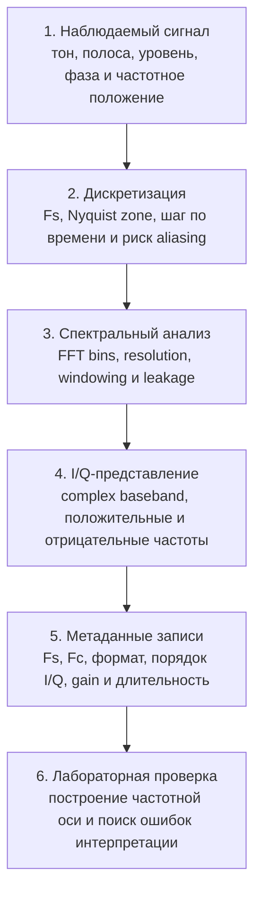

# Блок 2. Сигналы, спектр, дискретизация и I/Q

## Назначение

Блок 2 превращает первый принятый сигнал из Block 1 в инженерно понятные данные. Главная задача — научиться правильно читать временную форму, спектр, частотную ось и I/Q-запись.

## Почему блок важен

Если неправильно заданы `Fs`, `Fc`, формат файла или порядок I/Q, то спектр может выглядеть красиво, но инженерный вывод будет неверным. Этот блок вводит дисциплину интерпретации SDR-данных.

## Что должен уметь студент после блока

- отличать физическую RF-частоту от baseband-частоты;
- строить корректную частотную ось FFT;
- понимать связь `Fs`, числа точек FFT и разрешения по частоте;
- объяснять aliasing и mirrored spectrum;
- распознавать DC offset, leakage и ошибки окна;
- документировать IQ-запись так, чтобы её можно было воспроизвести.

## Темы блока

1. Сигнал во времени и частоте.
2. Дискретизация и Nyquist.
3. FFT и частотная ось.
4. I/Q-представление и complex baseband.
5. Aliasing, images и mirrored spectrum.
6. Метаданные IQ-записей.
7. Lab 2.1 — восстановление частотной оси.

!!! note "MkDocs include note"
    Подробные файлы тем лежат в `blocks/block_02_signals_and_sampling/`. На странице сайта они включаются как единый блок, поэтому внутренние ссылки на исходные файлы намеренно не используются.

## Практическая часть

В лабораторной части студент берёт известный тестовый сигнал, строит временную форму и FFT, затем проверяет, как меняется интерпретация при неверных `Fs`, `Fc` или I/Q metadata.

## Инженерный результат

На выходе блока должны появиться:

- график временной формы;
- FFT со строго подписанной частотной осью;
- таблица параметров записи;
- короткий отчёт о том, какие ошибки интерпретации были найдены.
