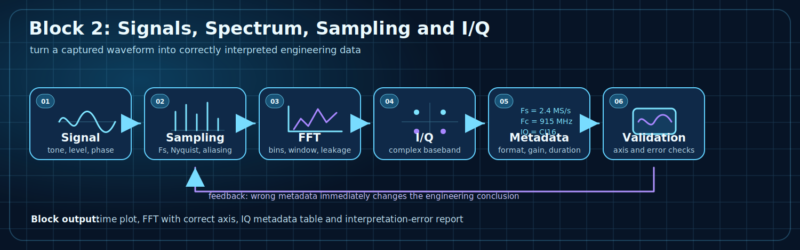

# Блок 2. Сигналы, спектр, дискретизация и I/Q

## Назначение

Блок 2 превращает первый принятый сигнал из Block 1 в инженерно понятные данные. Главная задача — научиться правильно читать временную форму, спектр, частотную ось и I/Q-запись.



## Почему блок важен

Если неправильно заданы `Fs`, `Fc`, формат файла или порядок I/Q, то спектр может выглядеть красиво, но инженерный вывод будет неверным. Этот блок вводит дисциплину интерпретации SDR-данных.

Главная идея блока:

```text
сигнал -> дискретизация -> FFT -> I/Q -> metadata -> проверка интерпретации
```

## Что должен уметь студент после блока

- отличать физическую RF-частоту от baseband-частоты;
- строить корректную частотную ось FFT;
- понимать связь `Fs`, числа точек FFT и разрешения по частоте;
- объяснять aliasing и mirrored spectrum;
- распознавать DC offset, leakage и ошибки окна;
- документировать IQ-запись так, чтобы её можно было воспроизвести.

## Темы блока

| Тема | Инженерный смысл |
|---|---|
| Сигнал во времени | уровень, форма, выбросы, клиппинг, DC offset |
| Дискретизация | `Fs`, Nyquist, aliasing, шаг по времени |
| FFT | bins, resolution bandwidth, windowing, leakage |
| I/Q | complex baseband, положительные и отрицательные частоты |
| Metadata | `Fs`, `Fc`, gain, формат, порядок I/Q, длительность |
| Проверка | намеренные ошибки интерпретации и их диагностика |

## Лабораторный маршрут

| Шаг | Что сделать | Что проверить |
|---:|---|---|
| 1 | построить временную форму | амплитуда, DC, клиппинг |
| 2 | построить FFT | правильность оси частот |
| 3 | изменить `Fs` | как меняется частотная интерпретация |
| 4 | изменить `Fc` | как baseband связывается с RF |
| 5 | поменять знак/порядок I/Q | mirrored spectrum |
| 6 | оформить metadata | воспроизводимость анализа |

## Практическая часть

В лабораторной части студент берёт известный тестовый сигнал, строит временную форму и FFT, затем проверяет, как меняется интерпретация при неверных `Fs`, `Fc` или I/Q metadata.

## Инженерный результат

На выходе блока должны появиться:

- график временной формы;
- FFT со строго подписанной частотной осью;
- таблица параметров записи;
- короткий отчёт о том, какие ошибки интерпретации были найдены.

## Связь с Block 3

Block 2 отвечает на вопрос: **что именно мы видим в сигнале?**

Block 3 отвечает на следующий вопрос: **как этот сигнал изменить, отфильтровать, перенести по частоте и подготовить к FPGA?**

!!! note "MkDocs include note"
    Подробные файлы тем лежат в `blocks/block_02_signals_and_sampling/`. На странице сайта они включаются как единый блок, поэтому внутренние ссылки на исходные файлы намеренно не используются.
