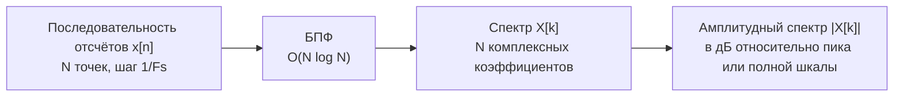

# 01. БПФ и интерпретация спектра

## Назначение

БПФ (быстрое преобразование Фурье) — главный инструмент анализа сигналов
в SDR. Понять спектр значит уметь читать результат БПФ как инженерный
документ: видеть где тон, где шум, где паразитная составляющая.



## Частотная ось

Для вещественного или комплексного входа с частотой дискретизации `Fs` и
`N` точками:

```text
f[k] = (k − N/2) × Fs / N     (после fftshift)
```

Разрешение по частоте: `Δf = Fs / N`.

## Связь с SDR

```text
f_абсолютная = Fc + f_baseband
```

Не зная `Fs` и `Fc`, невозможно сопоставить пик БПФ с реальной RF-частотой.

## Что показывает спектр

| Что видим | Что это значит |
|---|---|
| Один острый пик | тон с известной частотой |
| Несколько пиков | несколько тонов или гармоники |
| Широкий пьедестал | шумовой пол или широкополосный сигнал |
| DC-пик | постоянная составляющая или IQ-несбалансированность |
| Зеркальный пик | перепутаны I и Q или sign(Q) инвертирован |

## Единицы измерения

- **dBFS** — дБ относительно полной шкалы АЦП (0 dBFS = максимальный уровень);
- **dBc** — дБ относительно несущей (для оценки гармоник и паразитных составляющих).

## Мини-лабораторная

1. Сгенерировать тон с известной частотой `f0` при частоте дискретизации `Fs`.
2. Вычислить БПФ из `N` точек.
3. Построить спектр с правильной частотной осью.
4. Измерить:
   - положение пика (должно совпасть с `f0`);
   - уровень пика в дБFS;
   - уровень шумового пола.
5. Записать разрешение по частоте `Δf = Fs / N`.
