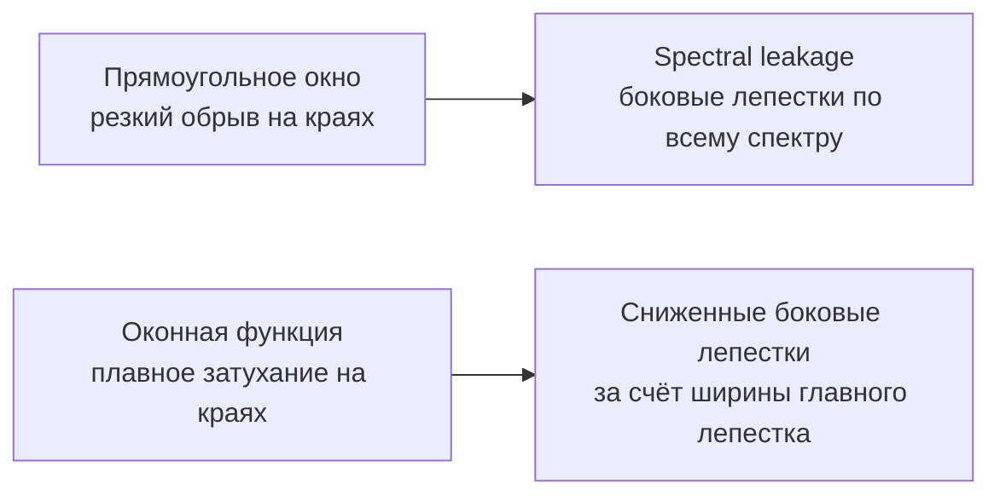

# 02. Оконные функции и спектральные утечки

## Проблема прямоугольного окна

БПФ предполагает периодичность сигнала. Если сигнал не кратен периоду
на выбранном окне наблюдения, на границах возникает разрыв — и энергия
"размазывается" по всему спектру. Это называется **spectral leakage**.



## Компромисс: разрешение vs. боковые лепестки

| Окно | Ширина главного лепестка | Уровень боковых лепестков | Применение |
|---|---|---|---|
| Прямоугольное | 1 бин (минимум) | -13 dB | одиночный тон без соседей |
| Ханна (Hann) | 1.5 бина | -31 dB | общего назначения |
| Хемминга (Hamming) | 1.5 бина | -41 dB | речь, широкополосный сигнал |
| Блэкмана (Blackman) | 2 бина | -58 dB | точное измерение уровня тона |
| Флэттоп (Flat-top) | 2.5 бина | -93 dB | точное измерение амплитуды |
| Кайзера (Kaiser, β=8) | 2 бина (регул.) | -80 dB | настраиваемый компромисс |

## Формула применения

```python
windowed = x * window(N)          # поэлементное умножение
X = np.fft.fftshift(np.fft.fft(windowed, N))
```

При оценке амплитуды нужно нормировать на когерентное усиление (coherent gain):

```text
amplitude_correction = N / sum(window)
```

## Инженерные правила

- **Точная частота тона** — Hann или Blackman.
- **Точная амплитуда тона** — Flat-top.
- **Максимальное разрешение по частоте** — прямоугольное окно (но с высоким
  уровнем боковых лепестков).
- **Широкополосный шум** — Hann или Hamming.

## Мини-лабораторная

1. Сгенерировать тон на нецелом числе периодов.
2. Вычислить БПФ с прямоугольным окном — зафиксировать картину утечки.
3. Повторить с окнами Ханна, Блэкмана и Флэттоп.
4. Сравнить:
   - ширину главного лепестка (в бинах);
   - уровень боковых лепестков (в дБ).
5. Выбрать окно для последующего анализа IQ-записи.
