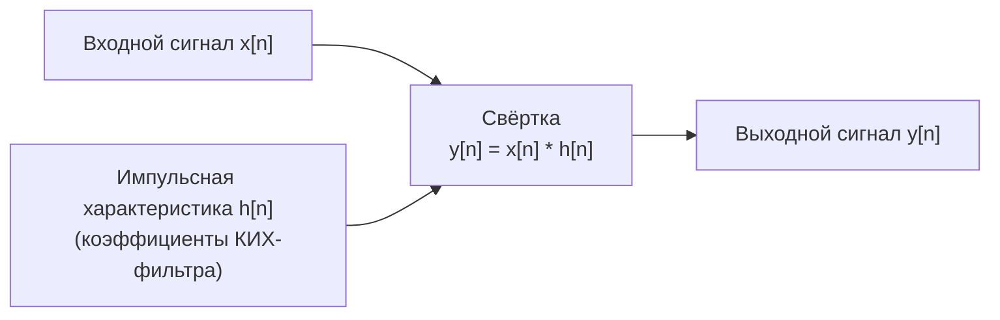

# 04. Свёртка и отклик системы

## Ключевая идея

Отклик линейной стационарной (ЛСС) системы на произвольный входной сигнал
полностью определяется её **импульсной характеристикой** `h[n]` через
операцию свёртки.

```text
y[n] = x[n] * h[n] = Σ x[k] · h[n-k]
```

В частотной области это умножение:

```text
Y(f) = X(f) · H(f)
```

## Свёртка как фильтрация



## Виды свёртки

| Тип | Граничные условия | Длина результата |
|---|---|---|
| Полная (`full`) | нулевые за пределами | `len(x) + len(h) − 1` |
| Та же длина (`same`) | усечение до `len(x)` | `len(x)` |
| Корректная (`valid`) | только перекрывающаяся часть | `len(x) − len(h) + 1` |

## Быстрая свёртка через БПФ

Для длинных сигналов прямая свёртка требует O(N·M) операций. Через БПФ:

```text
y = IFFT( FFT(x, Nfft) · FFT(h, Nfft) )
```

Сложность: O(N log N). Применяется в GNU Radio, MATLAB `fftfilt`, Python
`scipy.signal.fftconvolve`.

## Корреляция

Кросс-корреляция — это свёртка с инвертированным и комплексно-сопряжённым `h`:

```text
R_xh[n] = Σ x[k] · h*[k−n]
```

В SDR используется для:

- поиска преамбулы или маркера в потоке;
- оценки задержки между сигналами;
- синхронизации по известной опорной последовательности.

## Импульсная характеристика и передаточная функция

| Область | Обозначение | Связь |
|---|---|---|
| Время | `h[n]` | — |
| Частота | `H(f)` | `H = FFT(h)` |
| Z-преобразование | `H(z)` | полиномы числителя/знаменателя |

## Мини-лабораторная

1. Задать простую импульсную характеристику: усредняющий фильтр 5 отсчётов.
2. Применить прямую свёртку к тестовому сигналу.
3. Применить ту же свёртку через БПФ.
4. Сравнить результаты — убедиться в идентичности (с точностью до ошибок
   округления с плавающей точкой).
5. Построить амплитудную и фазовую характеристики `H(f)`.
