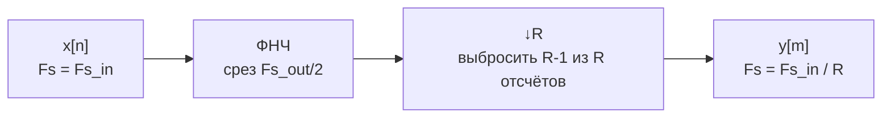
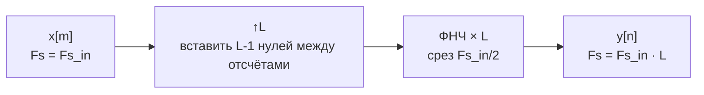

# 05. Децимация и интерполяция

## Зачем изменять частоту дискретизации

В SDR-цепочках приходится согласовывать несколько частот дискретизации:

- АЦП работает на высокой скорости (2.4–61.44 MS/s у AD9363);
- цифровая обработка узкополосного сигнала требует низкой скорости (сотни kHz);
- модем должен работать с целым числом отсчётов на символ.

Снижение частоты — **децимация**, повышение — **интерполяция**.

## Децимация



**Порядок важен**: фильтр перед децимацией, иначе alias'ы испортят сигнал.

### Формула alias при децимации

```text
f_alias = |f_signal − n · Fs_out|,   n = 0, ±1, ±2, …
```

## Интерполяция



**Усиление фильтра** должно быть `L` (компенсировать энергетические потери
от нулевых отсчётов).

## Многоступенчатые схемы

Большой коэффициент (например, 64×) выгодно разделить на этапы:

```text
64× = 8× (CIC) × 4× (CIC) × 2× (FIR)
```

Каждый этап оперирует на своей частоте дискретизации, снижая суммарную
вычислительную нагрузку.

## Сравнение реализаций

| Тип фильтра | Умножители | Применение |
|---|---|---|
| CIC | 0 | первая ступень (крупная децимация) |
| КИХ (полифазный) | M | точная фильтрация на любом этапе |
| БИХ | 2N | быстрая предфильтрация |

## Полифазная декомпозиция

КИХ-фильтр с `M` коэффициентами при децимации `R` можно разложить
на `R` полифазных ветвей, каждая длиной `M/R`. Вычислительная нагрузка
снижается в `R` раз.

## Мини-лабораторная

1. Сгенерировать тон 100 кГц при `Fs = 2.4 MHz`.
2. Применить ФНЧ (КИХ, 127 коэффициентов, срез 200 кГц).
3. Выполнить децимацию 8× → `Fs = 300 kHz`.
4. Построить спектр до и после.
5. Убедиться, что тон на 100 кГц сохранился, а alias'ы выше 150 кГц подавлены.
