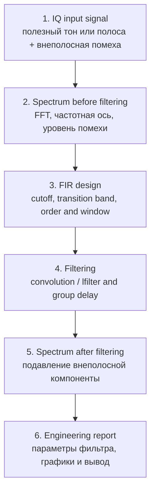

# 07. Lab 3.2 — FIR-фильтрация IQ-сигнала

## Цель

Научиться проектировать простой FIR low-pass filter, применять его к IQ-сигналу и оценивать результат в инженерном формате: спектр до/после, переходная полоса, подавление внеполосных компонент и задержка фильтра.

---

## Инженерный сценарий

---

## Теория в одном абзаце

FIR-фильтр вычисляет выходной отсчёт как взвешенную сумму текущего и прошлых входных отсчётов. Для low-pass фильтра коэффициенты обычно получают из идеального sinc-отклика, умноженного на окно. Чем выше порядок фильтра, тем уже переходная полоса и лучше подавление, но больше задержка и вычислительная стоимость.

---

## Параметры лабораторной

| Параметр | Пример | Смысл |
|---|---:|---|
| `Fs` | 1 MHz | частота дискретизации |
| полезный тон | 50 kHz | должен пройти через фильтр |
| помеха | 250 kHz | должна подавляться |
| cutoff | 100 kHz | граница low-pass фильтра |
| taps | 101 | порядок/длина FIR |

---

## Что нужно построить

1. Временную форму исходного IQ-сигнала.
2. FFT до фильтрации.
3. Амплитудно-частотную характеристику FIR.
4. FFT после фильтрации.
5. Таблицу параметров фильтра.

---

## Контрольные вопросы

- Почему фильтр не может иметь бесконечно резкую границу?
- Как порядок FIR влияет на переходную полосу?
- Почему после фильтрации появляется групповая задержка?
- Что произойдёт, если cutoff выбрать слишком низким?
- Чем FIR удобен для FPGA-реализации?

---

## Ожидаемый вывод

FIR-фильтр должен сохранить полезную компоненту внутри полосы и подавить внеполосную компоненту. Результат считается корректным только если частотная ось, `Fs`, cutoff и параметры фильтра явно указаны в отчёте.
