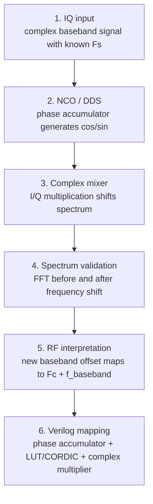

# 08. Lab 3.3 — Digital Mixing и перенос частоты

## Цель

Научиться переносить комплексный IQ-сигнал по частоте с помощью цифрового смесителя и связать эту операцию с RF-трактом и будущей Verilog/FPGA-реализацией.

---

## Инженерная идея

Digital mixing — базовая операция SDR. В complex baseband перенос частоты выполняется умножением сигнала на комплексную экспоненту:

```text
 y[n] = x[n] · exp(j · 2π · f_shift · n / Fs)
```

Если `f_shift > 0`, спектр сдвигается вверх по частоте. Если `f_shift < 0`, спектр сдвигается вниз.

---

## DSP → RF → Verilog pipeline



---

## Связь с RF

В SDR важно различать:

```text
f_absolute = Fc + f_baseband
```

Digital mixer меняет `f_baseband`, а не физический LO напрямую. Но после передачи через AD9363 итоговая RF-частота компоненты становится `Fc + f_baseband`.

---

## Verilog-архитектура

Минимальная FPGA-реализация digital mixer состоит из:

| Блок | Назначение |
|---|---|
| Phase accumulator | формирует фазу NCO |
| Phase increment word | задаёт частоту переноса |
| sin/cos LUT или CORDIC | формирует комплексную экспоненту |
| Complex multiplier | умножает IQ на NCO |
| Scaling/saturation | контролирует рост разрядности |

---

## Что построить

1. FFT исходного IQ-сигнала.
2. FFT после переноса частоты.
3. Таблицу `Fs`, `f_tone`, `f_shift`, ожидаемой и измеренной частоты.
4. Краткое описание, как операция переносится в Verilog.

---

## Контрольные вопросы

- Почему умножение на комплексную экспоненту сдвигает спектр?
- Чем complex mixer отличается от real mixer?
- Как `phase_increment` связан с `f_shift`?
- Почему в FPGA нужно учитывать рост разрядности?
- Что произойдёт при переполнении phase accumulator?

---

## Ожидаемый вывод

После digital mixing спектральный пик должен сместиться на `f_shift`. Если частотная ось построена правильно, измеренный сдвиг совпадает с заданным переносом.
