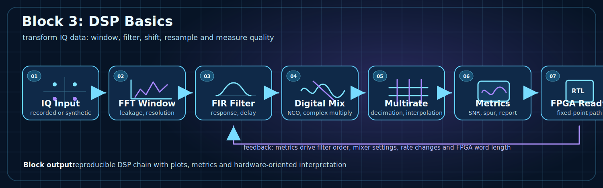

# Block 3. DSP Basics

## Purpose

Block 3 moves from signal interpretation to active IQ processing: FFT discipline, windowing, filtering, digital mixing, multirate processing and basic quality metrics.



## Why this block matters

Block 2 teaches how to read a signal. Block 3 teaches how to modify, clean, shift and prepare the signal for FPGA implementation.

Core idea:

```text
IQ input -> FFT window -> FIR filter -> digital mix -> multirate -> metrics -> FPGA-ready DSP
```

## Main topics

| Topic | Engineering meaning |
|---|---|
| FFT windows | leakage, resolution, measurement correctness |
| FIR/IIR filtering | frequency response, phase response, transition band, delay |
| Digital mixing | frequency shift through NCO/DDS and complex multiplication |
| Multirate DSP | decimation, interpolation, anti-aliasing, anti-imaging |
| Metrics | SNR, noise floor, spur level, engineering conclusion |
| FPGA preparation | fixed-point, latency, streaming interface, resource thinking |

## Labs

| Lab | Topic | Main artifact | FPGA/RF connection |
|---|---|---|---|
| Lab 3.1 | FFT windows and leakage | spectrum comparison | measurement discipline |
| Lab 3.2 | FIR low-pass filtering of IQ data | response + filtered IQ | future FIR RTL block |
| Lab 3.3 | Digital mixing and frequency shift | spectrum before/after shift | NCO + complex multiplier |
| Lab 3.4 | Decimation with anti-aliasing filter | anti-aliasing validation | rate-change block for FPGA |

## Minimum lab report

Each lab should produce not just a plot, but an engineering conclusion:

1. processing goal;
2. signal parameters and `Fs`;
3. plot before processing;
4. plot after processing;
5. numerical metric or observation;
6. implication for FPGA/RF implementation.

## Engineering result

After the block, the student can:

- select FFT windows for measurement tasks;
- design a simple FIR filter;
- explain delay and transition bandwidth;
- shift a signal in complex baseband;
- perform decimation/interpolation without destroying the spectrum;
- connect a DSP block to future fixed-point/HDL implementation;
- report DSP results reproducibly.

## Connection to later blocks

Block 3 prepares DSP primitives that later become fixed-point and HDL blocks:

- FIR -> streaming FIR RTL;
- digital mixer -> NCO + complex multiplier;
- decimation -> anti-aliasing + rate-change path;
- metrics -> automated validation and reports.
