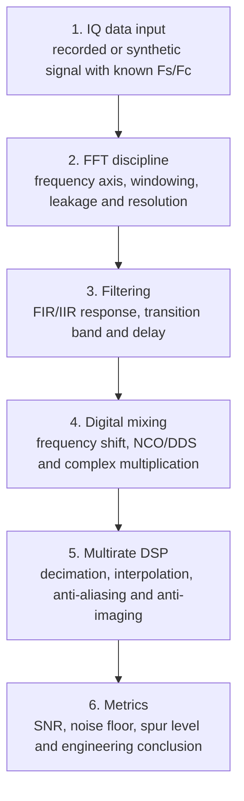

# Block 3. DSP Basics

## Purpose

Block 3 moves from signal interpretation to active IQ processing: FFT discipline, windowing, filtering, digital mixing, multirate processing and basic quality metrics.

## Why this block matters

Block 2 teaches how to read a signal. Block 3 teaches how to modify, clean, shift and prepare the signal for FPGA implementation.

## Main topics

1. FFT, windows and spectral leakage.
2. FIR/IIR filtering and frequency response.
3. Digital frequency shift: mixer, NCO, complex multiplication.
4. Decimation/interpolation and protection against aliasing/images.
5. SNR, noise floor, spur level and basic quality metrics.
6. Preparing DSP chains for fixed-point and HDL implementation.

## Labs

- Lab 3.1 — FFT windows and leakage.
- Lab 3.2 — FIR low-pass filtering of IQ data.
- Lab 3.3 — Digital mixing and frequency shift.
- Lab 3.4 — Decimation with anti-aliasing filter.

## Engineering result

After the block, the student can select FFT windows, design simple FIR filters, explain delay and transition bandwidth, shift a signal in complex baseband, perform decimation/interpolation correctly and report DSP results reproducibly.
