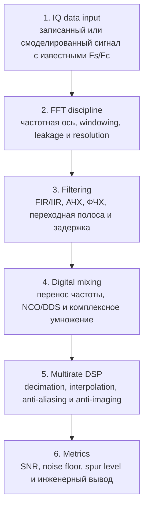

# Блок 3. Базовые DSP-операции

## Назначение

Блок 3 переводит студента от правильной интерпретации спектра к активной обработке IQ-данных: окна, FFT, фильтрация, цифровой перенос частоты, multirate-операции и базовые метрики.

## Почему блок важен

Block 2 учит правильно читать сигнал. Block 3 учит сигнал изменять, очищать, переносить по частоте и подготавливать к FPGA-реализации.

## Основные темы

1. FFT, оконные функции и spectral leakage.
2. FIR/IIR фильтрация и частотная характеристика.
3. Цифровой перенос частоты: mixer, NCO, complex multiplication.
4. Decimation/interpolation и защита от aliasing/images.
5. SNR, noise floor, spur level и базовые метрики качества.
6. Подготовка DSP-цепочки к fixed-point и HDL.

## Практические лабораторные

- Lab 3.1 — FFT windows and leakage.
- Lab 3.2 — FIR low-pass filtering of IQ data.
- Lab 3.3 — Digital mixing and frequency shift.
- Lab 3.4 — Decimation with anti-aliasing filter.

## Инженерный результат

После блока студент должен уметь:

- выбирать окно FFT под задачу измерения;
- проектировать простой FIR-фильтр;
- объяснять задержку и переходную полосу;
- переносить сигнал по частоте в complex baseband;
- выполнять decimation/interpolation без разрушения спектра;
- оформлять результаты в виде воспроизводимого отчёта.
