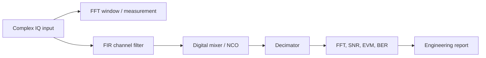

# Block 3 — DSP engineering notes

This page complements the Block 3 labs and connects basic DSP operations to a real SDR architecture: IQ streaming, FPGA implementation, RF chain and measurements.

## General DSP chain model



Main idea: in SDR, DSP blocks cannot be evaluated in isolation. FIR filters, digital mixers and decimators always affect the frequency plan, latency, dynamic range and future hardware implementation.

## What the student should understand

| Skill | Practical meaning |
|---|---|
| Read an FFT spectrum | distinguish useful signal, noise, leakage and spurs |
| Select an FFT window | trade frequency resolution against sidelobe suppression |
| Design an FIR filter | set passband, rejection and delay |
| Perform digital mixing | shift a channel to baseband or to an intermediate frequency |
| Perform decimation | reduce sample rate without aliasing |
| Compute metrics | prove quality with numbers, not only with plots |
| Think in fixed-point | anticipate overflow, scaling and hardware cost |

## Minimum formula set

### Complex tone

```text
x[n] = A * exp(j * 2*pi*f0*n/Fs)
```

### Digital frequency shift

```text
y[n] = x[n] * exp(j * 2*pi*fshift*n/Fs)
```

### FIR filter

```text
y[n] = sum_{k=0}^{M-1} h[k] * x[n-k]
```

### Decimation by M

```text
x_filtered[n] -> keep every M-th sample
```

An anti-aliasing filter is mandatory before decimation.

## Typical engineering mistakes

| Mistake | Consequence | How to check |
|---|---|---|
| No FFT window | leakage hides weak components | compare rectangular and Hann/Blackman |
| FIR is too short | poor out-of-band rejection | plot the filter response |
| Group delay is ignored | timing labels shift | account for `(Ntap-1)/2` samples |
| Wrong mixing sign | signal shifts in the wrong direction | plot spectrum before/after |
| Decimation without filtering | aliasing corrupts the spectrum | inspect the region above new Nyquist |
| FFT normalization is undefined | plots cannot be compared | fix the normalization method |
| Random noise seed is missing | figures change on every run | use a deterministic seed |

## FPGA connection

| DSP block | FPGA implementation | Main risk |
|---|---|---|
| FFT measurement | usually offline, sometimes debug core | memory cost and latency |
| FIR | multiply-accumulate pipeline | DSP slices and accumulator width |
| Digital mixer | NCO + complex multiplier | phase resolution and spurs |
| Decimator | FIR + downsampler | aliasing and valid/ready timing |
| Metrics | offline or embedded counters | frame synchronization |

## Recommended Block 3 report

At the end of the block, the student should assemble a mini-report:

1. One synthetic IQ signal with two tones and noise.
2. FFT before processing.
3. FIR low-pass filtering.
4. Digital mixing for frequency shift.
5. Decimation with anti-aliasing.
6. Metrics table: peak frequency, noise floor, interferer suppression, implementation notes.
7. Short conclusion: what will be difficult to map to FPGA.

## Block 3 completion criterion

Block 3 is complete when every lab has:

- clear engineering goal;
- Python reference;
- MATLAB reference;
- at least one plot;
- fixed-point connection;
- Verilog/FPGA connection;
- report checklist.
