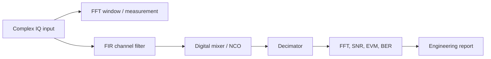

# Блок 3 — инженерные заметки по DSP

Эта страница дополняет лаборатории блока 3 и связывает базовые DSP-операции с реальной SDR-архитектурой: IQ-потоком, FPGA, RF-трактом и измерениями.

## Общая модель DSP-тракта



Главная мысль: в SDR нельзя рассматривать DSP-блоки отдельно. FIR, цифровой смеситель и decimator всегда влияют на частотный план, задержку, динамический диапазон и дальнейшую аппаратную реализацию.

## Что студент должен понимать после блока

| Навык | Практический смысл |
|---|---|
| Читать спектр после FFT | отличать полезный сигнал, шум, leakage и spur |
| Выбирать окно | управлять компромиссом между разрешением и подавлением боковых лепестков |
| Проектировать FIR | задавать полосу пропускания, подавление и задержку |
| Выполнять digital mixing | переносить канал в baseband или нужную ПЧ |
| Делать decimation | снижать sample rate без aliasing |
| Считать метрики | подтверждать качество не словами, а числами |
| Думать о fixed-point | заранее видеть переполнение, масштабирование и ресурсную цену |

## Минимальный набор формул

### Комплексный тон

```text
x[n] = A * exp(j * 2*pi*f0*n/Fs)
```

### Цифровой перенос частоты

```text
y[n] = x[n] * exp(j * 2*pi*fshift*n/Fs)
```

### FIR-фильтр

```text
y[n] = sum_{k=0}^{M-1} h[k] * x[n-k]
```

### Decimation by M

```text
x_filtered[n] -> keep every M-th sample
```

Перед decimation обязательно нужен anti-aliasing filter.

## Типовые инженерные ошибки

| Ошибка | Последствие | Как проверить |
|---|---|---|
| Нет окна FFT | leakage маскирует слабые компоненты | сравнить rectangular и Hann/Blackman |
| Слишком короткий FIR | плохое подавление вне полосы | построить АЧХ фильтра |
| Нет компенсации group delay | смещение временных меток | учесть `(Ntap-1)/2` samples |
| Mixing с неправильным знаком | сигнал уходит не туда по частоте | построить spectrum before/after |
| Decimation без фильтра | aliasing портит спектр | проверить область выше нового Nyquist |
| Нет нормировки FFT | графики нельзя сравнивать | зафиксировать метод нормировки |
| Не задан seed шума | графики меняются при каждом запуске | использовать фиксированный random seed |

## Связь с FPGA

| DSP-блок | FPGA-реализация | Главный риск |
|---|---|---|
| FFT measurement | чаще offline, иногда debug core | стоимость памяти и latency |
| FIR | multiply-accumulate pipeline | число DSP slices и ширина аккумулятора |
| Digital mixer | NCO + complex multiplier | фазовая разрядность и spur |
| Decimator | FIR + downsampler | aliasing и valid/ready timing |
| Metrics | offline или embedded counters | синхронизация кадров |

## Рекомендуемый отчёт по блоку

В конце блока студент должен собрать мини-отчёт:

1. Один синтетический IQ-сигнал с двумя тонами и шумом.
2. FFT до обработки.
3. FIR low-pass filtering.
4. Digital mixing для переноса тона.
5. Decimation с anti-aliasing.
6. Таблица метрик: peak frequency, noise floor, interferer suppression, implementation notes.
7. Краткий вывод: что будет сложно перенести в FPGA.

## Критерий готовности блока 3

Блок 3 считается наполненным, когда для каждой лаборатории есть:

- понятная инженерная цель;
- Python reference;
- MATLAB reference;
- хотя бы один график;
- связь с fixed-point;
- связь с Verilog/FPGA;
- отчётный чек-лист.
