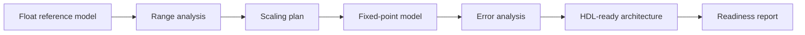

# Block 4 — float → fixed-point → HDL workflow

Block 4 teaches the student to stop treating a DSP algorithm as an infinitely precise mathematical formula and start seeing hardware constraints: word length, scaling, overflow, latency and implementation cost.

## Main engineering chain



## What to define before fixed-point conversion

Before converting a model to fixed-point, define:

| Parameter | Why it matters |
|---|---|
| Sample rate | defines frequency plan and latency in samples |
| Signal bandwidth | affects filters and allowed sample-rate reduction |
| Maximum amplitude | required for integer-bit selection |
| Crest factor / PAPR | important for modulated signals |
| Allowed error | drives fractional-bit selection |
| Required rejection | affects FIR coefficients |
| Streaming interface | valid/ready, frame boundaries and latency |

## Basic fixed-point format

Use this notation:

```text
Q<I>.<F>
```

where:

- `I` is the number of integer bits including the sign bit;
- `F` is the number of fractional bits;
- total word length is `W = I + F`.

Examples:

```text
Q1.15 -> signed 16-bit value, range approximately [-1, 1)
Q2.14 -> signed 16-bit value, range approximately [-2, 2)
Q4.20 -> signed 24-bit value, wider dynamic range and better precision
```

## Format selection table

| Node | Recommended initial format | Comment |
|---|---|---|
| Input IQ | Q1.15 or Q2.14 | depends on ADC/IQ-file normalization |
| NCO sin/cos | Q1.15 | usually sufficient for the first mixer |
| FIR coefficients | Q1.15 or Q1.17 | affects stopband attenuation |
| FIR accumulator | Q4.28 or wider | must tolerate the tap sum |
| Mixer product | Q2.30 before rounding | product of two Q1.15 values |
| Output stream | Q1.15 | after scaling/saturation |

## Word-length growth rules

### Addition

Adding two numbers of the same format usually needs one extra bit to protect against overflow.

```text
W_sum = W + 1
```

### Multiplication

For multiplication, widths add:

```text
W_product = W_a + W_b
F_product = F_a + F_b
```

### FIR accumulation

For an FIR with `N` taps, add guard bits:

```text
guard_bits = ceil(log2(N))
```

## Saturation vs wrap

| Mode | Behavior | Where it is acceptable |
|---|---|---|
| Wrap | modulo overflow | almost never in the final DSP chain |
| Saturation | clamp to min/max | preferred at block boundaries |
| Rounding | round when reducing word length | usually better than truncation |
| Truncation | discard LSBs | cheaper, but adds bias |

## Error analysis

For every fixed-point block, compare the result against the float reference:

```text
error[n] = y_float[n] - y_fixed[n]
```

Recommended metrics:

| Metric | Meaning |
|---|---|
| RMS error | average implementation error |
| Max abs error | worst-case excursion |
| SQNR | signal power to quantization/error power |
| EVM | useful for modulated IQ signals |
| Spur level | reveals NCO/mixer/quantization artifacts |

## Minimal Block 4 lab

1. Take the FIR or digital mixer from Block 3.
2. Build a float reference.
3. Select initial Q formats.
4. Implement a fixed-point model in MATLAB/Python.
5. Plot `float - fixed` error.
6. Compare float/fixed spectra.
7. Fill the format table.
8. Conclude whether the block is ready for HDL.

## HDL readiness checklist

- [ ] All input and output formats are defined.
- [ ] Coefficient formats are defined.
- [ ] Product widths are calculated.
- [ ] Accumulator widths are calculated.
- [ ] Rounding/saturation strategy is selected.
- [ ] Latency is estimated.
- [ ] Streaming interface is specified.
- [ ] Float/fixed test vectors exist.
- [ ] Allowed error against the reference is defined.

## Engineering conclusion

A good fixed-point report should answer this question:

> What is the minimum word length that keeps the error acceptable while preserving an economical FPGA implementation?
