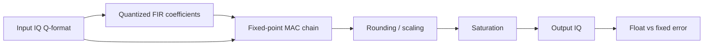

# Lab 4.1 — Fixed-Point FIR Filtering

## Goal

Convert the floating-point FIR filter from Block 3 into a fixed-point implementation and evaluate the implementation error before moving toward HDL.

The lab answers the practical question:

> What word lengths are sufficient for an FIR filter to keep useful signal quality while staying economical for FPGA implementation?

## Engineering context

A floating-point FIR is convenient for algorithm design, but FPGA implementation requires explicit decisions about:

- input IQ format;
- coefficient format;
- product width;
- accumulator width;
- rounding mode;
- saturation mode;
- output scaling;
- allowed error versus the reference model.

## Processing chain



## Recommended starting formats

| Signal | Start format | Notes |
|---|---|---|
| Input IQ | Q1.15 | normalized complex samples |
| FIR coefficients | Q1.15 | Blackman/windowed-sinc coefficients |
| Product | Q2.30 | multiplication of Q1.15 by Q1.15 |
| Accumulator | Q6.30 or wider | depends on number of taps |
| Output IQ | Q1.15 | after rounding and saturation |

For an FIR with `N` taps, use at least:

```text
guard_bits = ceil(log2(N))
```

extra accumulator bits.

## Python reference skeleton

```python
import numpy as np

rng = np.random.default_rng(7)
fs = 2.4e6
n = 32768
t = np.arange(n) / fs

x_float = (
    np.exp(1j * 2*np.pi*120e3*t)
    + 0.35*np.exp(1j * 2*np.pi*620e3*t)
    + 0.02*(rng.standard_normal(n) + 1j*rng.standard_normal(n))
)

num_taps = 129
cutoff = 250e3
m = np.arange(num_taps) - (num_taps - 1) / 2
h_float = 2 * cutoff / fs * np.sinc(2 * cutoff / fs * m)
h_float *= np.blackman(num_taps)
h_float /= np.sum(h_float)

y_float = np.convolve(x_float, h_float, mode="same")

scale = 2**15
x_q = np.clip(np.round(np.real(x_float) * scale), -32768, 32767).astype(np.int16) \
      + 1j*np.clip(np.round(np.imag(x_float) * scale), -32768, 32767).astype(np.int16)
h_q = np.clip(np.round(h_float * scale), -32768, 32767).astype(np.int16)

# Educational fixed-point model: use int64 accumulator, then scale back.
y_q = np.zeros(n, dtype=np.complex128)
for i in range(n):
    acc_i = 0
    acc_q = 0
    for k in range(num_taps):
        idx = i - k + num_taps // 2
        if 0 <= idx < n:
            acc_i += int(np.real(x_q[idx])) * int(h_q[k])
            acc_q += int(np.imag(x_q[idx])) * int(h_q[k])
    yi = np.clip(np.round(acc_i / scale), -32768, 32767)
    yq = np.clip(np.round(acc_q / scale), -32768, 32767)
    y_q[i] = (yi + 1j*yq) / scale

err = y_float - y_q
rms_error = np.sqrt(np.mean(np.abs(err)**2))
signal_rms = np.sqrt(np.mean(np.abs(y_float)**2))
sqnr_db = 20*np.log10(signal_rms / max(rms_error, 1e-15))

print(f"RMS error: {rms_error:.3e}")
print(f"SQNR: {sqnr_db:.2f} dB")
```

## MATLAB reference skeleton

```matlab
rng(7);
fs = 2.4e6;
N = 32768;
t = (0:N-1).' / fs;

xFloat = exp(1j*2*pi*120e3*t) + ...
         0.35*exp(1j*2*pi*620e3*t) + ...
         0.02*(randn(N,1) + 1j*randn(N,1));

numTaps = 129;
cutoff = 250e3;
m = (0:numTaps-1).' - (numTaps-1)/2;
hFloat = 2*cutoff/fs * sinc(2*cutoff/fs * m);
hFloat = hFloat .* blackman(numTaps);
hFloat = hFloat ./ sum(hFloat);

yFloat = conv(xFloat, hFloat, 'same');

% Fixed-Point Designer route
xFix = fi(xFloat, 1, 16, 15);
hFix = fi(hFloat, 1, 16, 15);
yFix = conv(xFix, hFix, 'same');

err = yFloat - double(yFix);
rmsError = rms(abs(err));
signalRms = rms(abs(yFloat));
sqnrDb = 20*log10(signalRms / max(rmsError, eps));

fprintf('RMS error: %.3e\n', rmsError);
fprintf('SQNR: %.2f dB\n', sqnrDb);
```

## Required plots

Produce at least:

1. floating-point FIR magnitude response;
2. quantized-coefficient FIR magnitude response;
3. spectrum before filtering;
4. spectrum after float FIR;
5. spectrum after fixed FIR;
6. error spectrum or time-domain error.

## Metrics

| Metric | How to compute | Engineering meaning |
|---|---|---|
| RMS error | `rms(y_float - y_fixed)` | average implementation error |
| SQNR | signal RMS / error RMS | quantization quality |
| Max abs error | `max(abs(error))` | worst-case excursion |
| Stopband delta | float stopband vs quantized stopband | coefficient quantization impact |
| Saturation count | number of clipped output samples | scaling quality |

## HDL mapping

The fixed-point FIR maps to a streaming block:

```text
input  wire              clk
input  wire              rst
input  wire              in_valid
input  wire signed [15:0] in_i
input  wire signed [15:0] in_q
output wire              out_valid
output wire signed [15:0] out_i
output wire signed [15:0] out_q
```

Implementation options:

| Architecture | Pros | Cons |
|---|---|---|
| Fully parallel FIR | maximum throughput | many multipliers |
| Time-multiplexed MAC | fewer resources | lower throughput / more control logic |
| Symmetric FIR | fewer multipliers | only for symmetric coefficients |

## Report checklist

- [ ] State input, coefficient, product, accumulator and output formats.
- [ ] Explain coefficient quantization.
- [ ] Plot float and quantized FIR responses.
- [ ] Compare output spectra.
- [ ] Compute RMS error and SQNR.
- [ ] Count saturation events.
- [ ] Estimate accumulator guard bits.
- [ ] State whether the FIR is ready for HDL.

## Engineering conclusion template

```text
The selected FIR format ______ provides SQNR = ____ dB and saturation count = ____.
The coefficient quantization changes stopband rejection by approximately ____ dB.
The accumulator requires at least ____ guard bits for ____ taps.
This configuration is / is not ready for an HDL implementation because ______.
```
