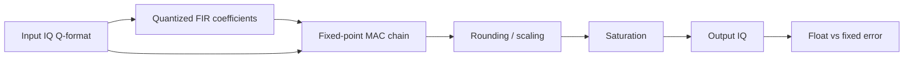

# Lab 4.1 — Fixed-Point FIR Filtering

## Goal

Convert the floating-point FIR filter from Block 3 into a fixed-point implementation and evaluate the implementation error before moving toward HDL.

The lab answers the practical question:

> What word lengths are sufficient for an FIR filter to keep useful signal quality while staying economical for FPGA implementation?

## Executable files

| Environment | File | Output |
|---|---|---|
| Python | `blocks/block_04_simulink_and_fixed_point/python/lab_4_1_fixed_point_fir.py` | metrics + PNG figures in `docs/assets` |
| MATLAB | `blocks/block_04_simulink_and_fixed_point/matlab/lab_4_1_fixed_point_fir.m` | metrics + PNG figures in `docs/assets` |

Run from the repository root:

```bash
python blocks/block_04_simulink_and_fixed_point/python/lab_4_1_fixed_point_fir.py
```

MATLAB:

```bash
matlab -batch "run('blocks/block_04_simulink_and_fixed_point/matlab/lab_4_1_fixed_point_fir.m')"
```

Generated Python figures:

```text
docs/assets/lab41_fixed_point_fir_response.png
docs/assets/lab41_fixed_point_fir_spectrum.png
docs/assets/lab41_fixed_point_fir_error.png
```

Generated MATLAB figures:

```text
docs/assets/lab41_fixed_point_fir_response_matlab.png
docs/assets/lab41_fixed_point_fir_spectrum_matlab.png
docs/assets/lab41_fixed_point_fir_error_matlab.png
```

## Engineering context

A floating-point FIR is convenient for algorithm design, but FPGA implementation requires explicit decisions about:

- input IQ format;
- coefficient format;
- product width;
- accumulator width;
- rounding mode;
- saturation mode;
- output scaling;
- allowed error versus the reference model.

## Processing chain



## Recommended starting formats

| Signal | Start format | Notes |
|---|---|---|
| Input IQ | Q1.15 | normalized complex samples |
| FIR coefficients | Q1.15 | Blackman/windowed-sinc coefficients |
| Product | Q2.30 | multiplication of Q1.15 by Q1.15 |
| Accumulator | Q6.30 or wider | depends on number of taps |
| Output IQ | Q1.15 | after rounding and saturation |

For an FIR with `N` taps, use at least:

```text
guard_bits = ceil(log2(N))
```

extra accumulator bits.

## Reference implementations

The executable Python and MATLAB scripts implement the same experiment:

1. generate a complex IQ signal with a wanted tone, interferer and noise;
2. design a Blackman-windowed low-pass FIR;
3. quantize input samples and coefficients to Q1.15;
4. run an educational integer fixed-point FIR model;
5. compare floating-point and fixed-point outputs;
6. compute RMS error, max error, SQNR, guard bits and saturation count;
7. save comparison figures.

## Required plots

Produce at least:

1. floating-point FIR magnitude response;
2. quantized-coefficient FIR magnitude response;
3. spectrum before filtering;
4. spectrum after float FIR;
5. spectrum after fixed FIR;
6. error spectrum or time-domain error.

## Metrics

| Metric | How to compute | Engineering meaning |
|---|---|---|
| RMS error | `rms(y_float - y_fixed)` | average implementation error |
| SQNR | signal RMS / error RMS | quantization quality |
| Max abs error | `max(abs(error))` | worst-case excursion |
| Stopband delta | float stopband vs quantized stopband | coefficient quantization impact |
| Saturation count | number of clipped output samples | scaling quality |

## HDL mapping

The fixed-point FIR maps to a streaming block:

```text
input  wire              clk
input  wire              rst
input  wire              in_valid
input  wire signed [15:0] in_i
input  wire signed [15:0] in_q
output wire              out_valid
output wire signed [15:0] out_i
output wire signed [15:0] out_q
```

Implementation options:

| Architecture | Pros | Cons |
|---|---|---|
| Fully parallel FIR | maximum throughput | many multipliers |
| Time-multiplexed MAC | fewer resources | lower throughput / more control logic |
| Symmetric FIR | fewer multipliers | only for symmetric coefficients |

## Report checklist

- [ ] State input, coefficient, product, accumulator and output formats.
- [ ] Explain coefficient quantization.
- [ ] Plot float and quantized FIR responses.
- [ ] Compare output spectra.
- [ ] Compute RMS error and SQNR.
- [ ] Count saturation events.
- [ ] Estimate accumulator guard bits.
- [ ] State whether the FIR is ready for HDL.

## Engineering conclusion template

```text
The selected FIR format ______ provides SQNR = ____ dB and saturation count = ____.
The coefficient quantization changes stopband rejection by approximately ____ dB.
The accumulator requires at least ____ guard bits for ____ taps.
This configuration is / is not ready for an HDL implementation because ______.
```
