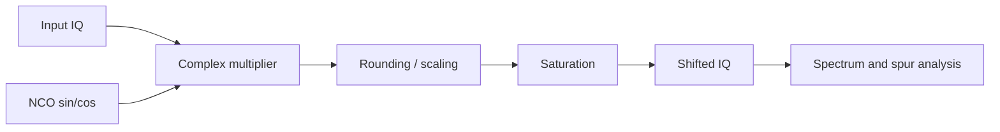
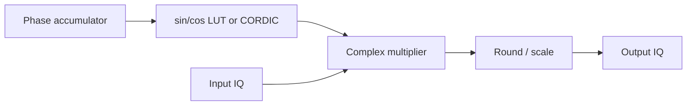

# Lab 4.2 — Fixed-Point Digital Mixer

## Goal

Convert the floating-point digital mixer from Block 3 into a fixed-point model and evaluate spectral artifacts, quantization error and HDL readiness.

The lab answers the practical question:

> How many bits are needed in the NCO and complex multiplier to shift an IQ signal without unacceptable spurs or EVM degradation?

## Executable files

| Environment | File | Output |
|---|---|---|
| Python | `blocks/block_04_simulink_and_fixed_point/python/lab_4_2_fixed_point_digital_mixer.py` | metrics + PNG figures in `docs/assets` |
| MATLAB | `blocks/block_04_simulink_and_fixed_point/matlab/lab_4_2_fixed_point_digital_mixer.m` | metrics + PNG figures in `docs/assets` |

Run from the repository root:

```bash
python blocks/block_04_simulink_and_fixed_point/python/lab_4_2_fixed_point_digital_mixer.py
```

MATLAB:

```bash
matlab -batch "run('blocks/block_04_simulink_and_fixed_point/matlab/lab_4_2_fixed_point_digital_mixer.m')"
```

Generated Python figures:

```text
docs/assets/lab42_fixed_point_mixer_spectrum.png
docs/assets/lab42_fixed_point_mixer_error.png
docs/assets/lab42_nco_frequency_resolution.png
```

Generated MATLAB figures:

```text
docs/assets/lab42_fixed_point_mixer_spectrum_matlab.png
docs/assets/lab42_fixed_point_mixer_error_matlab.png
docs/assets/lab42_nco_frequency_resolution_matlab.png
```

## Engineering context

A digital mixer shifts a complex baseband signal by multiplying it by a complex oscillator:

```text
y[n] = x[n] * exp(j * 2*pi*f_shift*n/Fs)
```

In hardware, this becomes:

```text
NCO / DDS -> sin/cos LUT or CORDIC -> complex multiplier -> rounding/saturation
```

## Processing chain



## Recommended starting formats

| Signal | Start format | Notes |
|---|---|---|
| Input IQ | Q1.15 | normalized complex input |
| NCO sin/cos | Q1.15 | simple LUT-compatible format |
| Product terms | Q2.30 | each real multiplication result |
| Sum/difference | Q3.30 | complex multiply accumulation |
| Output IQ | Q1.15 | after rounding and saturation |
| Phase accumulator | 24–32 bits | depends on frequency resolution and spur target |

## Complex multiplication

For:

```text
x = I + jQ
w = cos(phi) + j sin(phi)
```

The mixer output is:

```text
y_i = I*cos(phi) - Q*sin(phi)
y_q = I*sin(phi) + Q*cos(phi)
```

## Reference implementations

The executable Python and MATLAB scripts implement the same experiment:

1. generate a complex IQ tone with additive noise;
2. generate an NCO/DDS oscillator using a phase accumulator;
3. run a floating-point mixer;
4. run an educational Q1.15 fixed-point complex multiplier;
5. compare floating-point and fixed-point spectra;
6. compute frequency shift error, RMS error, EVM, spur estimate and saturation count;
7. save comparison figures.

## NCO / DDS discussion

For HDL, the oscillator is usually generated by an NCO:

```text
phase[n+1] = phase[n] + phase_increment
phase_increment = round(f_shift / Fs * 2^P)
```

where `P` is the phase accumulator width.

Frequency resolution:

```text
delta_f = Fs / 2^P
```

| Phase width | Frequency resolution at Fs = 2.4 MS/s | Practical note |
|---:|---:|---|
| 16 bits | 36.6 Hz | enough for simple demos |
| 24 bits | 0.143 Hz | good for most labs |
| 32 bits | 0.00056 Hz | common robust choice |

## Required plots

Produce at least:

1. input spectrum;
2. floating-point mixer output spectrum;
3. fixed-point mixer output spectrum;
4. float vs fixed error magnitude;
5. optional spur zoom near carrier;
6. optional constellation before/after for modulated signals.

## Metrics

| Metric | How to compute | Engineering meaning |
|---|---|---|
| Frequency shift error | measured peak minus expected peak | NCO phase increment accuracy |
| RMS error | `rms(y_float - y_fixed)` | average implementation error |
| EVM | RMS error normalized by signal RMS | modulation quality impact |
| Spur level | largest unwanted spectral component | NCO and quantization artifacts |
| Saturation count | clipped output samples | scaling quality |

## HDL mapping

Suggested streaming interface:

```text
input  wire              clk
input  wire              rst
input  wire              in_valid
input  wire signed [15:0] in_i
input  wire signed [15:0] in_q
output wire              out_valid
output wire signed [15:0] out_i
output wire signed [15:0] out_q
```

Internal blocks:



## Report checklist

- [ ] State sample rate, input tone frequency and shift frequency.
- [ ] State input, NCO, product and output formats.
- [ ] Compute phase increment and frequency resolution.
- [ ] Compare float and fixed spectra.
- [ ] Estimate frequency shift error.
- [ ] Compute RMS error and EVM.
- [ ] Estimate spur level.
- [ ] Count saturation events.
- [ ] Explain whether LUT, CORDIC or direct DDS is preferred.

## Engineering conclusion template

```text
The selected mixer format ______ provides EVM = ____ % and saturation count = ____.
The phase accumulator width ____ gives frequency resolution ____ Hz at Fs = ____ Hz.
The largest observed spur is approximately ____ dBc.
This configuration is / is not ready for HDL because ______.
```
