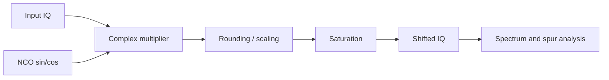
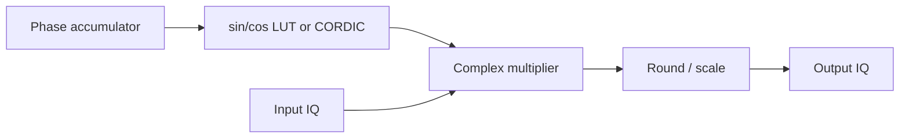

# Lab 4.2 — Fixed-Point Digital Mixer

## Goal

Convert the floating-point digital mixer from Block 3 into a fixed-point model and evaluate spectral artifacts, quantization error and HDL readiness.

The lab answers the practical question:

> How many bits are needed in the NCO and complex multiplier to shift an IQ signal without unacceptable spurs or EVM degradation?

## Engineering context

A digital mixer shifts a complex baseband signal by multiplying it by a complex oscillator:

```text
y[n] = x[n] * exp(j * 2*pi*f_shift*n/Fs)
```

In hardware, this becomes:

```text
NCO / DDS -> sin/cos LUT or CORDIC -> complex multiplier -> rounding/saturation
```

## Processing chain



## Recommended starting formats

| Signal | Start format | Notes |
|---|---|---|
| Input IQ | Q1.15 | normalized complex input |
| NCO sin/cos | Q1.15 | simple LUT-compatible format |
| Product terms | Q2.30 | each real multiplication result |
| Sum/difference | Q3.30 | complex multiply accumulation |
| Output IQ | Q1.15 | after rounding and saturation |
| Phase accumulator | 24–32 bits | depends on frequency resolution and spur target |

## Complex multiplication

For:

```text
x = I + jQ
w = cos(phi) + j sin(phi)
```

The mixer output is:

```text
y_i = I*cos(phi) - Q*sin(phi)
y_q = I*sin(phi) + Q*cos(phi)
```

## Python reference skeleton

```python
import numpy as np

rng = np.random.default_rng(11)
fs = 2.4e6
n = 32768
t = np.arange(n) / fs

f0 = 120e3
fshift = -120e3
x_float = np.exp(1j * 2*np.pi*f0*t) + 0.01*(rng.standard_normal(n) + 1j*rng.standard_normal(n))

osc_float = np.exp(1j * 2*np.pi*fshift*t)
y_float = x_float * osc_float

scale = 2**15

def q15(v):
    return np.clip(np.round(v * scale), -32768, 32767).astype(np.int16)

xi = q15(np.real(x_float))
xq = q15(np.imag(x_float))
ci = q15(np.real(osc_float))
sq = q15(np.imag(osc_float))

yi = np.zeros(n, dtype=np.int16)
yq = np.zeros(n, dtype=np.int16)
saturation_count = 0

for k in range(n):
    # Q1.15 * Q1.15 -> Q2.30
    acc_i = int(xi[k]) * int(ci[k]) - int(xq[k]) * int(sq[k])
    acc_q = int(xi[k]) * int(sq[k]) + int(xq[k]) * int(ci[k])

    # round back to Q1.15
    ri = int(np.round(acc_i / scale))
    rq = int(np.round(acc_q / scale))

    ri_sat = int(np.clip(ri, -32768, 32767))
    rq_sat = int(np.clip(rq, -32768, 32767))
    saturation_count += int(ri != ri_sat) + int(rq != rq_sat)

    yi[k] = ri_sat
    yq[k] = rq_sat

 y_fixed = (yi.astype(np.float64) + 1j*yq.astype(np.float64)) / scale

err = y_float - y_fixed
rms_error = np.sqrt(np.mean(np.abs(err)**2))
signal_rms = np.sqrt(np.mean(np.abs(y_float)**2))
evm_pct = 100 * rms_error / max(signal_rms, 1e-15)

print(f"RMS error: {rms_error:.3e}")
print(f"EVM: {evm_pct:.3f} %")
print(f"Saturation count: {saturation_count}")
```

## MATLAB reference skeleton

```matlab
rng(11);
fs = 2.4e6;
N = 32768;
t = (0:N-1).' / fs;

f0 = 120e3;
fshift = -120e3;
xFloat = exp(1j*2*pi*f0*t) + 0.01*(randn(N,1) + 1j*randn(N,1));
oscFloat = exp(1j*2*pi*fshift*t);
yFloat = xFloat .* oscFloat;

xFix = fi(xFloat, 1, 16, 15);
oscFix = fi(oscFloat, 1, 16, 15);
yFix = xFix .* oscFix;

err = yFloat - double(yFix);
rmsError = rms(abs(err));
signalRms = rms(abs(yFloat));
evmPct = 100 * rmsError / max(signalRms, eps);

fprintf('RMS error: %.3e\n', rmsError);
fprintf('EVM: %.3f %%\n', evmPct);
```

## NCO / DDS discussion

For HDL, the oscillator is usually generated by an NCO:

```text
phase[n+1] = phase[n] + phase_increment
phase_increment = round(f_shift / Fs * 2^P)
```

where `P` is the phase accumulator width.

Frequency resolution:

```text
delta_f = Fs / 2^P
```

| Phase width | Frequency resolution at Fs = 2.4 MS/s | Practical note |
|---:|---:|---|
| 16 bits | 36.6 Hz | enough for simple demos |
| 24 bits | 0.143 Hz | good for most labs |
| 32 bits | 0.00056 Hz | common robust choice |

## Required plots

Produce at least:

1. input spectrum;
2. floating-point mixer output spectrum;
3. fixed-point mixer output spectrum;
4. float vs fixed error magnitude;
5. optional spur zoom near carrier;
6. optional constellation before/after for modulated signals.

## Metrics

| Metric | How to compute | Engineering meaning |
|---|---|---|
| Frequency shift error | measured peak minus expected peak | NCO phase increment accuracy |
| RMS error | `rms(y_float - y_fixed)` | average implementation error |
| EVM | RMS error normalized by signal RMS | modulation quality impact |
| Spur level | largest unwanted spectral component | NCO and quantization artifacts |
| Saturation count | clipped output samples | scaling quality |

## HDL mapping

Suggested streaming interface:

```text
input  wire              clk
input  wire              rst
input  wire              in_valid
input  wire signed [15:0] in_i
input  wire signed [15:0] in_q
output wire              out_valid
output wire signed [15:0] out_i
output wire signed [15:0] out_q
```

Internal blocks:



## Report checklist

- [ ] State sample rate, input tone frequency and shift frequency.
- [ ] State input, NCO, product and output formats.
- [ ] Compute phase increment and frequency resolution.
- [ ] Compare float and fixed spectra.
- [ ] Estimate frequency shift error.
- [ ] Compute RMS error and EVM.
- [ ] Estimate spur level.
- [ ] Count saturation events.
- [ ] Explain whether LUT, CORDIC or direct DDS is preferred.

## Engineering conclusion template

```text
The selected mixer format ______ provides EVM = ____ % and saturation count = ____.
The phase accumulator width ____ gives frequency resolution ____ Hz at Fs = ____ Hz.
The largest observed spur is approximately ____ dBc.
This configuration is / is not ready for HDL because ______.
```
