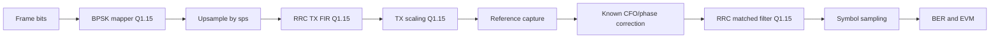

# Lab 4.3 - BPSK fixed-point chain

## Goal

Turn the shared Block 11 BPSK handoff package into a fixed-point bridge for the main modem route:

```text
MATLAB reference -> Simulink fixed-point -> HDL symbol mapper -> future Zynq TX/RX BER flow
```

The lab answers the practical question:

> Can the same BPSK frame be carried through Q1.15 pulse shaping and matched filtering with acceptable error before moving to Simulink and RTL?

## Executable files

| Environment | File | Output |
|---|---|---|
| Python | `blocks/block_04_simulink_and_fixed_point/python/lab_4_3_bpsk_fixed_point_chain.py` | metrics + PNG figures + format table in `docs/assets` |
| MATLAB | `blocks/block_04_simulink_and_fixed_point/matlab/lab_4_3_bpsk_fixed_point_chain.m` | MATLAB mirror figures in `docs/assets` |

Run from the repository root:

```bash
python blocks/block_04_simulink_and_fixed_point/python/lab_4_3_bpsk_fixed_point_chain.py
```

MATLAB:

```bash
matlab -batch "run('blocks/block_04_simulink_and_fixed_point/matlab/lab_4_3_bpsk_fixed_point_chain.m')"
```

The Python script automatically regenerates the Block 11 BPSK package if the shared handoff files are missing.

## Shared handoff dependency

This lab intentionally reuses the files from:

```text
blocks/block_11_integrated_sdr_project/assets/end_to_end_bpsk_reference/
```

The most important inputs are:

| File | Role |
|---|---|
| `tx_bits.txt` | deterministic BPSK frame bits |
| `tx_symbols_q15.txt` | symbol-mapper reference output |
| `rrc_taps_q15.txt` | shared TX/RX pulse-shaping coefficients |
| `sample_plan.json` | matched-filter symbol timing |
| `end_to_end_bpsk_reference_v1_tx_reference.ci16` | exported float TX waveform |
| `end_to_end_bpsk_reference_v1.ci16` | impaired synthetic capture for RX-side checks |

## Processing chain



## Generated Python artifacts

```text
docs/assets/lab43_bpsk_fixed_point_tx_waveform.png
docs/assets/lab43_bpsk_fixed_point_error.png
docs/assets/lab43_bpsk_fixed_point_constellation.png
docs/assets/lab43_bpsk_fixed_point_metrics.json
docs/assets/lab43_bpsk_fixed_point_format_table.md
```

Generated MATLAB figures:

```text
docs/assets/lab43_bpsk_fixed_point_tx_waveform_matlab.png
docs/assets/lab43_bpsk_fixed_point_error_matlab.png
docs/assets/lab43_bpsk_fixed_point_constellation_matlab.png
```

## Recommended starting formats

| Node | Start format | Notes |
|---|---|---|
| BPSK symbol mapper output | Q1.15 | `0 -> +32767`, `1 -> -32767` |
| Upsampled stream | Q1.15 | zeros inserted between symbols |
| RRC taps | Q1.15 | shared with future Simulink and HDL |
| FIR product | Q2.30 | complex sample times real tap |
| FIR accumulator | Q9.30 for 65 taps | 7 guard bits above the Q2.30 product |
| TX gain coefficient | Q1.15 | post-filter scaling into headroom |
| Capture / corrected RX input | Q1.15 | fixed-point analysis view |
| Sampled symbols | Q1.15 | before scalar alignment in analysis |

## What is measured

| Metric | Meaning |
|---|---|
| `tx_float_rebuild_rmse_vs_export` | sanity check that the float rebuild matches the shared TX export |
| `tx_fixed_rms_error` | fixed-point pulse-shaping error versus float |
| `tx_fixed_evm_percent` | TX waveform mismatch in EVM form |
| `matched_filter_rms_error` | fixed-point matched-filter error versus float |
| `ber_payload_fixed` | payload BER after fixed-point RX filtering |
| `rx_fixed_evm_percent` | symbol-quality penalty of the fixed-point RX path |
| saturation counts | whether Q1.15 needs extra headroom at any stage |

## Simulink import route

Use the same handoff files in a Simulink model:

1. import `tx_symbols_q15.txt` as the symbol stream source;
2. import `rrc_taps_q15.txt` into the TX and RX FIR blocks;
3. use `sample_plan.json` to set the symbol-sampling offset after the matched filter;
4. keep the stream width at signed 16-bit unless the saturation counters require a wider internal node;
5. preserve the Block 11 frame definition so BER stays comparable with the Python and HDL stages.

## HDL handoff relevance

This lab is the fixed-point companion to:

- `blocks/block_05_fpga_hdl_flow/rtl/bpsk_symbol_mapper.v`
- `blocks/block_05_fpga_hdl_flow/tb/tb_bpsk_symbol_mapper.v`

The intended next step is to grow the RTL path from the symbol mapper into an RRC TX filter and then into a full framed modem chain on Zynq.

## Report checklist

- [ ] State the exact shared Block 11 package version.
- [ ] Include the fixed-point format table.
- [ ] Report TX float-vs-fixed waveform error.
- [ ] Report RX float-vs-fixed EVM and payload BER.
- [ ] State FIR guard bits and accumulator width.
- [ ] State any observed saturation counts.
- [ ] Explain whether Q1.15 is sufficient or whether internal nodes need more headroom.
- [ ] Describe how the same files will be imported into Simulink.

## Engineering conclusion template

```text
Using the shared BPSK package ______, the Q1.15 TX/RX chain produced payload BER = ____ and RX EVM = ____ %.
The 65-tap RRC filter required ____ guard bits and an accumulator width of ____ bits.
The configuration is / is not ready for Simulink and HDL handoff because ______.
```
