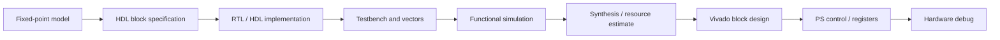
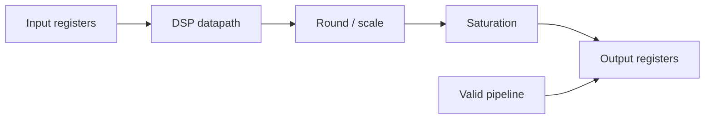
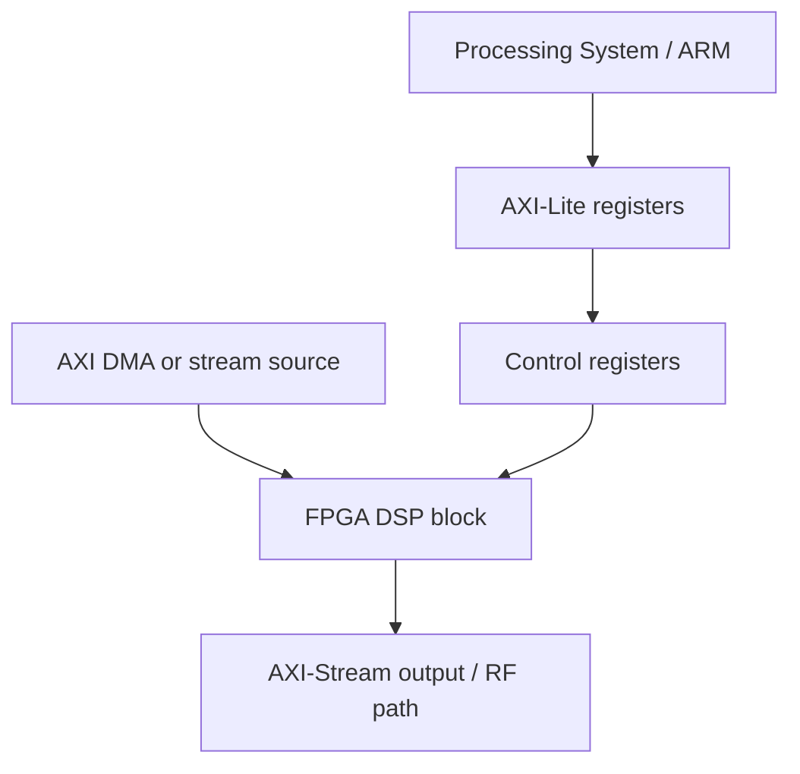

# Block 5 — HDL/FPGA workflow

This block turns fixed-point DSP from Block 4 into a hardware architecture: streaming interfaces, testbenches, RTL structure, resource estimation and Vivado integration.

## Main engineering chain



## Block 5 inputs

| Artifact from Block 4 | How it is used in Block 5 |
|---|---|
| Input/output Q formats | define RTL port widths |
| FIR/NCO coefficients | become ROM, parameters or registers |
| Float/fixed test vectors | become Verilog testbench inputs |
| Allowed error | used as a pass/fail criterion |
| Latency estimate | verified in simulation and documentation |
| Saturation/rounding strategy | implemented explicitly in RTL |

## HDL-friendly rules

| Rule | Why it matters |
|---|---|
| Fixed-size arrays | synthesis requires static structure |
| No dynamic memory | FPGA does not execute malloc/new like a CPU |
| No unbounded loops | loops must unroll or map to explicit control |
| Explicit pipeline delays | latency must be measurable |
| Separate data path and control path | simplifies testing and integration |
| valid/ready or valid-only protocol | required for streaming processing |
| Synchronous reset | usually easier for FPGA timing closure |

## Basic streaming interface

For the first labs, a valid-only stream is sufficient:

```text
clk
rst
in_valid
in_i[15:0]
in_q[15:0]
out_valid
out_i[15:0]
out_q[15:0]
```

Later, this expands to AXI-Stream:

```text
tvalid
tready
tdata
tlast
```

## Minimal RTL block structure



## Testbench as the quality gate

The testbench should verify not only signal presence, but also agreement with a reference vector.

Minimum checks:

1. reset behaviour;
2. latency;
3. output valid alignment;
4. sample-by-sample comparison;
5. saturation cases;
6. impulse response for FIR;
7. frequency shift for mixer;
8. fixed-point error tolerance.

## Resource estimation table

| Block | LUT | FF | DSP | BRAM | Latency | Fmax | Comment |
|---|---:|---:|---:|---:|---:|---:|---|
| FIR 129 taps parallel |  |  |  |  |  |  | many multipliers |
| FIR time-multiplexed |  |  |  |  |  |  | lower resources |
| NCO + mixer |  |  |  |  |  |  | LUT/CORDIC trade-off |
| Decimator |  |  |  |  |  |  | FIR + rate change |

## Vivado integration checklist

- [ ] RTL module has clean clock/reset.
- [ ] Ports are documented.
- [ ] Testbench passes.
- [ ] Latency is measured.
- [ ] Resource estimate is recorded.
- [ ] Timing target is stated.
- [ ] IP wrapper or block-design connection is described.
- [ ] Register map is documented if PS control is used.
- [ ] Debug signals are selected for ILA if needed.

## Zynq SoC connection



## Expected result

After this block, the student should be able to:

- turn a fixed-point model into an RTL specification;
- describe a streaming DSP block interface;
- write a testbench with reference vectors;
- estimate latency and resources;
- explain how the block enters a Vivado block design;
- prepare a minimal HDL/FPGA flow report.
