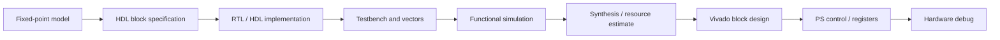
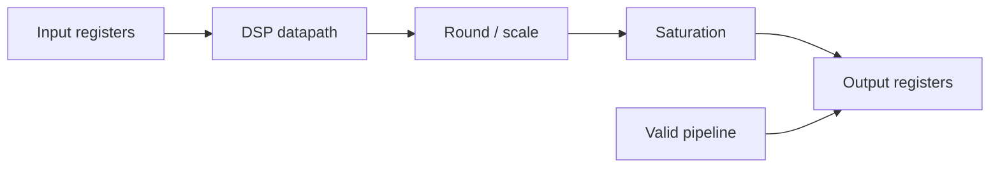
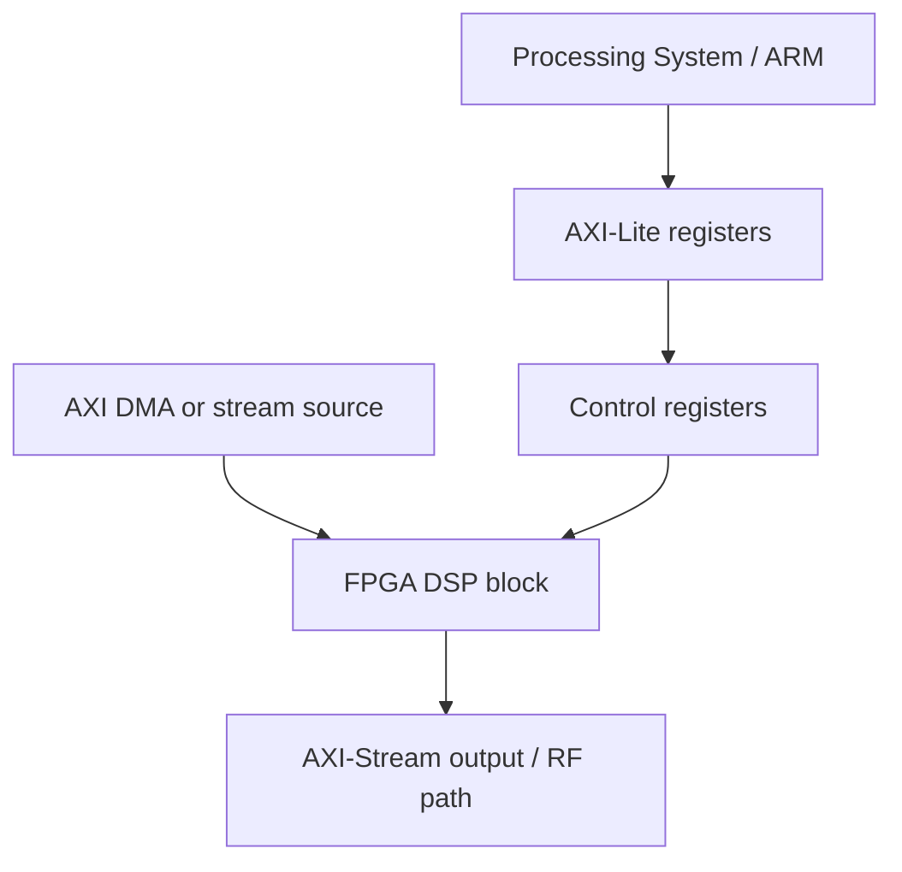

# Блок 5 — HDL/FPGA workflow

Этот блок переводит fixed-point DSP из блока 4 в аппаратную архитектуру: потоковые интерфейсы, тестбенчи, RTL-структуру, оценку ресурсов и интеграцию в Vivado.

## Главная инженерная цепочка



## Что является входом в блок 5

| Артефакт из блока 4 | Как используется в блоке 5 |
|---|---|
| Q-форматы входов/выходов | определяют ширину портов RTL |
| Коэффициенты FIR/NCO | попадают в ROM, параметры или регистры |
| Test vectors float/fixed | становятся входом для Verilog testbench |
| Допустимая ошибка | используется как критерий pass/fail |
| Latency estimate | проверяется в симуляции и документации |
| Saturation/rounding strategy | реализуется явно в RTL |

## HDL-friendly правила

| Правило | Почему важно |
|---|---|
| Фиксированные размеры массивов | синтезатору нужна статическая структура |
| Нет динамической памяти | FPGA не исполняет malloc/new как CPU |
| Нет бесконечных циклов без счётчиков | цикл должен разворачиваться или иметь понятное управление |
| Явные задержки pipeline | latency должна быть измерима |
| Разделение data path и control path | упрощает тестирование и интеграцию |
| valid/ready или valid-only протокол | нужен для потоковой обработки |
| Синхронный reset | проще для FPGA timing closure |

## Базовый streaming-интерфейс

Для первых лабораторий достаточно valid-only потока:

```text
clk
rst
in_valid
in_i[15:0]
in_q[15:0]
out_valid
out_i[15:0]
out_q[15:0]
```

Позже интерфейс расширяется до AXI-Stream:

```text
tvalid
tready
tdata
tlast
```

## Минимальная структура RTL-блока



## Тестбенч как основной критерий качества

Тестбенч должен проверять не только наличие сигнала, но и совпадение с reference vector.

Минимальные проверки:

1. reset behaviour;
2. latency;
3. output valid alignment;
4. sample-by-sample comparison;
5. saturation cases;
6. impulse response for FIR;
7. frequency shift for mixer;
8. fixed-point error tolerance.

## Таблица оценки ресурсов

| Блок | LUT | FF | DSP | BRAM | Latency | Fmax | Комментарий |
|---|---:|---:|---:|---:|---:|---:|---|
| FIR 129 taps parallel |  |  |  |  |  |  | many multipliers |
| FIR time-multiplexed |  |  |  |  |  |  | lower resources |
| NCO + mixer |  |  |  |  |  |  | LUT/CORDIC trade-off |
| Decimator |  |  |  |  |  |  | FIR + rate change |

## Vivado integration checklist

- [ ] RTL module has clean clock/reset.
- [ ] Ports are documented.
- [ ] Testbench passes.
- [ ] Latency is measured.
- [ ] Resource estimate is recorded.
- [ ] Timing target is stated.
- [ ] IP wrapper or block design connection is described.
- [ ] Register map is documented if PS control is used.
- [ ] Debug signals are selected for ILA if needed.

## Связь с Zynq SoC



## Что должно получиться после блока

После блока студент должен уметь:

- превратить fixed-point модель в RTL specification;
- описать потоковый интерфейс DSP-блока;
- написать testbench с reference vectors;
- оценить latency и ресурсы;
- объяснить, как блок попадёт в Vivado block design;
- подготовить минимальный отчёт по HDL/FPGA маршруту.
