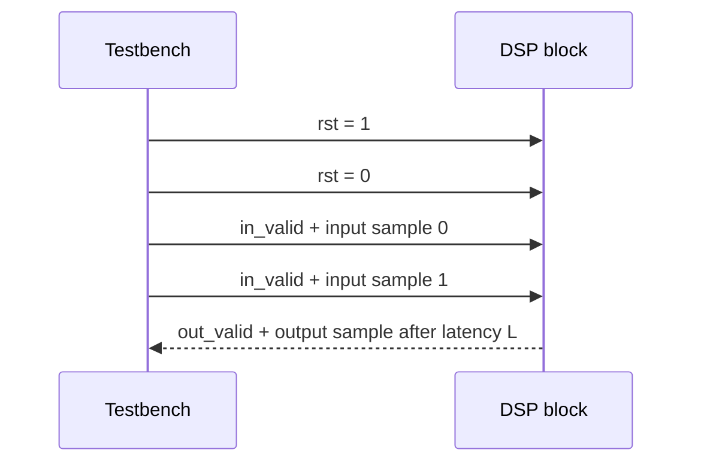
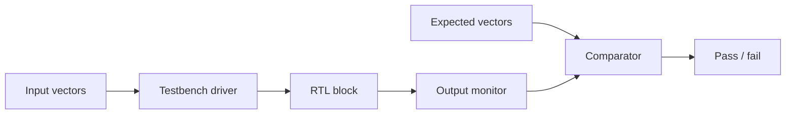

# Lab 5.1 — Streaming DSP Interface and Testbench

## Goal

Define a simple streaming interface for FPGA DSP blocks and write a testbench strategy that can validate latency, reset behaviour and sample alignment.

This lab prepares the interface style used later for FIR, mixer, decimator and full SDR processing chains.

## Engineering question

> How do we wrap a fixed-point DSP algorithm into a deterministic clocked hardware block that can be tested sample-by-sample?

## Minimal valid-only interface

For the first HDL labs, use a simple valid-only streaming interface:

```verilog
module dsp_block #(
    parameter integer W = 16
)(
    input  wire                 clk,
    input  wire                 rst,

    input  wire                 in_valid,
    input  wire signed [W-1:0]  in_i,
    input  wire signed [W-1:0]  in_q,

    output reg                  out_valid,
    output reg  signed [W-1:0]  out_i,
    output reg  signed [W-1:0]  out_q
);
```

This is not full AXI-Stream yet, but it teaches the most important ideas:

- samples are accepted on clock edges;
- `in_valid` marks meaningful input samples;
- output latency must be documented;
- `out_valid` must align with output samples;
- reset behaviour must be deterministic.

## Timing model



## Example pass-through block

```verilog
module iq_passthrough #(
    parameter integer W = 16
)(
    input  wire                 clk,
    input  wire                 rst,
    input  wire                 in_valid,
    input  wire signed [W-1:0]  in_i,
    input  wire signed [W-1:0]  in_q,
    output reg                  out_valid,
    output reg  signed [W-1:0]  out_i,
    output reg  signed [W-1:0]  out_q
);

always @(posedge clk) begin
    if (rst) begin
        out_valid <= 1'b0;
        out_i <= '0;
        out_q <= '0;
    end else begin
        out_valid <= in_valid;
        if (in_valid) begin
            out_i <= in_i;
            out_q <= in_q;
        end
    end
end

endmodule
```

## Testbench checklist

The testbench should verify:

| Check | Expected behaviour |
|---|---|
| Reset | output valid is zero and outputs are known |
| Valid propagation | output valid appears after expected latency |
| Data alignment | output sample corresponds to correct input sample |
| Idle cycles | block does not generate fake valid samples |
| Signed values | negative I/Q values are preserved correctly |
| Saturation cases | clipping behaviour is deterministic when applicable |

## Reference-vector approach

Use text files for deterministic test vectors:

```text
input_vectors.txt
expected_vectors.txt
```

Suggested format:

```text
valid i q
1 32767 0
1 0 32767
1 -32768 0
0 0 0
1 1234 -5678
```

## Testbench structure



## Minimal report

The lab report should contain:

- interface table;
- reset description;
- latency definition;
- timing diagram;
- test-vector format;
- pass/fail criteria;
- notes on how the interface will evolve into AXI-Stream.

## Engineering conclusion template

```text
The selected interface uses ____-bit signed I/Q samples and a valid-only protocol.
The measured latency is ____ clock cycles. The testbench verifies reset, valid
alignment and signed sample propagation. The next step is to replace the
pass-through datapath with FIR or mixer logic.
```
