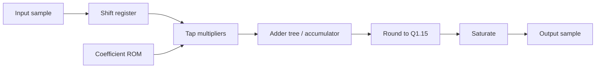

# Lab 5.2 — FIR RTL Mapping

## Goal

Map the fixed-point FIR from Block 4 into an RTL architecture and define its ports, latency, accumulator width and testbench strategy.

This lab is the first step from algorithmic FIR filtering to a synthesizable streaming FPGA block.

## Executable HDL package

| File | Purpose |
|---|---|
| `blocks/block_05_fpga_hdl_flow/rtl/fir_iq_4tap.v` | executable educational 4-tap IQ FIR RTL block |
| `blocks/block_05_fpga_hdl_flow/tb/tb_fir_iq_4tap.v` | self-checking Verilog testbench |
| `blocks/block_05_fpga_hdl_flow/python/generate_fir_iq_4tap_vectors.py` | deterministic reference-vector generator |
| `blocks/block_05_fpga_hdl_flow/tb/fir_iq_4tap_input_vectors.txt` | generated input vectors |
| `blocks/block_05_fpga_hdl_flow/tb/fir_iq_4tap_expected_vectors.txt` | generated expected output vectors |

Run from the repository root:

```bash
python blocks/block_05_fpga_hdl_flow/python/generate_fir_iq_4tap_vectors.py

iverilog -g2012 \
  -o blocks/block_05_fpga_hdl_flow/tb/tb_fir_iq_4tap.out \
  blocks/block_05_fpga_hdl_flow/rtl/fir_iq_4tap.v \
  blocks/block_05_fpga_hdl_flow/tb/tb_fir_iq_4tap.v

vvp blocks/block_05_fpga_hdl_flow/tb/tb_fir_iq_4tap.out
```

Expected result:

```text
PASS: fir_iq_4tap test completed without errors
```

The GitHub Actions workflow `.github/workflows/block5_hdl.yml` generates vectors and runs this simulation automatically.

## Engineering question

> How does a Q1.15 FIR model become a clocked RTL datapath with explicit multipliers, accumulator growth, rounding and saturation?

## Inputs from Block 4

| Item | Example value | RTL consequence |
|---|---:|---|
| Input format | Q1.15 | signed 16-bit input ports |
| Coefficient format | Q1.15 | signed 16-bit coefficient ROM |
| Number of taps | 4 in executable lab, 129 in full design | shift register length and multiplier count |
| Product format | Q2.30 | 32-bit products |
| Guard bits | ceil(log2(N)) | accumulator must be wider than product |
| Output format | Q1.15 | rounding/saturation before output |

## FIR datapath



## Direct-form FIR equation

```text
y[n] = sum_{k=0}^{N-1} h[k] * x[n-k]
```

For complex IQ, the same real coefficient FIR is applied independently to I and Q:

```text
y_i[n] = sum h[k] * x_i[n-k]
y_q[n] = sum h[k] * x_q[n-k]
```

## Executable 4-tap example

The executable lab uses this Q1.15 coefficient set:

```text
h = [0.125, 0.375, 0.375, 0.125]
h_q15 = [4096, 12288, 12288, 4096]
```

It is intentionally small enough to understand in a waveform viewer, but it still demonstrates the complete fixed-point FIR pattern:

- shift register;
- coefficient multiplication;
- accumulator growth;
- rounding back to Q1.15;
- saturation;
- output valid alignment;
- reference-vector comparison.

## Architecture options

| Architecture | DSP usage | Throughput | Latency | When to use |
|---|---:|---:|---:|---|
| Fully parallel | high | one sample/clock | low/medium | high-rate streaming |
| Time-multiplexed MAC | low | one sample per many clocks | high | low-rate or resource-limited design |
| Symmetric FIR | medium | one sample/clock | medium | linear-phase symmetric coefficients |
| Polyphase FIR | medium/high | efficient rate change | medium | decimator/interpolator |

## Accumulator sizing

For signed Q1.15 input and Q1.15 coefficients:

```text
product width = 16 + 16 = 32 bits
product fractional bits = 15 + 15 = 30 bits
guard bits = ceil(log2(Ntaps))
accumulator width >= 32 + guard_bits
```

For the executable 4-tap lab:

```text
guard_bits = 2
accumulator width >= 34 bits
```

For a 129-tap practical FIR:

```text
guard_bits = 8
accumulator width >= 40 bits
```

## RTL skeleton

```verilog
module fir_iq_stream #(
    parameter integer W = 16,
    parameter integer NTAPS = 129,
    parameter integer ACC_W = 40
)(
    input  wire                 clk,
    input  wire                 rst,
    input  wire                 in_valid,
    input  wire signed [W-1:0]  in_i,
    input  wire signed [W-1:0]  in_q,
    output reg                  out_valid,
    output reg  signed [W-1:0]  out_i,
    output reg  signed [W-1:0]  out_q
);

// Educational skeleton: actual coefficient ROM, shift register,
// multiplier array, adder tree, rounding and saturation are added
// step-by-step in implementation labs.

endmodule
```

## Testbench strategy

Use reference vectors generated by Python/MATLAB Lab 4.1 or by the local FIR vector generator.

Recommended tests:

1. impulse input -> output equals coefficient sequence;
2. constant input -> output approaches DC gain;
3. two-tone input -> interferer suppression matches reference;
4. random IQ vector -> sample-by-sample comparison after latency compensation;
5. saturation stress vector -> output clips deterministically.

## Latency documentation

Latency must be stated explicitly:

| Stage | Latency, clocks |
|---|---:|
| Input register | 1 |
| Shift register update | 0/1 |
| Multiplier pipeline | 1–3 |
| Adder tree | depends on tree depth |
| Rounding/saturation | 1 |
| Output register | 1 |

## Vivado resource report template

| Resource | Estimated | Synthesized | Comment |
|---|---:|---:|---|
| LUT |  |  | control + adders |
| FF |  |  | registers + valid pipeline |
| DSP |  |  | multipliers |
| BRAM |  |  | coefficient storage if used |
| Latency |  |  | clocks |
| Fmax |  |  | MHz |

## Report checklist

- [ ] State FIR format and number of taps.
- [ ] Compute product and accumulator widths.
- [ ] Select architecture: parallel, time-multiplexed, symmetric or polyphase.
- [ ] Draw datapath diagram.
- [ ] Define streaming ports.
- [ ] Define latency.
- [ ] Define test vectors.
- [ ] Define pass/fail error tolerance.
- [ ] Add resource estimate table.

## Engineering conclusion template

```text
The FIR RTL mapping uses ____ taps with Q1.15 input and coefficients.
The product width is ____ bits and the accumulator width is ____ bits.
The selected architecture is ____ because ______.
The expected latency is ____ clocks and the main FPGA cost is ______.
```
