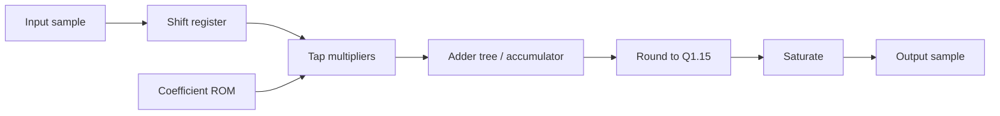

# Lab 5.2 — FIR RTL Mapping

## Goal

Map the fixed-point FIR from Block 4 into an RTL architecture and define its ports, latency, accumulator width and testbench strategy.

This lab is the first step from algorithmic FIR filtering to a synthesizable streaming FPGA block.

## Executable HDL package

| File | Purpose |
|---|---|
| `blocks/block_05_fpga_hdl_flow/rtl/fir_iq_4tap.v` | executable educational 4-tap IQ FIR RTL block |
| `blocks/block_05_fpga_hdl_flow/tb/tb_fir_iq_4tap.v` | self-checking Verilog testbench |
| `blocks/block_05_fpga_hdl_flow/python/generate_fir_iq_4tap_vectors.py` | deterministic reference-vector generator |
| `blocks/block_05_fpga_hdl_flow/tb/fir_iq_4tap_input_vectors.txt` | generated input vectors |
| `blocks/block_05_fpga_hdl_flow/tb/fir_iq_4tap_expected_vectors.txt` | generated expected output vectors |

Run from the repository root:

```bash
python blocks/block_05_fpga_hdl_flow/python/generate_fir_iq_4tap_vectors.py

iverilog -g2012 \
  -o blocks/block_05_fpga_hdl_flow/tb/tb_fir_iq_4tap.out \
  blocks/block_05_fpga_hdl_flow/rtl/fir_iq_4tap.v \
  blocks/block_05_fpga_hdl_flow/tb/tb_fir_iq_4tap.v

vvp blocks/block_05_fpga_hdl_flow/tb/tb_fir_iq_4tap.out
```

Expected result:

```text
PASS: fir_iq_4tap test completed without errors
```

The GitHub Actions workflow `.github/workflows/block5_hdl.yml` generates vectors and runs this simulation automatically.

## Engineering question

> How does a Q1.15 FIR model become a clocked RTL datapath with explicit multipliers, accumulator growth, rounding and saturation?

## Inputs from Block 4

| Item | Example value | RTL consequence |
|---|---:|---|
| Input format | Q1.15 | signed 16-bit input ports |
| Coefficient format | Q1.15 | signed 16-bit coefficient ROM |
| Number of taps | 4 in executable lab, 129 in full design | shift register length and multiplier count |
| Product format | Q2.30 | 32-bit products |
| Guard bits | ceil(log2(N)) | accumulator must be wider than product |
| Output format | Q1.15 | rounding/saturation before output |

## FIR datapath


```mermaid
flowchart LR
    IN[Input sample] --> SR[Shift register]
    SR --> MUL[Tap multipliers]
    COEF[Coefficient ROM] --> MUL
    MUL --> SUM[Adder tree / accumulator]
    SUM --> ROUND[Round to Q1.15]
    ROUND --> SAT[Saturate]
    SAT --> OUT[Output sample]
```

## Direct-form FIR equation

```text
y[n] = sum_{k=0}^{N-1} h[k] * x[n-k]
```

For complex IQ, the same real coefficient FIR is applied independently to I and Q:

```text
y_i[n] = sum h[k] * x_i[n-k]
y_q[n] = sum h[k] * x_q[n-k]
```

## Executable 4-tap example

The executable lab uses this Q1.15 coefficient set:

```text
h = [0.125, 0.375, 0.375, 0.125]
h_q15 = [4096, 12288, 12288, 4096]
```

It is intentionally small enough to understand in a waveform viewer, but it still demonstrates the complete fixed-point FIR pattern:

- shift register;
- coefficient multiplication;
- accumulator growth;
- rounding back to Q1.15;
- saturation;
- output valid alignment;
- reference-vector comparison.

## Architecture options

| Architecture | DSP usage | Throughput | Latency | When to use |
|---|---:|---:|---:|---|
| Fully parallel | high | one sample/clock | low/medium | high-rate streaming |
| Time-multiplexed MAC | low | one sample per many clocks | high | low-rate or resource-limited design |
| Symmetric FIR | medium | one sample/clock | medium | linear-phase symmetric coefficients |
| Polyphase FIR | medium/high | efficient rate change | medium | decimator/interpolator |

## Accumulator sizing

For signed Q1.15 input and Q1.15 coefficients:

```text
product width = 16 + 16 = 32 bits
product fractional bits = 15 + 15 = 30 bits
guard bits = ceil(log2(Ntaps))
accumulator width >= 32 + guard_bits
```

For the executable 4-tap lab:

```text
guard_bits = 2
accumulator width >= 34 bits
```

For a 129-tap practical FIR:

```text
guard_bits = 8
accumulator width >= 40 bits
```

## RTL skeleton

```verilog
module fir_iq_stream #(
    parameter integer W = 16,
    parameter integer NTAPS = 129,
    parameter integer ACC_W = 40
)(
    input  wire                 clk,
    input  wire                 rst,
    input  wire                 in_valid,
    input  wire signed [W-1:0]  in_i,
    input  wire signed [W-1:0]  in_q,
    output reg                  out_valid,
    output reg  signed [W-1:0]  out_i,
    output reg  signed [W-1:0]  out_q
);

// Educational skeleton: actual coefficient ROM, shift register,
// multiplier array, adder tree, rounding and saturation are added
// step-by-step in implementation labs.

endmodule
```

## Testbench strategy

Use reference vectors generated by Python/MATLAB Lab 4.1 or by the local FIR vector generator.

Recommended tests:

1. impulse input -> output equals coefficient sequence;
2. constant input -> output approaches DC gain;
3. two-tone input -> interferer suppression matches reference;
4. random IQ vector -> sample-by-sample comparison after latency compensation;
5. saturation stress vector -> output clips deterministically.

## Latency documentation

Latency must be stated explicitly:

| Stage | Latency, clocks |
|---|---:|
| Input register | 1 |
| Shift register update | 0/1 |
| Multiplier pipeline | 1–3 |
| Adder tree | depends on tree depth |
| Rounding/saturation | 1 |
| Output register | 1 |

## Vivado resource report template

| Resource | Estimated | Synthesized | Comment |
|---|---:|---:|---|
| LUT |  |  | control + adders |
| FF |  |  | registers + valid pipeline |
| DSP |  |  | multipliers |
| BRAM |  |  | coefficient storage if used |
| Latency |  |  | clocks |
| Fmax |  |  | MHz |

Reference result for this RTL, Vivado 2021.1 out-of-context synthesis on the course part `xc7z020clg400-2` with a 100 MHz clock (`python tools/generate_block5_vivado_reports.py`, raw reports in [`reports/fpga/vivado_ooc_raw`](https://github.com/Lay007/zynq-sdr-course/tree/main/reports/fpga/vivado_ooc_raw)):

| Resource | Synthesized | Comment |
|---|---:|---|
| LUT | 117 | adders, rounding and saturation |
| FF | 129 | shift register, outputs, valid |
| DSP48E1 | 4 | constant multiplications mapped to DSP slices |
| BRAM | 0 | coefficients are constants |
| Latency | 1 clock | from `in_valid` to `out_valid` |
| Timing at 100 MHz | WNS -0.125 ns | misses by a narrow margin: 20 logic levels, estimate about 98.8 MHz |

## What to expect

```text
PASS: fir_iq_4tap test completed without errors
```

The comparison is bit-exact: the Python generator computes the same `h = [0.125, 0.375, 0.375, 0.125]` filter in integers with round-half-up and saturation, and every output sample must match exactly. The DC gain is 1.0, so a constant input comes out unchanged once the four taps are filled.

The course runner generates the vectors, compiles, simulates and turns any `FAIL` line or non-zero simulator exit into an error:

```bash
python tools/run_block5_hdl_smoke.py --test tb_fir_iq_4tap
```

## Exercises

Each exercise below is a deliberate one-line RTL mutation. Make it, run the bench, read the messages, then restore the file (`git checkout -- <file>`). The quoted outputs were observed with Icarus Verilog 12.0.

1. Replace rounding with truncation: `round_q15 = value >>> SHIFT;`. The bench reports 6 errors, each exactly 1 LSB low, for example `out=(4095,0) expected=(4096,0)` and `out=(12287,4095) expected=(12288,4096)`. Truncation is a -0.5 LSB bias; a floating-point comparison with a 1e-3 tolerance would never see it, a bit-exact bench does.
2. Change `H1` from `16'sd12288` to `16'sd12289` (one coefficient LSB). The bench reports only 4 errors, for example `out=(12289,4096) expected=(12288,4096)`. The other outputs are unchanged because the extra `x * 2^-15` did not cross a rounding boundary. What does that say about how many vectors a coefficient check needs?
3. The coefficients sum to exactly 1.0. Compute the worst-case accumulator width for 16-bit inputs and justify (or shrink) `ACC_W = 40`.
4. The critical path at 100 MHz is not where it looks. Put a register after the multipliers (latency 2) and synthesize again: WNS stays at -0.125 ns. The timing report shows why: the path now starts at the product registers and still runs through the 40-bit sum, the rounding adder and the saturation compare in one clock (20 levels, 15 of them CARRY4). Register the sum as well and do rounding and saturation in a third clock: WNS becomes +5.35 ns with 12 logic levels (70 LUT, 67 FF, 6 DSP48E1). Both variants were checked bit-exact against this RTL on 2000 random samples, just 1 and 2 clocks later. Which change would you keep in a real design, and what does it cost in latency?

## Report checklist

- [ ] State FIR format and number of taps.
- [ ] Compute product and accumulator widths.
- [ ] Select architecture: parallel, time-multiplexed, symmetric or polyphase.
- [ ] Draw datapath diagram.
- [ ] Define streaming ports.
- [ ] Define latency.
- [ ] Define test vectors.
- [ ] Define pass/fail error tolerance.
- [ ] Add resource estimate table.

## Engineering conclusion template

```text
The FIR RTL mapping uses ____ taps with Q1.15 input and coefficients.
The product width is ____ bits and the accumulator width is ____ bits.
The selected architecture is ____ because ______.
The expected latency is ____ clocks and the main FPGA cost is ______.
```
