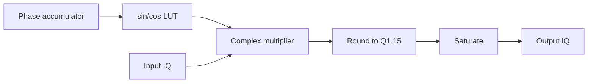

# Lab 5.3 — Fixed-Point NCO Mixer RTL

## Goal

Implement a compact fixed-point NCO-based IQ mixer in RTL and verify it against deterministic Python-generated reference vectors.

This lab connects Block 4 fixed-point digital mixing with an executable Verilog implementation.

## Executable HDL package

| File | Purpose |
|---|---|
| `blocks/block_05_fpga_hdl_flow/rtl/nco_mixer_iq.v` | executable Q1.15 NCO IQ mixer RTL block |
| `blocks/block_05_fpga_hdl_flow/tb/tb_nco_mixer_iq.v` | self-checking Verilog testbench |
| `blocks/block_05_fpga_hdl_flow/python/generate_nco_mixer_iq_vectors.py` | deterministic reference-vector generator |
| `blocks/block_05_fpga_hdl_flow/tb/nco_mixer_iq_input_vectors.txt` | generated input vectors |
| `blocks/block_05_fpga_hdl_flow/tb/nco_mixer_iq_expected_vectors.txt` | generated expected output vectors |

Run from the repository root:

```bash
python blocks/block_05_fpga_hdl_flow/python/generate_nco_mixer_iq_vectors.py

iverilog -g2012 \
  -o blocks/block_05_fpga_hdl_flow/tb/tb_nco_mixer_iq.out \
  blocks/block_05_fpga_hdl_flow/rtl/nco_mixer_iq.v \
  blocks/block_05_fpga_hdl_flow/tb/tb_nco_mixer_iq.v

vvp blocks/block_05_fpga_hdl_flow/tb/tb_nco_mixer_iq.out
```

Expected result:

```text
PASS: nco_mixer_iq test completed without errors
```

The GitHub Actions workflow `.github/workflows/block5_hdl.yml` generates vectors and runs this simulation automatically.

## Engineering question

> How does a fixed-point digital mixer become a clocked RTL block with an NCO, LUT, complex multiplier, rounding and saturation?

## DSP equation

For complex input:

```text
x[n] = I[n] + jQ[n]
w[n] = cos(phi[n]) + j sin(phi[n])
y[n] = x[n] * w[n]
```

The RTL implements:

```text
y_i = I*cos - Q*sin
y_q = I*sin + Q*cos
```

## NCO model

The educational RTL uses a compact phase accumulator:

```text
phase[n+1] = phase[n] + phase_increment
```

For this lab:

```text
PHASE_W = 4
LUT size = 16 samples
PHASE_INC = 1
```

This is intentionally small so students can inspect all LUT values and waveform transitions. A production SDR mixer should use a wider phase accumulator and a higher quality oscillator implementation.

## Fixed-point formats

| Signal | Format | Comment |
|---|---|---|
| Input I/Q | Q1.15 | signed 16-bit samples |
| sin/cos LUT | Q1.15 | signed 16-bit oscillator values |
| Product | Q2.30 | multiplication result |
| Accumulator | 40-bit educational accumulator | safe for sum/difference |
| Output I/Q | Q1.15 | rounded and saturated |

## RTL datapath



## Testbench strategy

The testbench verifies:

1. reset behaviour;
2. `out_valid` alignment;
3. phase advance only on valid input;
4. signed complex multiplication;
5. rounding to Q1.15;
6. saturation bounds;
7. sample-by-sample agreement with Python reference vectors.

## Scaling toward real SDR designs

| Educational lab | Production SDR version |
|---|---|
| 4-bit phase accumulator | 24–48 bit phase accumulator |
| 16-entry LUT | large LUT, interpolated LUT or CORDIC |
| no tready | AXI-Stream valid/ready |
| compact unpipelined multiplier | pipelined DSP-slice complex multiplier |
| vector testbench | constrained/random and file-based regression |

## Report checklist

- [ ] State input, LUT, product, accumulator and output formats.
- [ ] Explain phase accumulator behaviour.
- [ ] Explain why the LUT is intentionally small.
- [ ] Run the testbench and record PASS output.
- [ ] Inspect the VCD waveform.
- [ ] State measured latency.
- [ ] Explain how to scale the design to a real SDR NCO.

## Engineering conclusion template

```text
The NCO mixer uses Q1.15 input samples and Q1.15 oscillator values.
The educational phase accumulator is ____ bits and advances only when in_valid is asserted.
The output is rounded and saturated back to Q1.15. The simulation passes against
Python-generated reference vectors, so the next step is widening the phase accumulator
and replacing the compact LUT with a production oscillator architecture.
```
