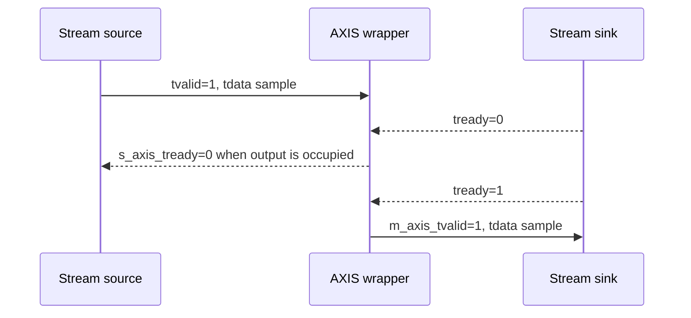

# Lab 5.4 — AXI-Stream Wrapper

## Goal

Move from a simple valid-only educational DSP interface to an AXI-Stream style interface suitable for Vivado/Zynq integration.

This lab introduces the handshake signals used when DSP blocks are connected to DMA, RF interfaces or larger streaming processing chains.

## Executable HDL package

| File | Purpose |
|---|---|
| `blocks/block_05_fpga_hdl_flow/rtl/axis_iq_passthrough.v` | AXI-Stream style IQ pass-through wrapper |
| `blocks/block_05_fpga_hdl_flow/tb/tb_axis_iq_passthrough.v` | self-checking AXI-Stream testbench |

Run from the repository root:

```bash
iverilog -g2012 \
  -o blocks/block_05_fpga_hdl_flow/tb/tb_axis_iq_passthrough.out \
  blocks/block_05_fpga_hdl_flow/rtl/axis_iq_passthrough.v \
  blocks/block_05_fpga_hdl_flow/tb/tb_axis_iq_passthrough.v

vvp blocks/block_05_fpga_hdl_flow/tb/tb_axis_iq_passthrough.out
```

Expected result:

```text
PASS: axis_iq_passthrough test completed without errors
```

The GitHub Actions workflow `.github/workflows/block5_hdl.yml` runs this simulation automatically.

## Engineering question

> How do we connect a streaming IQ DSP block to a Vivado/Zynq-style data path that supports backpressure?

## AXI-Stream signal subset

This lab uses the most important AXI-Stream-style signals:

| Signal | Direction | Meaning |
|---|---|---|
| `s_axis_tvalid` | input | input sample is valid |
| `s_axis_tready` | output | block can accept input sample |
| `s_axis_tdata` | input | packed input I/Q sample |
| `s_axis_tlast` | input | end of frame/packet marker |
| `m_axis_tvalid` | output | output sample is valid |
| `m_axis_tready` | input | downstream block can accept sample |
| `m_axis_tdata` | output | packed output I/Q sample |
| `m_axis_tlast` | output | output end of frame/packet marker |

## IQ packing

The educational wrapper packs complex samples into 32-bit `tdata`:

```text
tdata[15:0]   = I sample, signed Q1.15
tdata[31:16]  = Q sample, signed Q1.15
```

## Handshake rule

A transfer happens only when:

```text
tvalid == 1 and tready == 1
```

If `m_axis_tready` is low, the block must hold its output sample and must not lose data.

## Backpressure model



## RTL behaviour

The executable wrapper is a one-stage registered pass-through:

```text
input AXIS sample -> output register -> downstream AXIS
```

It demonstrates:

- `tvalid/tready` handshake;
- output register holding during backpressure;
- `tlast` preservation;
- 32-bit packed I/Q data path;
- active-low reset `aresetn`.

## Testbench strategy

The testbench verifies:

1. reset clears `m_axis_tvalid`;
2. all samples are transferred exactly once;
3. `tdata` is preserved;
4. `tlast` is preserved;
5. deterministic backpressure does not lose samples;
6. the simulation fails automatically on mismatch.

## Scaling toward a real Vivado design

| Educational lab | Real design extension |
|---|---|
| 32-bit `tdata` with I/Q | wider bus, multiple samples per beat |
| pass-through datapath | FIR, mixer, DDC or packet processor |
| simple deterministic backpressure | DMA, FIFO or RF front-end backpressure |
| no side-channel metadata | `tuser`, `tkeep`, frame counters, timestamps |
| educational simulation | AXI VIP, cocotb or SystemVerilog verification |

## Report checklist

- [ ] Explain `tvalid/tready` handshake.
- [ ] Define IQ packing in `tdata`.
- [ ] Explain `tlast` role.
- [ ] Show how backpressure is tested.
- [ ] Run simulation and record PASS output.
- [ ] Explain how the wrapper can be used around FIR or mixer blocks.

## Engineering conclusion template

```text
The AXI-Stream wrapper transfers 32-bit packed IQ samples and preserves tlast.
The testbench applies deterministic backpressure through m_axis_tready and confirms
that no samples are lost or duplicated. This wrapper is the first step toward
connecting FIR, mixer and decimator blocks to a Vivado/Zynq streaming data path.
```
