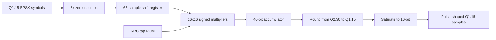

# Lab 5.6 - BPSK RRC TX FIR RTL

## Goal

Extend the executable BPSK HDL route beyond the symbol mapper and implement the actual 65-tap Q1.15 pulse-shaping FIR used by the shared Block 11 reference package.

This lab is the first real bridge from the Simulink fixed-point model into a reusable modem RTL block:

```text
Block 11 BPSK handoff -> symbol mapper -> RRC TX FIR -> future TX gain / DAC / Zynq integration
```

## Executable HDL package

| File | Purpose |
|---|---|
| `blocks/block_05_fpga_hdl_flow/rtl/bpsk_rrc_tx_fir.v` | 65-tap Q1.15 pulse-shaping FIR for I/Q streams |
| `blocks/block_05_fpga_hdl_flow/rtl/bpsk_rrc_tx_fir_taps.mem` | generated coefficient ROM image derived from `rrc_taps_q15.txt` |
| `blocks/block_05_fpga_hdl_flow/python/generate_bpsk_rrc_tx_fir_vectors.py` | regenerates the tap memory and deterministic test vectors |
| `blocks/block_05_fpga_hdl_flow/tb/tb_bpsk_rrc_tx_fir.v` | self-checking Verilog testbench |
| `blocks/block_05_fpga_hdl_flow/tb/bpsk_rrc_tx_fir_input_vectors.txt` | generated Q1.15 upsampled mapper output |
| `blocks/block_05_fpga_hdl_flow/tb/bpsk_rrc_tx_fir_expected_vectors.txt` | generated Q1.15 FIR reference output |

Run from the repository root:

```bash
python blocks/block_05_fpga_hdl_flow/python/generate_bpsk_rrc_tx_fir_vectors.py

iverilog -g2012 \
  -o blocks/block_05_fpga_hdl_flow/tb/tb_bpsk_rrc_tx_fir.out \
  blocks/block_05_fpga_hdl_flow/rtl/bpsk_rrc_tx_fir.v \
  blocks/block_05_fpga_hdl_flow/tb/tb_bpsk_rrc_tx_fir.v

vvp blocks/block_05_fpga_hdl_flow/tb/tb_bpsk_rrc_tx_fir.out
```

Expected result:

```text
PASS: bpsk_rrc_tx_fir test completed without errors
```

## Shared inputs

The lab intentionally uses the same shared package as Block 4.4:

| Shared file | Role in this RTL step |
|---|---|
| `tx_symbols_q15.txt` | deterministic symbol stream after BPSK mapping |
| `rrc_taps_q15.txt` | exact 65-tap pulse-shaping coefficients |
| `config.json` | provides `samples_per_symbol = 8` for zero insertion |

The Python generator upsamples the symbols, appends the flush tail, computes the fixed-point FIR response, and writes both the test vectors and the ROM memory file.

## Datapath



## Fixed-point contract

| Item | Value |
|---|---:|
| Input sample format | signed Q1.15 |
| Coefficient format | signed Q1.15 |
| Product format | signed Q2.30 |
| Number of taps | 65 |
| Minimum guard bits | `ceil(log2(65)) = 7` |
| Accumulator width in RTL | 40 bits |
| Output format | signed Q1.15 with saturation |

## Relation to Simulink

Block 4.4 already verifies the same pulse-shaping path in Simulink with the shared `rrc_taps_q15` coefficients.

This lab reuses the exact same taps and symbol stream, so the next integration step can compare:

1. MATLAB/Simulink output;
2. RTL simulation output;
3. eventual Zynq TX sample capture.

## Report checklist

- [ ] Show that the same `rrc_taps_q15.txt` file feeds both Simulink and RTL.
- [ ] State the accumulator width and rounding rule.
- [ ] Explain why `NTAPS = 65` needs more than the 4-tap demo architecture.
- [ ] Include the `PASS` log from the self-checking testbench.
- [ ] State what block comes next: TX gain / framing or RX matched filter.

## Engineering conclusion template

```text
The BPSK TX FIR RTL consumes the shared Block 11 Q1.15 symbols and 65-tap RRC coefficients.
The design uses a 40-bit accumulator and rounds back to Q1.15 with saturation.
This block is now the pulse-shaping anchor between the symbol mapper and the future Zynq transmit chain.
```
