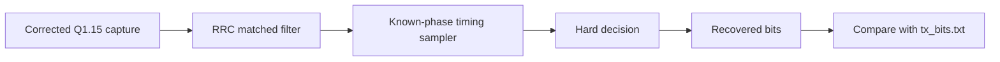

# Lab 5.8 - BPSK RX matched filter and bit recovery

## Goal

Turn the deterministic Block 11 synthetic capture into a reproducible receive-side RTL chain:

```text
corrected capture -> RRC matched filter -> fixed-phase symbol timing -> hard decision -> recovered bits
```

This is the first executable BER-oriented RX anchor in the HDL route.

## Executable HDL package

| File | Purpose |
|---|---|
| `blocks/block_05_fpga_hdl_flow/rtl/bpsk_rrc_rx_fir.v` | RX-side wrapper around the shared 65-tap RRC FIR |
| `blocks/block_05_fpga_hdl_flow/rtl/bpsk_symbol_timing_sampler.v` | selects one symbol sample every `8` samples after the known start offset |
| `blocks/block_05_fpga_hdl_flow/rtl/bpsk_hard_decision.v` | maps the sampled symbol sign to bit `0/1` |
| `blocks/block_05_fpga_hdl_flow/python/generate_bpsk_rx_bit_recovery_vectors.py` | generates corrected-capture vectors and expected recovered bits |
| `blocks/block_05_fpga_hdl_flow/tb/tb_bpsk_rx_bit_recovery.v` | self-checking RX recovery testbench |

Run from the repository root:

```bash
python blocks/block_05_fpga_hdl_flow/python/generate_bpsk_rx_bit_recovery_vectors.py

iverilog -g2012 \
  -o blocks/block_05_fpga_hdl_flow/tb/tb_bpsk_rx_bit_recovery.out \
  blocks/block_05_fpga_hdl_flow/rtl/bpsk_rrc_tx_fir.v \
  blocks/block_05_fpga_hdl_flow/rtl/bpsk_rrc_rx_fir.v \
  blocks/block_05_fpga_hdl_flow/rtl/bpsk_symbol_timing_sampler.v \
  blocks/block_05_fpga_hdl_flow/rtl/bpsk_hard_decision.v \
  blocks/block_05_fpga_hdl_flow/tb/tb_bpsk_rx_bit_recovery.v

vvp blocks/block_05_fpga_hdl_flow/tb/tb_bpsk_rx_bit_recovery.out
```

Expected result:

```text
PASS: bpsk_rx_bit_recovery completed without errors
```

## Shared inputs from Block 11

| Shared file | Role |
|---|---|
| `end_to_end_bpsk_reference_v1.ci16` | deterministic synthetic captured burst |
| `sample_plan.json` | known matched-filter sampling start and `samples_per_symbol` |
| `tx_bits.txt` | expected bit sequence for BER comparison |
| `rrc_taps_q15.txt` | matched-filter coefficients |

The Python generator applies the same CFO/phase correction used by the MATLAB reference, appends the FIR flush tail, and emits a deterministic Q1.15 input stream for the RTL testbench.

## Datapath



## Why this stage matters

The TX chain is no longer enough once the course moves toward BER. A BER-oriented modem route needs:

1. deterministic matched filtering;
2. reproducible symbol selection;
3. explicit bit decisions;
4. bit-for-bit comparison against the known source frame.

This lab provides all four in a single executable HDL check.

## Fixed assumptions

This first RX recovery lab intentionally uses known reference values rather than a blind synchronizer:

- CFO and phase are corrected offline before the RTL testbench starts;
- symbol timing uses the known `matched_filter_sample_start`;
- the threshold is fixed at zero for BPSK hard decisions.

That makes the chain simple enough to verify before later blocks introduce timing and carrier recovery loops.

## Report checklist

- [ ] State that the RX matched filter reuses the same `rrc_taps_q15.txt` as the TX FIR.
- [ ] Show the configured start offset from `sample_plan.json`.
- [ ] Explain why this lab uses fixed timing instead of a synchronizer.
- [ ] Include the recovered-bit pass log and the total/payload error counts.
- [ ] State what comes next: framed burst control or true synchronization blocks.

## Engineering conclusion template

```text
The RX HDL chain reused the shared RRC coefficients and recovered the deterministic BPSK frame without bit errors.
Symbol selection used the known matched-filter start offset and one sample every eight clocks.
This provides the first executable HDL BER anchor before moving to framed Zynq TX/RX integration.
```

## Timing-recovery extension (Lab 5.8b) — what comes next

The fixed-phase decimator above assumes exactly 8 samples per symbol. On a real
AD9361 sample path that assumption can be off by a fraction of a percent, so the
sampling instant drifts across a 281-symbol burst and BER floors at ~40 % even in a
coherent loopback (no carrier offset). The course therefore adds a drop-in
**Gardner symbol timing-recovery loop** that tracks the drift:

- a decrementing modulo-1 NCO at 2 strobes/symbol, a linear interpolator
  (`mu ≈ nco<<2`), a **sign-Gardner** timing-error detector
  `e = sgn(y_mid)·sgn(y_on[k]−y_on[k−1])` (amplitude-independent), and a PI loop
  filter with power-of-two gains (`k1 = 1/256`, `k2 = 1/4096`) — no multipliers in
  the loop.

Reference models and RTL, all bit-exact with each other:

| Artifact | Path |
| --- | --- |
| Float + fixed-point Python models (+ demo) | `python/bpsk_timing_recovery_model.py` |
| MATLAB float + fixed-point models | `matlab/bpsk_timing_recovery_model.m` |
| Simulink build script (HDL-Coder MATLAB Function block) | `simulink/bpsk_timing_recovery_build_simulink.m` |
| Synthesizable RTL | `rtl/bpsk_symbol_timing_recovery.v` |
| Vector generator | `python/generate_bpsk_timing_recovery_vectors.py` |
| Bit-exact HDL check | `tb/tb_bpsk_symbol_timing_recovery.v` |
| Full-chain BER check (TR vs fixed-phase) | `tb/tb_bpsk_zynq_ber_timing_recovery.v` |

`bpsk_rx_bit_recovery_chain` selects between the two via `parameter TIMING_RECOVERY`
(0 = this lab's fixed-phase sampler, 1 = the Gardner loop); the runtime AD9361
bridge sets it to 1. Running `python/bpsk_timing_recovery_model.py` prints the
float / fixed-point / fixed-phase BER table on a drifted burst — both
timing-recovery models reach BER 0 where the fixed-phase decimator does not.
