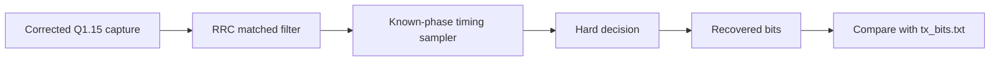

# Lab 5.8 - BPSK RX matched filter and bit recovery

## Goal

Turn the deterministic Block 11 synthetic capture into a reproducible receive-side RTL chain:

```text
corrected capture -> RRC matched filter -> fixed-phase symbol timing -> hard decision -> recovered bits
```

This is the first executable BER-oriented RX anchor in the HDL route.

## Executable HDL package

| File | Purpose |
|---|---|
| `blocks/block_05_fpga_hdl_flow/rtl/bpsk_rrc_rx_fir.v` | RX-side wrapper around the shared 65-tap RRC FIR |
| `blocks/block_05_fpga_hdl_flow/rtl/bpsk_symbol_timing_sampler.v` | selects one symbol sample every `8` samples after the known start offset |
| `blocks/block_05_fpga_hdl_flow/rtl/bpsk_hard_decision.v` | maps the sampled symbol sign to bit `0/1` |
| `blocks/block_05_fpga_hdl_flow/python/generate_bpsk_rx_bit_recovery_vectors.py` | generates corrected-capture vectors and expected recovered bits |
| `blocks/block_05_fpga_hdl_flow/tb/tb_bpsk_rx_bit_recovery.v` | self-checking RX recovery testbench |

Run from the repository root:

```bash
python blocks/block_05_fpga_hdl_flow/python/generate_bpsk_rx_bit_recovery_vectors.py

iverilog -g2012 \
  -o blocks/block_05_fpga_hdl_flow/tb/tb_bpsk_rx_bit_recovery.out \
  blocks/block_05_fpga_hdl_flow/rtl/bpsk_rrc_tx_fir.v \
  blocks/block_05_fpga_hdl_flow/rtl/bpsk_rrc_rx_fir.v \
  blocks/block_05_fpga_hdl_flow/rtl/bpsk_symbol_timing_sampler.v \
  blocks/block_05_fpga_hdl_flow/rtl/bpsk_hard_decision.v \
  blocks/block_05_fpga_hdl_flow/tb/tb_bpsk_rx_bit_recovery.v

vvp blocks/block_05_fpga_hdl_flow/tb/tb_bpsk_rx_bit_recovery.out
```

Expected result:

```text
PASS: bpsk_rx_bit_recovery completed without errors
```

## Shared inputs from Block 11

| Shared file | Role |
|---|---|
| `end_to_end_bpsk_reference_v1.ci16` | deterministic synthetic captured burst |
| `sample_plan.json` | known matched-filter sampling start and `samples_per_symbol` |
| `tx_bits.txt` | expected bit sequence for BER comparison |
| `rrc_taps_q15.txt` | matched-filter coefficients |

The Python generator applies the same CFO/phase correction used by the MATLAB reference, appends the FIR flush tail, and emits a deterministic Q1.15 input stream for the RTL testbench.

## Datapath


```mermaid
flowchart LR
    CAP[Corrected Q1.15 capture] --> MF[RRC matched filter]
    MF --> TS[Known-phase timing sampler]
    TS --> HD[Hard decision]
    HD --> BITS[Recovered bits]
    BITS --> CMP[Compare with tx_bits.txt]
```

## Why this stage matters

The TX chain is no longer enough once the course moves toward BER. A BER-oriented modem route needs:

1. deterministic matched filtering;
2. reproducible symbol selection;
3. explicit bit decisions;
4. bit-for-bit comparison against the known source frame.

This lab provides all four in a single executable HDL check.

## Fixed assumptions

This first RX recovery lab intentionally uses known reference values rather than a blind synchronizer:

- CFO and phase are corrected offline before the RTL testbench starts;
- symbol timing uses the known `matched_filter_sample_start`;
- the threshold is fixed at zero for BPSK hard decisions.

That makes the chain simple enough to verify before later blocks introduce timing and carrier recovery loops.

## What to expect

```text
PASS: bpsk_rx_bit_recovery completed without errors (281 bits, payload errors 0)
```

`tb/bpsk_rx_bit_recovery_meta.txt` holds the contract: `start_offset = 450` samples, `sps = 8`, 281 frame bits of which the first 25 are preamble, so 256 payload bits are scored.

The course runner generates the vectors, compiles, simulates and turns any `FAIL` line or non-zero simulator exit into an error:

```bash
python tools/run_block5_hdl_smoke.py --test tb_bpsk_rx_bit_recovery
```

## Exercises

Each exercise below is a deliberate one-line RTL mutation. Make it, run the bench, read the messages, then restore the file (`git checkout -- <file>`). The quoted outputs were observed with Icarus Verilog 12.0.

1. Flip the hard-decision polarity in `bpsk_hard_decision.v`: `out_bit <= (in_i >= 0);`. Every bit is wrong: `FAIL: bpsk_rx_bit_recovery completed with total/payload errors = 281 / 256`. Keep this mutation in mind: Lab 5.10 shows a top-level that survives it.
2. The sampler takes one sample per symbol at a fixed offset. Edit `start_offset` in `tb/bpsk_rx_bit_recovery_meta.txt` and rerun with `--no-generate` (so the file is not regenerated). Observed: 451 (one sample late) still passes; 454 gives `total/payload errors = 68 / 64` and 446 gives `72 / 64`. Half a symbol off, about a quarter of the bits are wrong. Explain both results from the eye diagram of an RRC-filtered BPSK signal: how wide is the open part of the eye?
3. Why can the matched filter use the same taps as the TX filter? What would change if the channel added a phase rotation (compare with Lab 8.2)?

## Report checklist

- [ ] State that the RX matched filter reuses the same `rrc_taps_q15.txt` as the TX FIR.
- [ ] Show the configured start offset from `sample_plan.json`.
- [ ] Explain why this lab uses fixed timing instead of a synchronizer.
- [ ] Include the recovered-bit pass log and the total/payload error counts.
- [ ] State what comes next: framed burst control or true synchronization blocks.

## Engineering conclusion template

```text
The RX HDL chain reused the shared RRC coefficients and recovered the deterministic BPSK frame without bit errors.
Symbol selection used the known matched-filter start offset and one sample every eight clocks.
This provides the first executable HDL BER anchor before moving to framed Zynq TX/RX integration.
```

## Timing-recovery extension (Lab 5.8b) — what comes next

The fixed-phase decimator above assumes exactly 8 samples per symbol. On a real
AD9361 sample path that assumption can be off by a fraction of a percent, so the
sampling instant drifts across a 281-symbol burst and BER floors at ~40 % even in a
coherent loopback (no carrier offset). The course therefore adds a drop-in
**Gardner symbol timing-recovery loop** that tracks the drift:

- a decrementing modulo-1 NCO at 2 strobes/symbol, a linear interpolator
  (`mu ≈ nco<<2`), a **sign-Gardner** timing-error detector
  `e = sgn(y_mid)·sgn(y_on[k]−y_on[k−1])` (amplitude-independent), and a PI loop
  filter with power-of-two gains (`k1 = 1/256`, `k2 = 1/4096`) — no multipliers in
  the loop.

Reference models and RTL, all bit-exact with each other:

| Artifact | Path |
| --- | --- |
| Float + fixed-point Python models (+ demo) | `python/bpsk_timing_recovery_model.py` |
| MATLAB float + fixed-point models | `matlab/bpsk_timing_recovery_model.m` |
| Simulink build script (HDL-Coder MATLAB Function block) | `simulink/bpsk_timing_recovery_build_simulink.m` |
| Synthesizable RTL | `rtl/bpsk_symbol_timing_recovery.v` |
| Vector generator | `python/generate_bpsk_timing_recovery_vectors.py` |
| Bit-exact HDL check | `tb/tb_bpsk_symbol_timing_recovery.v` |
| Full-chain BER check (TR vs fixed-phase) | `tb/tb_bpsk_zynq_ber_timing_recovery.v` |
| One-clock vs pipelined loop, symbol for symbol | `tb/tb_bpsk_symbol_timing_recovery_equivalence.v` |

`bpsk_rx_bit_recovery_chain` selects between the two via `parameter TIMING_RECOVERY`
(0 = this lab's fixed-phase sampler, 1 = the Gardner loop). The Block 11 runtime
bridge keeps 0: on its short, gap-free loopback burst the loop mis-tracks and does worse
than the fixed phase, so the loop is meant for genuinely drifted streams. Running `python/bpsk_timing_recovery_model.py` prints the
float / fixed-point / fixed-phase BER table on a drifted burst — both
timing-recovery models reach BER 0 where the fixed-phase decimator does not.

### Implementing the loop at 100 MHz

The loop is a recursion over one sample: at a strobe, the interpolation multiply, the timing error
and the loop filter must produce the next NCO step before the next sample needs it. Written that
way (`PIPELINED = 0`), Vivado places and routes it at about 52 MHz on the course part, 9.4 ns
short of a 100 MHz clock
([report](https://github.com/Lay007/zynq-sdr-course/blob/main/reports/fpga/block5-bpsk-vivado-evidence.md)).
The default `PIPELINED = 1` meets 100 MHz (+0.335 ns) with the same output symbols, using two
ideas that apply to most feedback loops in a receiver:

- **Use the slack the algorithm already has.** The next strobe is at least three samples away
  (`3 * W_MAX <= 1.0` at 8 samples per symbol), so the symbol and the loop update can be formed
  two clocks after the strobe. The samples in between stepped the NCO with the old step; the update
  rewrites the NCO as "NCO after the strobe - k * new step", with k the number of samples consumed
  since the strobe.
- **Lookahead.** The sign-Gardner error has only three values, so the three possible results of
  the loop filter are computed and registered at the strobe, and the error only selects one.

The cost is area (659 instead of 201 flip-flops). `tb/tb_bpsk_symbol_timing_recovery_equivalence.v`
runs both forms on the same drifted burst with random idle clocks and requires every output symbol
to match in I and Q:

```bash
iverilog -g2012 -o /tmp/tr_eq.vvp \
  blocks/block_05_fpga_hdl_flow/rtl/bpsk_symbol_timing_recovery.v \
  blocks/block_05_fpga_hdl_flow/tb/tb_bpsk_symbol_timing_recovery_equivalence.v
vvp /tmp/tr_eq.vvp
```

```text
PASS: bpsk_symbol_timing_recovery PIPELINED=1 equals PIPELINED=0 on all 281 symbols (I and Q values, 854 idle input clocks)
```

Exercise: in `rtl/bpsk_symbol_timing_recovery.v`, make the NCO correction ignore the sample consumed
in the clock after the strobe (`wire [1:0] k_steps = {1'b0, consume};`). The equivalence test then
fails with `symbol counts reference=281 pipelined=270, expected 281`: the loop loses track, drops
symbols, and the error is invisible to a test that only looks at the decided bits of the symbols
that do come out. Which k does the broken code use, in which clocks is it wrong, and why does
the test also fail with `-Ptb_bpsk_symbol_timing_recovery_equivalence.GAPS=0` (a sample every clock)?
