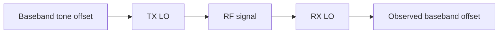

# Lab 6.1 — RF Frequency Plan

## Goal

Build a clear frequency plan for the first SDR RF experiment using a Zynq/AD9363 transmitter and an external receiver such as RTL-SDR or another SDR receiver.

The lab answers the practical question:

> Where should the useful signal appear in the receiver spectrum, and how do sample rate, LO frequency and digital offset interact?

## Basic frequency model



If the transmitter uses center frequency `f_tx` and generates a digital tone at offset `f_bb`, the RF tone appears at:

```text
f_rf = f_tx + f_bb
```

If the receiver center frequency is `f_rx`, the observed baseband offset is approximately:

```text
f_observed = f_rf - f_rx
```

Therefore:

```text
f_observed = f_tx + f_bb - f_rx
```

## Example plan

| Parameter | Value | Comment |
|---|---:|---|
| TX center frequency | 915 MHz | AD9363 TX LO |
| RX center frequency | 915 MHz | RTL-SDR/HDSDR center |
| Digital tone offset | +100 kHz | generated by FPGA/DSP |
| Expected observed offset | +100 kHz | peak should appear at +100 kHz |
| Sample rate | 2.4 MS/s | observation bandwidth |
| RF bandwidth | 2 MHz | analog chain bandwidth |

## Frequency plan variants

| Case | TX LO | Digital offset | RX LO | Expected observed offset |
|---|---:|---:|---:|---:|
| Same LO | 915 MHz | +100 kHz | 915 MHz | +100 kHz |
| RX shifted up | 915 MHz | +100 kHz | 915.05 MHz | +50 kHz |
| RX shifted down | 915 MHz | +100 kHz | 914.95 MHz | +150 kHz |
| Negative tone | 915 MHz | -100 kHz | 915 MHz | -100 kHz |

## Aliasing and bandwidth check

The expected observed offset must be inside the receiver Nyquist range:

```text
|f_observed| < Fs_rx / 2
```

For `Fs_rx = 2.4 MS/s`:

```text
|f_observed| < 1.2 MHz
```

Add margin for analog filters and receiver imperfections. Do not place the test tone too close to the band edge.

## Practical procedure

1. Select a legal and safe test frequency for your lab environment.
2. Select TX LO and RX LO.
3. Select a small digital tone offset, for example 50–200 kHz.
4. Check that the expected offset is inside the receiver bandwidth.
5. Start with low TX gain and external attenuation.
6. Observe the spectrum.
7. Record actual peak frequency.
8. Estimate frequency error.

## Frequency error

```text
frequency_error = measured_peak - expected_peak
```

Possible contributors:

- LO frequency error;
- receiver oscillator offset;
- sample-rate error;
- FFT bin resolution;
- sign convention mistakes;
- wrong IQ swap or conjugation.

## Report checklist

- [ ] State TX center frequency.
- [ ] State RX center frequency.
- [ ] State digital tone offset.
- [ ] Compute expected observed offset.
- [ ] State sample rate and RF bandwidth.
- [ ] Verify Nyquist margin.
- [ ] Record measured peak frequency.
- [ ] Estimate frequency error.
- [ ] Explain possible error sources.

## Engineering conclusion template

```text
The planned RF tone is at ____ MHz and should appear at ____ kHz in the receiver baseband.
The measured peak is ____ kHz, giving a frequency error of ____ Hz.
The result confirms / does not confirm the frequency plan because ______.
```
