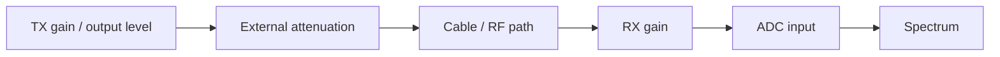

# Lab 6.2 — Gain Staging and Overload

## Goal

Learn how to choose safe RF levels, observe overload symptoms and document gain settings for repeatable SDR experiments.

The lab answers the practical question:

> How do we know whether the RF receiver is seeing a clean signal or an overloaded/distorted one?

## RF level chain



## Safe starting point

Use conservative settings for the first cabled experiment:

| Item | Recommended start | Comment |
|---|---:|---|
| TX gain | minimum or strongly reduced | avoid receiver damage/overload |
| External attenuation | 30–60 dB | mandatory for direct cable tests |
| RX gain | low/manual | disable AGC for repeatability |
| Signal type | single tone | easiest overload indicator |
| Tone offset | 50–200 kHz | away from DC and band edge |
| Observation span | within RX bandwidth | avoid edge effects |

!!! warning "Do not skip attenuation"
    A direct TX-to-RX cable without attenuation can overload or damage a sensitive receiver. Start with more attenuation than you think you need.

## Normal vs overloaded spectrum

| Observation | Normal mode | Overload mode |
|---|---|---|
| Main tone | narrow stable peak | distorted or flat-topped region |
| Harmonics | absent or low | strong harmonics/spurs |
| Noise floor | stable | rises with signal level |
| Gain response | predictable | compressed or unchanged |
| Time waveform | sinusoidal-like | clipped / squared |

## Gain sweep procedure

1. Configure a fixed frequency plan from Lab 6.1.
2. Set external attenuation.
3. Disable AGC if possible.
4. Start with low TX gain and low RX gain.
5. Record the main peak level and noise floor.
6. Increase RX gain in small steps.
7. Stop when overload symptoms appear.
8. Return to the last clean setting.
9. Repeat for TX gain if needed.

## Measurement table

| Step | TX gain | RX gain | External attenuation | Peak level | Noise floor | Spur level | Verdict |
|---:|---:|---:|---:|---:|---:|---:|---|
| 1 |  |  |  |  |  |  | clean / overload |
| 2 |  |  |  |  |  |  | clean / overload |
| 3 |  |  |  |  |  |  | clean / overload |
| 4 |  |  |  |  |  |  | clean / overload |

## Simple overload metrics

### Headroom estimate

```text
headroom = clipping_level - peak_level
```

### Spur-free dynamic range estimate

```text
SFDR = main_peak_level - largest_spur_level
```

### Signal-to-noise estimate

```text
SNR = main_peak_level - noise_floor_level
```

These estimates are spectrum-display approximations. For rigorous work, define bandwidth, window, averaging and calibration method.

## Common mistakes

| Mistake | Result | Fix |
|---|---|---|
| AGC enabled during measurement | gain changes during experiment | use manual gain |
| no external attenuation | overload or damage risk | add attenuator |
| tone too close to DC | DC spur hides signal | shift tone away from DC |
| tone near band edge | filter roll-off changes level | move tone toward center |
| only screenshot, no settings | experiment cannot be reproduced | record metadata |

## Report checklist

- [ ] Draw the RF level chain.
- [ ] State TX/RX frequencies.
- [ ] State TX/RX gains.
- [ ] State external attenuation.
- [ ] State sample rate and bandwidth.
- [ ] Record clean spectrum observation.
- [ ] Record overload spectrum observation or safe margin.
- [ ] Choose recommended safe setting.
- [ ] Attach IQ metadata.

## Engineering conclusion template

```text
The clean operating region was observed for TX gain ____ and RX gain ____ with ____ dB external attenuation.
Overload symptoms appeared at ______. The recommended setting is ______ because it provides stable peak level,
low spur content and enough headroom for repeatable measurements.
```
