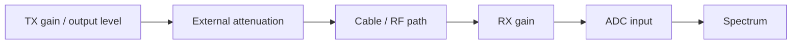

# Lab 6.2 — Gain Staging and Overload

## Goal

Learn how to choose safe RF levels, observe overload symptoms and document gain settings for repeatable SDR experiments.

The lab answers the practical question:

> How do we know whether the RF receiver is seeing a clean signal or an overloaded/distorted one?

## RF level chain


```mermaid
flowchart LR
    TXGAIN[TX gain / output level] --> ATT[External attenuation]
    ATT --> CABLE[Cable / RF path]
    CABLE --> RXGAIN[RX gain]
    RXGAIN --> ADC[ADC input]
    ADC --> FFT[Spectrum]
```

## Safe starting point

Use conservative settings for the first cabled experiment:

| Item | Recommended start | Comment |
|---|---:|---|
| TX gain | minimum or strongly reduced | avoid receiver damage/overload |
| External attenuation | 30–60 dB | mandatory for direct cable tests |
| RX gain | low/manual | disable AGC for repeatability |
| Signal type | single tone | easiest overload indicator |
| Tone offset | 50–200 kHz | away from DC and band edge |
| Observation span | within RX bandwidth | avoid edge effects |

!!! warning "Do not skip attenuation"
    A direct TX-to-RX cable without attenuation can overload or damage a sensitive receiver. Start with more attenuation than you think you need.

## Normal vs overloaded spectrum

| Observation | Normal mode | Overload mode |
|---|---|---|
| Main tone | narrow stable peak | distorted or flat-topped region |
| Harmonics | absent or low | strong harmonics/spurs |
| Noise floor | stable | rises with signal level |
| Gain response | predictable | compressed or unchanged |
| Time waveform | sinusoidal-like | clipped / squared |

## Gain sweep procedure

1. Configure a fixed frequency plan from Lab 6.1.
2. Set external attenuation.
3. Disable AGC if possible.
4. Start with low TX gain and low RX gain.
5. Record the main peak level and noise floor.
6. Increase RX gain in small steps.
7. Stop when overload symptoms appear.
8. Return to the last clean setting.
9. Repeat for TX gain if needed.

## Measurement table

| Step | TX gain | RX gain | External attenuation | Peak level | Noise floor | Spur level | Verdict |
|---:|---:|---:|---:|---:|---:|---:|---|
| 1 |  |  |  |  |  |  | clean / overload |
| 2 |  |  |  |  |  |  | clean / overload |
| 3 |  |  |  |  |  |  | clean / overload |
| 4 |  |  |  |  |  |  | clean / overload |

## Simple overload metrics

### Headroom estimate

```text
headroom = clipping_level - peak_level
```

### Spur-free dynamic range estimate

```text
SFDR = main_peak_level - largest_spur_level
```

### Signal-to-noise estimate

```text
SNR = main_peak_level - noise_floor_level
```

These estimates are spectrum-display approximations. For rigorous work, define bandwidth, window, averaging and calibration method.

## Software check without hardware (synthetic)

`lab_6_2_gain_overload_sweep.py` turns captures into the measurement table above. Before you have a board, run its self-test. It uses **synthetic** captures (a tone whose amplitude follows a simulated gain, plus fixed noise, clipped at +/-1.0 per I and Q), every row is marked `[SYNTHETIC]`, and none of it is a hardware measurement:

```bash
python blocks/block_06_rf_frontend_and_ad9363/python/lab_6_2_gain_overload_sweep.py --self-test --output lab62_selftest.json --markdown-output lab62_selftest.md
```

| Sim gain | Observed peak | SNR (peak / median bin) | SFDR (peak / largest other bin) | Flag |
|---:|---:|---:|---:|---|
| -20 dB | -26.56 dBFS | 25.1 dB | 13.1 dB | none |
| -10 dB | -27.29 dBFS | 35.5 dB | 23.6 dB | none |
| 0 dB | -23.67 dBFS | 45.6 dB | 34.7 dB | none |
| 20 dB | -9.50 dBFS | 65.6 dB | 54.8 dB | none |
| 30 dB | -0.15 dBFS | 75.4 dB | 64.1 dB | marginal |
| 34 dB | +2.75 dBFS | 79.6 dB | 19.1 dB | clipping |

What the synthetic rows teach, before any real capture:

- **At -20 and -10 dB the "observed peak" is the noise, not the tone.** The tone amplitude is 0.003 and 0.0095, but the largest noise sample over 8192 points is about 0.047 (the -26.56 dBFS peak). The peak does not even rise between those two rows.
- **The median-based SNR keeps rising through clipping** (75.4 dB at 30 dB, 79.6 dB at 34 dB). Clipping puts its power into a few harmonic bins, and the median of all bins hardly moves. **SFDR collapses from 64.1 to 19.1 dB**: that is the overload signature in the spectrum.
- **+2.75 dBFS is possible** because the peak is the complex magnitude, while full scale is defined per I and Q. A tone clipped on both rails has a corner at sqrt(2), about +3 dBFS.
- The 30 dB row does not clip yet, but its peak is within 1 dB of full scale, so it is flagged `marginal` and not recommended.

In this model the noise is added after the gain, like ADC noise, so the SNR grows dB for dB with gain. In a real receiver the front-end noise is amplified together with the signal, so the SNR stops improving once that noise dominates. Finding that knee is what the hardware sweep is for.

## Exercises

1. Explain from the table why a gain sweep judged only by the median SNR would pick the clipping point as the best setting.
2. In `synthetic_capture()`, change the noise so that it is scaled by the same gain as the tone (a front-end-noise model). Predict the SNR and SFDR columns, then run it.
3. Add a two-tone test (two tones 10 bins apart) and find the gain where third-order intermodulation products first rise above the noise. Is that lower or higher than the gain where the clipping counter becomes non-zero?
4. When you have a real capture, write a manifest for `--manifest` and compare the real SNR/SFDR-vs-gain curve with the synthetic one. Where is the knee?


## Common mistakes

| Mistake | Result | Fix |
|---|---|---|
| AGC enabled during measurement | gain changes during experiment | use manual gain |
| no external attenuation | overload or damage risk | add attenuator |
| tone too close to DC | DC spur hides signal | shift tone away from DC |
| tone near band edge | filter roll-off changes level | move tone toward center |
| only screenshot, no settings | experiment cannot be reproduced | record metadata |

## Report checklist

- [ ] Draw the RF level chain.
- [ ] State TX/RX frequencies.
- [ ] State TX/RX gains.
- [ ] State external attenuation.
- [ ] State sample rate and bandwidth.
- [ ] Record clean spectrum observation.
- [ ] Record overload spectrum observation or safe margin.
- [ ] Choose recommended safe setting.
- [ ] Attach IQ metadata.

## Engineering conclusion template

```text
The clean operating region was observed for TX gain ____ and RX gain ____ with ____ dB external attenuation.
Overload symptoms appeared at ______. The recommended setting is ______ because it provides stable peak level,
low spur content and enough headroom for repeatable measurements.
```
