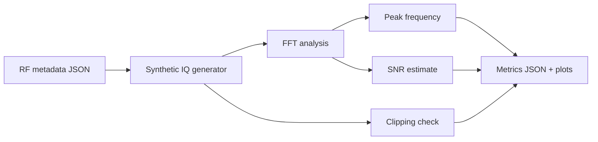

# Lab 6.4 — Synthetic RF Capture Analysis

## Goal

Validate the RF capture analysis workflow before using real IQ recordings from an AD9363/RTL-SDR/HDSDR experiment.

The lab answers the practical question:

> Can we take an RF metadata file, generate or load an IQ capture, estimate peak frequency, frequency error, SNR and overload indicators, and produce a repeatable report artifact?

## Executable files

| File | Purpose |
|---|---|
| `blocks/block_06_rf_frontend_and_ad9363/python/lab_6_4_synthetic_rf_capture_analysis.py` | synthetic IQ generation and analysis |
| `blocks/block_06_rf_frontend_and_ad9363/assets/example_first_rf_capture_metadata.json` | RF capture metadata example |

Run from the repository root:

```bash
python blocks/block_06_rf_frontend_and_ad9363/python/lab_6_4_synthetic_rf_capture_analysis.py
```

Optional: also write a synthetic CI16 IQ file:

```bash
python blocks/block_06_rf_frontend_and_ad9363/python/lab_6_4_synthetic_rf_capture_analysis.py --write-iq
```

## Generated outputs

The script writes analysis artifacts to `docs/assets`:

```text
docs/assets/lab64_synthetic_rf_capture_fft.png
docs/assets/lab64_synthetic_rf_capture_time.png
docs/assets/lab64_synthetic_rf_capture_metrics.json
```

With `--write-iq`, it also writes:

```text
blocks/block_06_rf_frontend_and_ad9363/assets/synthetic_first_rf_capture.ci16
```

## Processing chain



## Metrics

| Metric | Meaning |
|---|---|
| `expected_offset_hz` | expected baseband location from frequency plan |
| `measured_peak_hz` | strongest observed FFT component |
| `frequency_error_hz` | measured peak minus expected offset |
| `peak_dbfs` | estimated tone level |
| `noise_floor_dbfs` | median spectrum floor outside excluded bins |
| `snr_db` | peak level minus noise floor estimate |
| `clipping_count` | number of clipped I/Q samples after CI16 quantization |
| `overload_flag` | quick warning based on clipping, peak level or poor SNR |

## Why synthetic first?

Synthetic capture analysis is useful because it lets the student debug the processing workflow before dealing with real RF uncertainty:

- wrong frequency sign convention;
- FFT normalization mistakes;
- metadata parsing errors;
- missing sample-rate information;
- incorrect CI16 I/Q ordering;
- plotting problems;
- report automation problems.

## Transition to real IQ data

After this lab works, replace the synthetic generator with a real IQ reader:

```text
metadata JSON + real capture.ci16 -> FFT -> metrics -> report
```

The same metadata fields should remain valid:

- sample rate;
- IQ format;
- center frequencies;
- expected offset;
- RF bandwidth;
- gain settings;
- external attenuation;
- overload notes.

## Report checklist

- [ ] Attach or reference metadata JSON.
- [ ] State expected baseband offset.
- [ ] Record measured FFT peak.
- [ ] Compute frequency error.
- [ ] Estimate SNR.
- [ ] Check clipping/overload flag.
- [ ] Include FFT plot.
- [ ] Include time-domain preview.
- [ ] Explain whether the analysis is ready for real IQ data.

## Engineering conclusion template

```text
The synthetic RF capture used metadata file ______ and expected a tone at ____ Hz.
The measured peak was ____ Hz, giving a frequency error of ____ Hz.
The estimated SNR was ____ dB and clipping count was ____.
The analysis workflow is / is not ready for real RF IQ recordings because ______.
```
