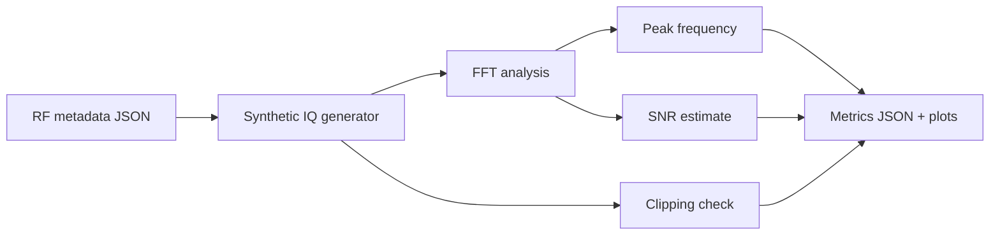

# Lab 6.4 — Synthetic RF Capture Analysis

## Goal

Validate the RF capture analysis workflow before using real IQ recordings from an AD9363/RTL-SDR/HDSDR experiment.

The lab answers the practical question:

> Can we take an RF metadata file, generate or load an IQ capture, estimate peak frequency, frequency error, SNR and overload indicators, and produce a repeatable report artifact?

## Executable files

| File | Purpose |
|---|---|
| `blocks/block_06_rf_frontend_and_ad9363/python/lab_6_4_synthetic_rf_capture_analysis.py` | synthetic IQ generation and analysis |
| `blocks/block_06_rf_frontend_and_ad9363/assets/example_first_rf_capture_metadata.json` | RF capture metadata example |

Run from the repository root:

```bash
python blocks/block_06_rf_frontend_and_ad9363/python/lab_6_4_synthetic_rf_capture_analysis.py
```

Optional: also write a synthetic CI16 IQ file:

```bash
python blocks/block_06_rf_frontend_and_ad9363/python/lab_6_4_synthetic_rf_capture_analysis.py --write-iq
```

## Generated outputs

The script writes analysis artifacts to `docs/assets`:

```text
docs/assets/lab64_synthetic_rf_capture_fft.png
docs/assets/lab64_synthetic_rf_capture_time.png
docs/assets/lab64_synthetic_rf_capture_metrics.json
```

With `--write-iq`, it also writes:

```text
blocks/block_06_rf_frontend_and_ad9363/assets/synthetic_first_rf_capture.ci16
```

## Processing chain


```mermaid
flowchart LR
    META[RF metadata JSON] --> SYNTH[Synthetic IQ generator]
    SYNTH --> FFT[FFT analysis]
    FFT --> PEAK[Peak frequency]
    FFT --> SNR[SNR estimate]
    SYNTH --> CLIP[Clipping check]
    PEAK --> REPORT[Metrics JSON + plots]
    SNR --> REPORT
    CLIP --> REPORT
```

## Metrics

| Metric | Meaning |
|---|---|
| `expected_offset_hz` | expected baseband location from frequency plan |
| `measured_peak_hz` | strongest observed FFT component |
| `frequency_error_hz` | measured peak minus expected offset |
| `peak_dbfs` | estimated tone level |
| `noise_floor_dbfs` | median spectrum floor outside excluded bins |
| `snr_db` | peak level minus noise floor estimate |
| `clipping_count` | number of clipped I/Q samples after CI16 quantization |
| `overload_flag` | quick warning based on clipping, peak level or poor SNR |

## Why synthetic first?

Synthetic capture analysis is useful because it lets the student debug the processing workflow before dealing with real RF uncertainty:

- wrong frequency sign convention;
- FFT normalization mistakes;
- metadata parsing errors;
- missing sample-rate information;
- incorrect CI16 I/Q ordering;
- plotting problems;
- report automation problems.

## Transition to real IQ data

After this lab works, replace the synthetic generator with a real IQ reader:

```text
metadata JSON + real capture.ci16 -> FFT -> metrics -> report
```

The same metadata fields should remain valid:

- sample rate;
- IQ format;
- center frequencies;
- expected offset;
- RF bandwidth;
- gain settings;
- external attenuation;
- overload notes.

## What to expect

```text
Expected offset: 100000.000 Hz
Measured peak: 100012.207 Hz
Frequency error: 12.207 Hz
Peak level: -5.82 dBFS
Noise floor: -79.88 dBFS
SNR estimate: 74.06 dB
Clipping count: 0
Overload flag: False
```

- **The 12.2 Hz error is the FFT bin quantization**, not an RF error: the analysis uses a 65 536-point FFT,
  so at 2.4 MS/s the bins are 36.6 Hz apart and the peak is read at the nearest bin. On a real capture
  the same analysis would report the transmitter and receiver oscillator offset on top of this.
- **"SNR 74 dB" is peak over median FFT bin**, so it includes the FFT processing gain of a long
  record. It is not the SNR per sample and not comparable with an SNR computed from EVM. State the
  definition whenever you report it.
- **Peak level −5.8 dBFS with zero clipping** means the synthetic capture uses about half of full
  scale; on hardware you would read this number to set RX gain.

## Exercises

1. Change `processing.fft_length` in the metadata to 16 384 and rerun. How do the frequency error
   and the "SNR" change, and why does the SNR change although the signal did not?
2. Raise the tone amplitude until the clipping counter becomes non-zero. What happens to the
   spectrum (harmonics, raised floor)?
3. Write down the expected offset for a real capture where the TX LO is 915.000 MHz, the digital
   tone is +100 kHz and the RX LO is 914.950 MHz.

## Report checklist

- [ ] Attach or reference metadata JSON.
- [ ] State expected baseband offset.
- [ ] Record measured FFT peak.
- [ ] Compute frequency error.
- [ ] Estimate SNR.
- [ ] Check clipping/overload flag.
- [ ] Include FFT plot.
- [ ] Include time-domain preview.
- [ ] Explain whether the analysis is ready for real IQ data.

## Engineering conclusion template

```text
The synthetic RF capture used metadata file ______ and expected a tone at ____ Hz.
The measured peak was ____ Hz, giving a frequency error of ____ Hz.
The estimated SNR was ____ dB and clipping count was ____.
The analysis workflow is / is not ready for real RF IQ recordings because ______.
```
