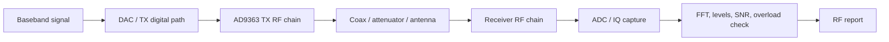
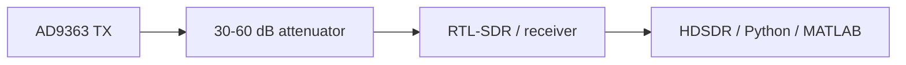

# Block 6 — RF frontend workflow

This block moves the student from digital DSP/FPGA processing to a real RF bench: frequency plan, levels, bandwidth, gain, safe connection and external signal observation.

## Main engineering chain

## Block 6 inputs

| Artifact from earlier blocks | How it is used in the RF experiment |
|---|---|
| Sample rate | defines digital bandwidth and FFT interpretation |
| Digital mixer / NCO | defines signal offset in baseband |
| FIR/decimator | defines useful bandwidth and out-of-band rejection |
| IQ metadata | records capture parameters for reproducibility |
| HDL/AXIS interface | connects FPGA streaming path to the RF chain |

## Minimum RF discipline

Before enabling transmission, record:

| Parameter | Example | Why it matters |
|---|---:|---|
| TX center frequency | 915 MHz | transmitter LO frequency |
| RX center frequency | 915 MHz | receiver LO frequency |
| Sample rate | 2.4 MS/s | digital observation bandwidth |
| RF bandwidth | 2 MHz | analog chain bandwidth |
| TX gain / attenuation | -20 dB | protects receiver from overload |
| External attenuation | 20–60 dB | safe cabled connection |
| Expected tone offset | 100 kHz | frequency-plan verification |

## Safe first-bench connection

!!! warning "RF safety"
    Do not connect TX directly to a sensitive receiver without attenuation. Start with minimum TX gain, external attenuation and overload monitoring in the spectrum.

## Normal operating signs

| Sign | Meaning |
|---|---|
| One stable peak | frequency plan is correct |
| No broad flat top | no obvious ADC/RF overload |
| Stable noise floor | gain is reasonable |
| Side spurs below the useful signal | NCO/LO/quantization do not dominate |
| Gain changes level predictably | chain is not saturated |

## Overload signs

| Symptom | Possible cause | Action |
|---|---|---|
| Wide flat spectral top | ADC/RF overload | reduce gain / add attenuation |
| Many harmonics | amplifier saturation | reduce TX power |
| Noise floor rises with signal | nonlinearity or AGC | disable AGC, reduce level |
| Peak does not change with gain | clipping/limiting | check levels and cables |
| Signal drifts in frequency | LO offset / drift | measure frequency error |

## Basic RF report

Every Block 6 experiment should contain:

1. RF experiment goal;
2. connection diagram;
3. frequency plan;
4. gain/bandwidth settings table;
5. screenshot or FFT plot of normal operation;
6. overload signs or their absence;
7. IQ metadata file;
8. engineering conclusion.

## Connection to later blocks

Block 6 prepares the real RF bench for:

- TX/RX chain experiments;
- modulation and synchronization;
- recording and analysis tools;
- integrated SDR project;
- final report with measured IQ data.
