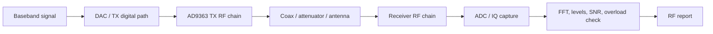
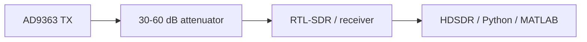

# Блок 6 — RF frontend workflow

Этот блок переводит студента от цифрового DSP/FPGA-тракта к реальному радиочастотному стенду: частотный план, уровни, полосы, усиление, безопасное подключение и наблюдение сигнала внешним приёмником.

## Главная инженерная цепочка

## Что является входом в блок 6

| Артефакт из предыдущих блоков | Как используется в RF-эксперименте |
|---|---|
| Sample rate | задаёт цифровую полосу и FFT-интерпретацию |
| Digital mixer / NCO | определяет смещение сигнала в baseband |
| FIR/decimator | задаёт полезную полосу и подавление вне полосы |
| IQ metadata | фиксирует параметры записи и воспроизводимость |
| HDL/AXIS интерфейс | связывает FPGA-поток с RF-трактом |

## Минимальная RF-дисциплина

Перед включением передачи нужно зафиксировать:

| Параметр | Пример | Зачем нужен |
|---|---:|---|
| TX center frequency | 915 MHz | частота LO передатчика |
| RX center frequency | 915 MHz | частота LO приёмника |
| Sample rate | 2.4 MS/s | цифровая ширина наблюдения |
| RF bandwidth | 2 MHz | аналоговая полоса тракта |
| TX gain / attenuation | -20 dB | защита приёмника от перегруза |
| External attenuation | 20–60 dB | безопасное кабельное соединение |
| Expected tone offset | 100 kHz | проверка частотного плана |

## Безопасная схема первого стенда

!!! warning "RF safety"
    Не соединяйте TX напрямую с чувствительным приёмником без аттенюатора. Начинайте с минимального TX gain, внешнего ослабления и контроля перегрузки по спектру.

## Признаки нормального режима

| Признак | Что означает |
|---|---|
| Один устойчивый пик | частотный план корректен |
| Нет широкого плато сверху | нет явной перегрузки ADC/RF |
| Noise floor стабилен | усиление выбрано разумно |
| Side spurs ниже полезного сигнала | NCO/LO/квантование не доминируют |
| Изменение gain меняет уровень предсказуемо | тракт не в насыщении |

## Признаки перегрузки

| Симптом | Возможная причина | Что сделать |
|---|---|---|
| Широкая “шапка” в спектре | перегруз ADC/RF | уменьшить gain / добавить attenuator |
| Много гармоник | насыщение усилителя | снизить TX power |
| Noise floor поднимается вместе с сигналом | нелинейность или AGC | отключить AGC, уменьшить уровень |
| Пик не меняется при изменении gain | ограничение/клиппинг | проверить уровни и кабели |
| Сигнал “плывёт” по частоте | LO offset / drift | измерить frequency error |

## Базовый RF-отчёт

Каждый эксперимент блока 6 должен содержать:

1. цель RF-эксперимента;
2. схему подключения;
3. частотный план;
4. таблицу gain/bandwidth settings;
5. скриншот или FFT-график нормального режима;
6. признаки перегрузки или их отсутствие;
7. IQ metadata file;
8. инженерный вывод.

## Связь с последующими блоками

Block 6 подготавливает реальный RF-стенд для:

- TX/RX chain experiments;
- modulation and synchronization;
- recording and analysis tools;
- integrated SDR project;
- final report with measured IQ data.
