# Lab 7.1 — TX/RX Chain Architecture

## Goal

Design and document a complete SDR transmit/receive chain before implementing it in code or hardware.

The lab answers the practical question:

> Which blocks are required between generated baseband samples and measured receiver metrics, and what are the interfaces between them?

## Reference architecture

```mermaid
flowchart LR
    TXSRC[TX source] --> SHAPE[Pulse shaping / TX FIR]
    SHAPE --> TXMIX[TX mixer / DUC]
    TXMIX --> TXIF[TX interface / AXIS]
    TXIF --> RF[RF frontend]
    RF --> RXIF[RX capture / IQ file]
    RXIF --> RXMIX[RX mixer / DDC]
    RXMIX --> RXFIR[RX FIR / decimator]
    RXFIR --> METRICS[FFT / SNR / EVM / BER]
```



## Architecture table

| Stage | Purpose | Input | Output | Main risk |
|---|---|---|---|---|
| TX source | generate tone/symbols/frame | parameters | complex baseband | wrong amplitude or frame structure |
| TX FIR | shape spectrum | complex samples | filtered samples | bandwidth too wide / ISI |
| TX mixer / DUC | move signal in baseband | baseband | shifted signal | wrong sign or aliasing |
| TX interface | format for FPGA/RF | Q-format samples | stream | sample alignment |
| RF frontend | convert to RF | digital stream | RF signal | overload / wrong LO |
| RX capture | record IQ | RF signal | IQ file | missing metadata |
| RX mixer / DDC | move channel to DC | IQ samples | baseband channel | frequency error |
| RX FIR/decimator | select channel | baseband | lower-rate baseband | aliasing |
| Metrics | validate chain | processed signal | numbers/plots | wrong reference alignment |

## Required design decisions

| Decision | Selected value | Justification |
|---|---|---|
| Signal type | tone / QPSK / frame |  |
| TX sample rate |  |  |
| RX sample rate |  |  |
| TX LO |  |  |
| RX LO |  |  |
| TX baseband offset |  |  |
| DDC shift |  |  |
| Main data format | float / Q1.15 / ci16 |  |
| Loopback type | digital / file / RF cable |  |
| Metrics | FFT / SNR / EVM / BER |  |

## Sample-rate plan

```text
TX source Fs -> TX shaping Fs -> DUC Fs -> RF DAC Fs
RX ADC Fs -> DDC Fs -> decimated Fs -> metrics Fs
```

Every sample-rate change must have an anti-aliasing or anti-imaging explanation.

## Frequency-plan check

The chain is consistent if:

```text
expected_rx_offset = TX_LO + TX_baseband_offset - RX_LO
DDC_shift ≈ -expected_rx_offset
```

After DDC, the useful signal should be near DC.

## Validation order

1. Pure Python/MATLAB simulation.
2. File replay with saved IQ.
3. Digital loopback.
4. RF cable loopback with attenuation.
5. External receiver observation.

## Report checklist

- [ ] Draw TX/RX chain diagram.
- [ ] Fill architecture table.
- [ ] Fill sample-rate table.
- [ ] Fill frequency-plan table.
- [ ] State data formats between blocks.
- [ ] Define loopback method.
- [ ] Define metrics.
- [ ] State what will be implemented in software and what in FPGA.

## Engineering conclusion template

```text
The selected TX/RX architecture uses ______ as the test signal and validates the chain through ______ loopback.
The expected RX baseband offset is ____ Hz and the DDC shift is ____ Hz.
The main implementation risk is ______ because ______.
```
