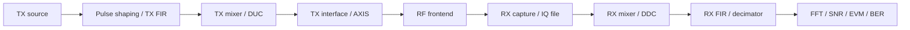

# Lab 7.1 — TX/RX Chain Architecture

## Goal

Design and document a complete SDR transmit/receive chain before implementing it in code or hardware.

The lab answers the practical question:

> Which blocks are required between generated baseband samples and measured receiver metrics, and what are the interfaces between them?

## Reference architecture


```mermaid
flowchart LR
    TXSRC[TX source] --> SHAPE[Pulse shaping / TX FIR]
    SHAPE --> TXMIX[TX mixer / DUC]
    TXMIX --> TXIF[TX interface / AXIS]
    TXIF --> RF[RF frontend]
    RF --> RXIF[RX capture / IQ file]
    RXIF --> RXMIX[RX mixer / DDC]
    RXMIX --> RXFIR[RX FIR / decimator]
    RXFIR --> METRICS[FFT / SNR / EVM / BER]
```

## Architecture table

| Stage | Purpose | Input | Output | Main risk |
|---|---|---|---|---|
| TX source | generate tone/symbols/frame | parameters | complex baseband | wrong amplitude or frame structure |
| TX FIR | shape spectrum | complex samples | filtered samples | bandwidth too wide / ISI |
| TX mixer / DUC | move signal in baseband | baseband | shifted signal | wrong sign or aliasing |
| TX interface | format for FPGA/RF | Q-format samples | stream | sample alignment |
| RF frontend | convert to RF | digital stream | RF signal | overload / wrong LO |
| RX capture | record IQ | RF signal | IQ file | missing metadata |
| RX mixer / DDC | move channel to DC | IQ samples | baseband channel | frequency error |
| RX FIR/decimator | select channel | baseband | lower-rate baseband | aliasing |
| Metrics | validate chain | processed signal | numbers/plots | wrong reference alignment |

## Required design decisions

| Decision | Selected value | Justification |
|---|---|---|
| Signal type | tone / QPSK / frame |  |
| TX sample rate |  |  |
| RX sample rate |  |  |
| TX LO |  |  |
| RX LO |  |  |
| TX baseband offset |  |  |
| DDC shift |  |  |
| Main data format | float / Q1.15 / ci16 |  |
| Loopback type | digital / file / RF cable |  |
| Metrics | FFT / SNR / EVM / BER |  |

## Sample-rate plan

```text
TX source Fs -> TX shaping Fs -> DUC Fs -> RF DAC Fs
RX ADC Fs -> DDC Fs -> decimated Fs -> metrics Fs
```

Every sample-rate change must have an anti-aliasing or anti-imaging explanation.

## Frequency-plan check

The chain is consistent if:

```text
expected_rx_offset = TX_LO + TX_baseband_offset - RX_LO
DDC_shift ≈ -expected_rx_offset
```

After DDC, the useful signal should be near DC.

## Validation order

1. Pure Python/MATLAB simulation.
2. File replay with saved IQ.
3. Digital loopback.
4. RF cable loopback with attenuation.
5. External receiver observation.

## Worked example: where each stage is verified in this course

Every stage of the architecture table already has a lab in which its behaviour was measured by running code. Use them as the reference numbers for your own design:

| Stage | Lab | Verified result |
|---|---|---|
| TX / RX FIR | [Lab 3.2](/zynq-sdr-course/en/labs/lab-3-2-fir-low-pass/), [Lab 5.6](/zynq-sdr-course/en/labs/lab-5-6-bpsk-rrc-tx-fir-rtl/) | 129-tap low-pass: -3 dB at 240.3 kHz, Q1.15 stopband -71.0 dB (float -89.7 dB); RRC TX FIR RTL latency 9 cycles |
| Mixer / DUC / DDC | [Lab 3.3](/zynq-sdr-course/en/labs/lab-3-3-digital-mixing/), [Lab 4.2](/zynq-sdr-course/en/labs/lab-4-2-fixed-point-digital-mixer/) | wrong shift sign puts the tone at 840 kHz instead of 0 Hz; 24-bit NCO error of 0.0286 Hz is already 0.14 % EVM over 13.7 ms |
| Decimator | [Lab 3.4](/zynq-sdr-course/en/labs/lab-3-4-decimation/) | M = 4 without a filter aliases an interferer at -6.0 dBc; with the FIR it is -111.8 dBc |
| Frequency plan | [Lab 6.1](/zynq-sdr-course/en/labs/lab-6-1-frequency-plan/) | 10 ppm LO error = 9.15 kHz at 915 MHz, 9150 times the effect of the same ppm error in the sample clock |
| Digital loopback | [Lab 5.10](/zynq-sdr-course/en/labs/lab-5-10-bpsk-zynq-ready-top/) | 281 bits, 0 payload errors in RTL simulation |
| Metrics | [Lab 8.9](/zynq-sdr-course/en/labs/lab-8-9-qpsk-carrier-recovery/), [Lab 11.28](/zynq-sdr-course/en/labs/lab-11-28-rtl-sdr-ota-qpsk/) | the table's "wrong reference alignment" risk in practice: at -55 dB the reference-aided BER counted 18 errors, a receiver that does not know the payload makes 39 |

## Exercises

1. For your chosen signal, fill the sample-rate plan and name, for every rate change, the lab above that shows what happens without the anti-aliasing or anti-imaging filter.
2. Which stages can be validated at step 1 (pure simulation) of the validation order, and which only at step 4 or 5? Give one failure mode for each that the earlier steps cannot reveal.
3. Write down how your metrics block will get its phase and timing reference. If it uses the known transmitted symbols, say which ones (preamble only, or the whole frame) and what that does to the BER you report.

## Report checklist

- [ ] Draw TX/RX chain diagram.
- [ ] Fill architecture table.
- [ ] Fill sample-rate table.
- [ ] Fill frequency-plan table.
- [ ] State data formats between blocks.
- [ ] Define loopback method.
- [ ] Define metrics.
- [ ] State what will be implemented in software and what in FPGA.

## Engineering conclusion template

```text
The selected TX/RX architecture uses ______ as the test signal and validates the chain through ______ loopback.
The expected RX baseband offset is ____ Hz and the DDC shift is ____ Hz.
The main implementation risk is ______ because ______.
```
