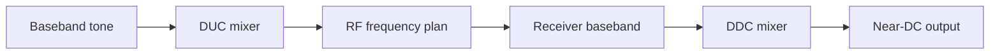

# Lab 7.2 — DUC/DDC Frequency Translation

## Goal

Model digital upconversion and downconversion in a TX/RX chain and verify that the target signal moves to the expected frequency at each stage.

The lab answers the practical question:

> How do TX digital offset, RF LO frequencies and RX DDC shift determine where the signal appears in the final baseband?

## Executable files

| Environment | File | Output |
|---|---|---|
| Python | `blocks/block_07_tx_rx_chains/python/lab_7_2_duc_ddc_frequency_translation.py` | FFT figures + metrics JSON in `docs/assets` |

Run from the repository root:

```bash
python blocks/block_07_tx_rx_chains/python/lab_7_2_duc_ddc_frequency_translation.py
```

Generated artifacts:

```text
docs/assets/lab72_duc_ddc_tx_spectrum.png
docs/assets/lab72_duc_ddc_rx_spectrum.png
docs/assets/lab72_duc_ddc_frequency_plan.png
docs/assets/lab72_duc_ddc_metrics.json
```

## Processing chain



## Frequency equations

TX RF tone:

```text
f_rf = f_tx_lo + f_tx_offset
```

Receiver observed baseband offset:

```text
f_rx_obs = f_rf - f_rx_lo
```

After DDC:

```text
f_out = f_rx_obs + f_ddc_shift
```

Correct DDC choice:

```text
f_ddc_shift = -f_rx_obs
```

## Example

| Parameter | Value |
|---|---:|
| TX LO | 915 MHz |
| TX digital offset | +100 kHz |
| RX LO | 915 MHz |
| RX observed offset | +100 kHz |
| DDC shift | -100 kHz |
| Final output offset | 0 Hz |

## Practical procedure

1. Generate a complex tone at baseband.
2. Apply DUC shift.
3. Interpret the result through the RF frequency plan.
4. Generate a receiver IQ signal at the observed offset.
5. Apply DDC shift.
6. Plot FFT before and after DDC.
7. Estimate output peak frequency.
8. Verify that the output peak is close to DC.

## Expected plots

- TX baseband spectrum;
- after DUC spectrum;
- RX observed spectrum;
- after DDC spectrum;
- frequency error summary.

## Metrics generated by the script

| Metric | Meaning |
|---|---|
| `tx_rf_hz` | RF frequency implied by TX LO and DUC shift |
| `rx_observed_offset_hz` | expected receiver baseband offset |
| `ddc_shift_hz` | digital shift applied in RX DDC |
| `rx_peak_hz` | measured peak before DDC |
| `final_peak_hz` | measured peak after DDC |
| `final_frequency_error_hz` | final peak minus expected final frequency |
| `snr_db` | rough SNR estimate after DDC |

## Common sign mistakes

| Mistake | Symptom | Fix |
|---|---|---|
| DDC sign is wrong | signal moves farther from DC | use negative observed offset |
| TX/RX LO relation ignored | expected peak is wrong | compute `TX_LO + offset - RX_LO` |
| real mixer used instead of complex mixer | image appears | use complex IQ mixing |
| sample rate mismatch | peak appears at wrong FFT bin | check metadata sample rate |
| IQ conjugation | spectrum mirrored | check I/Q ordering and sign convention |

## Report checklist

- [ ] State TX LO and RX LO.
- [ ] State TX digital offset.
- [ ] Compute RX observed offset.
- [ ] Select DDC shift.
- [ ] Plot FFT before DDC.
- [ ] Plot FFT after DDC.
- [ ] Estimate output frequency error.
- [ ] Explain any residual offset.

## Engineering conclusion template

```text
The TX/RX frequency plan predicts an RX observed offset of ____ Hz.
Using DDC shift ____ Hz, the final output peak is ____ Hz.
The residual frequency error is ____ Hz and is mainly caused by ______.
```
