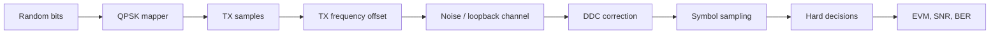

# Lab 7.3 — TX/RX Loopback Metrics

## Goal

Build a compact synthetic QPSK TX/RX loopback experiment and compute the core metrics used later for real RF captures: EVM, SNR and BER.

The lab answers the practical question:

> How do we validate a complete TX/RX chain using constellation plots and numeric metrics before moving to RF hardware?

## Executable files

| Environment | File | Output |
|---|---|---|
| Python | `blocks/block_07_tx_rx_chains/python/lab_7_3_tx_rx_loopback_metrics.py` | spectra, constellation plots and metrics JSON in `docs/assets` |

Run from the repository root:

```bash
python blocks/block_07_tx_rx_chains/python/lab_7_3_tx_rx_loopback_metrics.py
```

Generated artifacts:

```text
docs/assets/lab73_tx_rx_loopback_spectrum.png
docs/assets/lab73_tx_constellation.png
docs/assets/lab73_rx_constellation_after_ddc.png
docs/assets/lab73_tx_rx_loopback_metrics.json
```

## Processing chain



## Model assumptions

This lab is intentionally compact:

- QPSK symbols use a deterministic random seed;
- rectangular pulse shaping is used as an educational placeholder;
- timing is assumed known;
- DDC shift exactly compensates the synthetic TX offset;
- scalar gain/phase alignment is applied before EVM and BER estimation;
- synchronization algorithms are introduced later in Block 8.

## Metrics

| Metric | Meaning |
|---|---|
| EVM | RMS distance between aligned RX symbols and TX reference symbols |
| EVM dB | `20*log10(EVM_rms)` |
| SNR estimate | approximately `-EVM_dB` in this simplified model |
| BER | bit errors divided by compared bits |
| estimated offset before/after DDC | carrier-offset estimate before and after digital downconversion |
| residual frequency error | estimated residual carrier offset after DDC |

## Expected plots

- RX spectrum before and after DDC;
- TX reference constellation;
- RX constellation after DDC and scalar alignment.

## What to expect

With the default configuration (4096 QPSK symbols, 4 samples/symbol, 100 kHz TX offset) a
correct run prints:

```text
Symbols: 4096
Samples per symbol: 4
TX offset: 100000.000 Hz
DDC shift: -100000.000 Hz
Estimated offset before DDC: 99908.589 Hz
Estimated offset after DDC: 91.568 Hz
Residual frequency error: 91.568 Hz
EVM: 8.526 % (-21.39 dB)
SNR estimate: 21.39 dB
BER: 0.000000e+00 (0/8192)
```

Read these together:

- **The DDC removes the offset.** The estimator sees about 99.9 kHz before the
  downconversion and about 92 Hz after it: the residual is under 0.1 % of the original
  offset. The remaining ~92 Hz is the estimator's own bias, not a channel effect.
- **EVM 8.5 % corresponds to SNR ≈ 21.4 dB** through `SNR ≈ −EVM_dB`, which is the
  approximation this simplified model uses. It is an estimate of SNR from the
  constellation, not an independent measurement.
- **BER = 0 over 8192 bits, but EVM is not zero.** This is the normal picture for QPSK
  at ~21 dB: decisions are still correct while the constellation clouds already have a
  visible spread. BER alone would hide the noise level, which is why the metric set
  always includes EVM (compare [Lab 8.7](/zynq-sdr-course/en/labs/lab-8-7-snr-vs-ber-traps/)).

## Why this lab matters

This lab connects several earlier course blocks:

| Earlier block | Used here |
|---|---|
| Block 3 DSP basics | FFT, mixer, spectrum reading |
| Block 4 fixed-point thinking | Q-format and EVM/error interpretation |
| Block 6 RF frontend | frequency offset and capture-style analysis |
| Block 7 TX/RX chain | end-to-end metrics |

## Transition to real RF captures

The same metric pipeline can be reused with real IQ data:

```text
real capture.ci16 + metadata JSON -> DDC -> symbol timing -> alignment -> EVM/SNR/BER
```

The synthetic model avoids the hardest real-world steps at first:

- carrier frequency offset estimation;
- timing recovery;
- frame synchronization;
- IQ imbalance;
- DC offset;
- gain drift;
- phase noise.

These are introduced in Block 8.

## Report checklist

- [ ] State modulation type and symbol count.
- [ ] State sample rate and samples per symbol.
- [ ] State TX offset and DDC shift.
- [ ] Include RX spectrum before/after DDC.
- [ ] Include TX and RX constellation plots.
- [ ] Report EVM, SNR estimate and BER.
- [ ] Explain why the synthetic model is easier than real RF.
- [ ] State which synchronization steps are still missing.

## Engineering conclusion template

```text
The synthetic QPSK loopback used ____ symbols and a TX frequency offset of ____ Hz.
After DDC, the residual frequency error was ____ Hz. The measured EVM was ____ %,
the SNR estimate was ____ dB and BER was ____.
The chain is / is not ready for real RF captures because ______.
```
