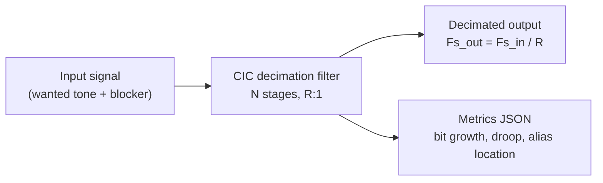

# Lab 7.5 - CIC decimator for SDR receiver chains

## Goal

Model a CIC (Cascaded Integrator-Comb) decimation filter, analyse its
frequency response, estimate accumulator bit growth, and verify the output
signal location and alias rejection using Python.

This lab bridges the fixed-point arithmetic studied in Block 4 with the
hardware receiver chain of Block 7. CIC filters are the standard first-stage
decimator in FPGA SDR designs because they require no multipliers — only
integrators and combs implemented with adders and delay registers.

## Background

A CIC decimator with `N` stages, decimation factor `R`, and differential delay
`M` has the transfer function:

```text
H(z) = [(1 - z^{-RM}) / (1 - z^{-1})]^N
```

Key properties:

- no multipliers required — hardware-efficient;
- bit growth per stage: `log2(R·M)` bits;
- passband droop near the edge of the pass band;
- aliases from higher Nyquist zones may fold into the passband.

## Executable file

| File | Purpose |
|---|---|
| `blocks/block_07_tx_rx_chains/python/lab_7_5_cic_decimator.py` | CIC model, bit growth estimate, spectrum comparison, metrics JSON |

## Run

```bash
python blocks/block_07_tx_rx_chains/python/lab_7_5_cic_decimator.py
```

No arguments are required. Default configuration:

| Parameter | Default |
|---|---|
| Input sample rate | 9.6 MHz |
| Decimation factor R | 8 |
| CIC stages N | 4 |
| Differential delay M | 1 |
| Input bit width | 16 |
| Wanted tone | 220 kHz |
| Blocker tone | 1.85 MHz |

## What the script produces



The script writes:

| Output | Content |
|---|---|
| `docs/assets/lab75_cic_decimator_spectrum.png` | input vs output spectrum overlay |
| `docs/assets/lab75_cic_decimator_response.png` | CIC frequency response (linear and dB) |
| `docs/assets/lab75_cic_decimator_metrics.json` | quantitative metrics |

## Key metrics computed

| Metric | Formula |
|---|---|
| Theoretical bit growth | `N × log2(R·M)` bits |
| Recommended accumulator width | `input_bits + bit_growth` |
| Passband droop at wanted tone | `20 log10(|H(f_wanted)|)` dB |
| Blocker alias frequency | `|f_blocker − n·Fs_out|` |

## Interpreting the output spectrum

After decimation:

- the wanted tone at 220 kHz should remain near 220 kHz in the output
  (now at `220 kHz / (Fs_out/2)` of the new Nyquist limit);
- the blocker at 1.85 MHz folds into the output band as an alias;
  the predicted alias location is listed in the metrics JSON;
- the CIC provides attenuation of the alias, but the remaining level
  depends on the filter frequency response at the blocker frequency.

## Fixed-point considerations

| Risk | Mitigation |
|---|---|
| Integrator overflow | use at least `input_bits + N·log2(R·M)` accumulator bits |
| Comb truncation error | truncate only after all comb stages |
| Output scaling | right-shift by `N·log2(R·M)` before the next stage |

## Connection to hardware

In Block 5 (Lab 5.3), the NCO mixer produces a baseband I/Q stream at a high
sample rate. A CIC decimation stage reduces this rate by `R:1` before the
narrow-band FIR compensation filter, which is the standard `CIC + FIR` DDC
architecture used in the AD9363 internal datapath and in custom PL RX chains.

## Report checklist

- [ ] State CIC parameters (N, R, M, input bit width).
- [ ] Record theoretical bit growth and recommended accumulator width.
- [ ] Attach spectrum plot with wanted tone and alias locations marked.
- [ ] Record passband droop at the wanted tone frequency.
- [ ] State whether the alias level is acceptable for the intended application.

## Engineering conclusion template

```text
The CIC decimator with N = ____, R = ____, M = ____ and ____ input bits
requires ____ accumulator bits. Passband droop at ____ kHz = ____ dB.
The blocker at ____ MHz aliases to ____ kHz in the output band at ____ dB.
The decimated output is / is not suitable for direct downstream processing
because ______.
```
