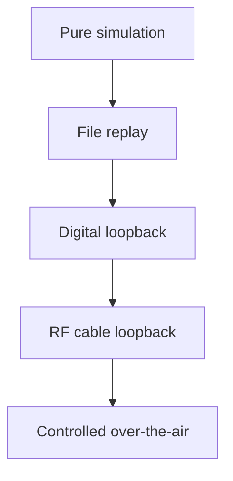

# Block 7 — TX/RX chain workflow

This block combines earlier course results into a complete transmit/receive chain: baseband generation, DUC, RF frontend, channel, DDC, filtering, decimation and metric estimation.

## Main engineering chain

```mermaid
flowchart LR
    SRC[Symbols / tone / waveform] --> TXBB[TX baseband shaping]
    TXBB --> DUC[DUC: interpolation + mixer]
    DUC --> TXRF[AD9363 TX]
    TXRF --> CH[RF path / loopback / channel]
    CH --> RXRF[Receiver / AD9363 RX / RTL-SDR]
    RXRF --> DDC[DDC: mixer + FIR + decimation]
    DDC --> SYNC[Timing / frequency alignment]
    SYNC --> METRICS[FFT, SNR, EVM, BER]
    METRICS --> REPORT[Engineering report]
```



## Why this block exists

Before Block 7, the student studied separate elements:

- FFT, FIR, mixer and decimation;
- fixed-point conversion;
- RTL/testbench;
- RF frequency/gain planning.

Block 7 shows how these elements become a system. The main output is not a single filter or mixer, but a coherent TX/RX chain with explicit frequencies, formats, latencies and validation checks.

## Main design decisions

| Decision | Options | What it affects |
|---|---|---|
| TX waveform | tone, QPSK, test frame | synchronization complexity |
| Pulse shaping | none, RRC, FIR | bandwidth and EVM |
| DUC | mixer only, interpolation + mixer | sample-rate plan |
| RF loop | cable, attenuator, over-the-air | reproducibility and safety |
| RX path | RTL-SDR, AD9363 RX, file replay | availability and accuracy |
| DDC | mixer + FIR + decimator | channel selection |
| Metrics | FFT/SNR, EVM, BER | signal type |

## Signal interface map

Every transition between blocks should have an explicit interface:

| Stage | Data type | Sample rate | Format | Notes |
|---|---|---:|---|---|
| TX source | complex |  | float / Q1.15 | symbols or waveform |
| TX FIR | complex |  | float / Q1.15 | pulse shaping or channel filter |
| DUC output | complex |  | Q1.15 | shifted baseband |
| RF capture | complex |  | ci16 / cu8 / cf32 | receiver-dependent |
| DDC output | complex |  | float / Q1.15 | baseband channel |
| Metrics input | complex / symbols |  | float | aligned signal |

## Frequency plan through the chain

```text
RF frequency = TX_LO + TX_baseband_offset
RX observed offset = RF frequency - RX_LO
DDC output offset = RX observed offset + DDC_shift
```

For a correct chain, the target signal should end near DC after DDC:

```text
DDC_shift ≈ -RX_observed_offset
```

## Loopback levels

Block 7 must reuse the Block 6 safety discipline:

- start with attenuation;
- use manual gain;
- avoid overload;
- record metadata;
- compare loopback and external observation.

## Verification ladder



Do not start from RF if the pure simulation chain does not work.

## Minimal Block 7 report

A complete report should contain:

1. TX/RX block diagram;
2. sample-rate table;
3. frequency-plan table;
4. data-format table;
5. loopback method;
6. FFT before/after DDC;
7. metric table;
8. limitations and next experiment.
