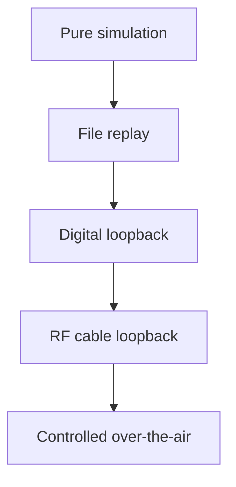

# Блок 7 — TX/RX chain workflow

Этот блок объединяет результаты предыдущих частей курса в цельный тракт передачи и приёма: baseband generation, DUC, RF frontend, канал, DDC, фильтрация, decimation и измерение метрик.

## Главная инженерная цепочка

```mermaid
flowchart LR
    SRC[Symbols / tone / waveform] --> TXBB[TX baseband shaping]
    TXBB --> DUC[DUC: interpolation + mixer]
    DUC --> TXRF[AD9363 TX]
    TXRF --> CH[RF path / loopback / channel]
    CH --> RXRF[Receiver / AD9363 RX / RTL-SDR]
    RXRF --> DDC[DDC: mixer + FIR + decimation]
    DDC --> SYNC[Timing / frequency alignment]
    SYNC --> METRICS[FFT, SNR, EVM, BER]
    METRICS --> REPORT[Engineering report]
```



## Зачем нужен этот блок

До блока 7 студент изучал отдельные элементы:

- FFT, FIR, mixer, decimation;
- fixed-point conversion;
- RTL/testbench;
- RF frequency/gain plan.

Block 7 показывает, как эти элементы становятся системой. Главный результат — не отдельный фильтр или смеситель, а согласованный TX/RX тракт с понятными частотами, форматами, задержками и проверками.

## Основные проектные решения

| Решение | Варианты | Что влияет |
|---|---|---|
| TX waveform | tone, QPSK, test frame | сложность синхронизации |
| Pulse shaping | none, RRC, FIR | bandwidth и EVM |
| DUC | mixer only, interpolation + mixer | sample-rate plan |
| RF loop | cable, attenuator, over-the-air | reproducibility и safety |
| RX path | RTL-SDR, AD9363 RX, file replay | доступность и точность |
| DDC | mixer + FIR + decimator | channel selection |
| Metrics | FFT/SNR, EVM, BER | тип сигнала |

## Signal interface map

Каждый переход между блоками должен иметь явный интерфейс:

| Stage | Data type | Sample rate | Format | Notes |
|---|---|---:|---|---|
| TX source | complex |  | float / Q1.15 | symbols or waveform |
| TX FIR | complex |  | float / Q1.15 | pulse shaping or channel filter |
| DUC output | complex |  | Q1.15 | shifted baseband |
| RF capture | complex |  | ci16 / cu8 / cf32 | receiver-dependent |
| DDC output | complex |  | float / Q1.15 | baseband channel |
| Metrics input | complex / symbols |  | float | aligned signal |

## Frequency plan through the chain

```text
RF frequency = TX_LO + TX_baseband_offset
RX observed offset = RF frequency - RX_LO
DDC output offset = RX observed offset + DDC_shift
```

For a correct chain, the target signal should end near DC after DDC:

```text
DDC_shift ≈ -RX_observed_offset
```

## Loopback levels

Block 7 must reuse the Block 6 safety discipline:

- start with attenuation;
- use manual gain;
- avoid overload;
- record metadata;
- compare loopback and external observation.

## Verification ladder



Do not start from RF if the pure simulation chain does not work.

## Minimal Block 7 report

A complete report should contain:

1. TX/RX block diagram;
2. sample-rate table;
3. frequency plan table;
4. data-format table;
5. loopback method;
6. FFT before/after DDC;
7. metric table;
8. limitations and next experiment.
