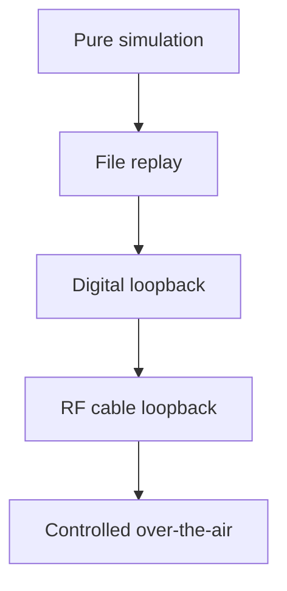

# Блок 7 — порядок работы с трактом TX/RX

Этот блок объединяет результаты предыдущих частей курса в цельный тракт передачи и приёма: baseband generation, DUC, RF frontend, канал, DDC, фильтрация, decimation и измерение метрик.

## Главная инженерная цепочка


```mermaid
flowchart LR
    SRC[Symbols / tone / waveform] --> TXBB[TX baseband shaping]
    TXBB --> DUC[DUC: interpolation + mixer]
    DUC --> TXRF[AD9363 TX]
    TXRF --> CH[RF path / loopback / channel]
    CH --> RXRF[Receiver / AD9363 RX / RTL-SDR]
    RXRF --> DDC[DDC: mixer + FIR + decimation]
    DDC --> SYNC[Timing / frequency alignment]
    SYNC --> METRICS[FFT, SNR, EVM, BER]
    METRICS --> REPORT[Engineering report]
```

## Зачем нужен этот блок

До блока 7 студент изучал отдельные элементы:

- FFT, FIR, mixer, decimation;
- fixed-point conversion;
- RTL/testbench;
- RF frequency/gain plan.

Блок 7 показывает, как эти элементы становятся системой. Главный результат — не отдельный фильтр или смеситель, а согласованный TX/RX тракт с понятными частотами, форматами, задержками и проверками.

## Основные проектные решения

| Решение | Варианты | Что влияет |
|---|---|---|
| TX waveform | tone, QPSK, test frame | сложность синхронизации |
| Pulse shaping | none, RRC, FIR | bandwidth и EVM |
| DUC | mixer only, interpolation + mixer | sample-rate plan |
| RF loop | cable, attenuator, over-the-air | reproducibility и safety |
| RX path | RTL-SDR, AD9363 RX, file replay | доступность и точность |
| DDC | mixer + FIR + decimator | channel selection |
| Metrics | FFT/SNR, EVM, BER | тип сигнала |

## Карта сигнальных интерфейсов

Каждый переход между блоками должен иметь явный интерфейс:

| Этап | Тип данных | Частота дискретизации | Формат | Примечания |
|---|---|---:|---|---|
| Источник TX | комплексный |  | float / Q1.15 | символы или waveform |
| TX FIR | комплексный |  | float / Q1.15 | формирование импульсов или канальный фильтр |
| Выход DUC | комплексный |  | Q1.15 | смещённый baseband |
| Запись RF | комплексный |  | ci16 / cu8 / cf32 | зависит от приёмника |
| Выход DDC | комплексный |  | float / Q1.15 | baseband канала |
| Вход метрик | комплексный / символы |  | float | выровненный сигнал |

## Частотный план по тракту

```text
RF frequency = TX_LO + TX_baseband_offset
RX observed offset = RF frequency - RX_LO
DDC output offset = RX observed offset + DDC_shift
```

В правильно настроенном тракте целевой сигнал после DDC оказывается около DC:

```text
DDC_shift ≈ -RX_observed_offset
```

## Уровни в loopback

Блок 7 повторяет дисциплину безопасности блока 6:

- начинать с аттенюации;
- использовать ручное усиление;
- избегать перегрузки;
- записывать метаданные;
- сравнивать loopback с внешним наблюдением.

## Лестница верификации


```mermaid
flowchart TB
    SIM[Pure simulation] --> FILE[File replay]
    FILE --> LOOP[Digital loopback]
    LOOP --> RFLOOP[RF cable loopback]
    RFLOOP --> OTA[Controlled over-the-air]
```

Не переходите к RF, пока не работает чисто симуляционная цепочка.

## Минимальный отчёт по блоку 7

Полный отчёт должен содержать:

1. структурную схему TX/RX;
2. таблицу частот дискретизации;
3. таблицу частотного плана;
4. таблицу форматов данных;
5. способ организации loopback;
6. FFT до и после DDC;
7. таблицу метрик;
8. ограничения и следующий эксперимент.
