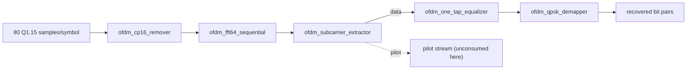

# Lab 8.14 - OFDM RTL: mapper to equalized loopback

## Goal

Take the [Lab 8.5](/zynq-sdr-course/en/labs/lab-8-5-ofdm-mini-link/) OFDM mini-link from a floating-point Python model to a synthesizable, self-checked fixed-point datapath: QPSK mapper, subcarrier allocator/extractor, a streaming radix-2 64-point IFFT/FFT, cyclic-prefix insertion/removal and a one-tap equalizer, each with its own Icarus Verilog testbench, composed into a full TX-to-RX digital loopback and a channel-equalized loopback.

This lab is the software/RTL half of issue #48. Read the [evidence boundary](#what-this-lab-does-and-does-not-prove) before treating any result here as a hardware measurement — it is not one.

## Why a second, RTL-level model of the same chain

[Lab 8.5](/zynq-sdr-course/en/labs/lab-8-5-ofdm-mini-link/) already proves the OFDM algorithm works in floating point. That is not the same claim as "this runs on the FPGA fabric." Every stage here exists twice, on purpose:

- once as a bit-exact Q1.15 fixed-point Python model (`tools/ofdm_ifft_fixed.py`, `tools/ofdm_fft_fixed.py`, `tools/ofdm_equalizer_fixed.py`) that tracks every rounding and saturation decision explicitly;
- once as synthesizable Verilog that is checked against the *same* committed vectors as that fixed-point model, not just against its own testbench's expectations.

That second copy is what makes "the RTL is correct" a falsifiable claim instead of an assumption. The `verification/vectors/block08_ofdm_*.mem` files are the shared ground truth: `tests/test_ofdm_ifft_fixed.py`, `tests/test_ofdm_fft_fixed.py` and `tests/test_ofdm_tx_fixed.py` check the Python model against them, and `tb_ofdm_ifft64_sequential.sv`/`tb_ofdm_fft64_sequential.sv` check the RTL against the same files — so a mismatch between Python and RTL cannot hide.

## TX chain


| Block | Role | Fixed-point / timing contract |
|---|---|---|
| `ofdm_qpsk_mapper.v` | 2 bits -> one Q1.15 QPSK symbol, matching Lab 8.5's `qpsk_from_bits` sign convention | magnitude `round(32767/sqrt(2)) = 23170`; 1-cycle latency |
| `ofdm_subcarrier_allocator.v` | Places 48 data symbols into a natural-order 64-bin IFFT frame and inserts the four pilot values (`pilot_ref = [+1,+1,+1,-1]`) at `k = -21,-7,+7,+21`, exactly like Lab 8.5's frequency-domain layout | collects 48 symbols, then emits bins 0..63; no new frame accepted mid-emission |
| `ofdm_ifft64_sequential.v` | Streaming radix-2 DIT IFFT, one `ofdm_ifft_butterfly` instance reused for all 6 stages x 32 butterflies | each butterfly divides by 2 -> normalized `1/64` scale; `total_saturation_count` accumulates clipped final components across all 192 butterflies |
| `ofdm_cp16_inserter.v` | Prepends samples `[48..63]` as the cyclic prefix | emits 80 samples/symbol (`out_is_cp` high for indices 0..15); `frame_error` if the input symbol was short |

`ofdm_tx_mapper_ifft_path.v` composes mapper -> allocator -> IFFT; `ofdm_tx_cp16_path.v` adds the CP stage and is the complete TX baseline used by the loopback tests below.

## RX chain



| Block | Role | Fixed-point / timing contract |
|---|---|---|
| `ofdm_cp16_remover.v` | Drops the 16-sample prefix, forwards samples 16..79 unchanged | fully backpressured on the 64 useful samples |
| `ofdm_fft64_sequential.v` | Scaled forward FFT, built by reusing the IFFT core via `FFT(x)/N = conj(IFFT(conj(x)))` | rare Q1.15 endpoint clips from conjugating `-32768` are counted, not hidden |
| `ofdm_subcarrier_extractor.v` | Splits the 64 bins into 48 data, 4 pilot and 12 null/guard carriers -- the exact inverse of the allocator's layout | data and pilot are independently backpressured sinks; a stalled pilot sink cannot stall data (or vice versa) |
| `ofdm_one_tap_equalizer.v` | Multiplies each data symbol by an externally supplied Q2.14 correction coefficient | Q1.15 x Q2.14 -> Q3.29, rounded to Q15 (nearest, half-LSB away from zero), then saturated; `saturation_count` is cumulative from reset |
| `ofdm_qpsk_demapper.v` | Hard-decision inverse of the mapper | transparent ready/valid, zero maps to bit `0` exactly like the Python reference |

## Fixed-point contract, in one place

Every sample in this chain is signed Q1.15 (`±1` represented as `±32767`/`-32768`, the usual asymmetric two's-complement endpoint). The one deliberate exception is the equalizer's correction coefficient, Q2.14, so a correction gain up to almost 2.0 can be represented without silently rescaling the signal path. Every arithmetic stage that can lose precision or range -- IFFT/FFT butterflies, the equalizer's complex multiply -- rounds explicitly (nearest, half-LSB away from zero) and saturates explicitly, and every saturation is *counted*, not just clamped: `total_saturation_count` on the TX/IFFT side, `total_saturation_count` + `conjugation_saturation_count` on the FFT side, `saturation_count` on the equalizer. That satisfies issue #48's "explicit scaling, saturation and overflow counters" requirement directly, and it is what makes the acceptance criterion below checkable rather than assumed:

> "No undocumented saturation at the selected back-off."

Every loopback test below asserts every one of these counters is exactly zero, and would fail loudly if any stage clipped silently.

## Streaming contract

Every block uses one clock, synchronous active-low reset, and a single-register ready/valid handshake: a producer must hold `valid` and its data stable until `ready` is also high, and a consumer's `ready` can depend combinationally on its own occupancy but not create a combinational loop back through `valid`. This is deliberately the same discipline the QPSK modem chain elsewhere in this course already uses. It is **not**, yet, packaged as AXI4-Stream: signal names are `valid`/`ready`/`re`/`im`/`index`/`last` rather than `tvalid`/`tready`/`tdata`/`tlast`, and there is no AXI4-Lite control/status register block exposing the saturation counters or a soft reset to a PS. `ofdm_tx_mapper_ifft_path.v`'s own header comment says as much: CP and "AXI-Stream" are named together as the next step, and CP has been added since; AXI packaging has not. Treat this as an open, scoped, and honestly reported item rather than a silent gap.

## Pilots: what exists and what does not yet

The allocator/extractor pair already does real pilot **insertion and extraction**: the allocator writes the four fixed pilot values into their bins on TX, and the extractor produces a *separate* pilot stream on RX (`pilot_re`/`pilot_im`/`pilot_slot`/`pilot_ref_re`) alongside the data stream, exactly mirroring Lab 8.5's `pilot_k`/`pilot_ref`. What does not exist yet in RTL is a block that *consumes* that pilot stream to estimate and correct residual phase drift the way Lab 8.5's Python receiver does (`pilot_phase = angle(vdot(pilot_ref, y_eq[pilots]))`, applied per OFDM symbol). The loopback tests below prove the equalizer's arithmetic against a **flat** channel (one shared correction coefficient for every subcarrier); they do not yet exercise a frequency-selective channel or automatic per-subcarrier channel estimation in hardware. Closing that gap -- a pilot-phase-tracking block plus a per-subcarrier coefficient feed for the equalizer -- is real, well-scoped future work, not something this lab claims to have finished.

## Verification stage 1: float model vs. fixed-point model vs. RTL

```bash
python -m pytest tests/test_ofdm_ifft_fixed.py tests/test_ofdm_fft_fixed.py \
  tests/test_ofdm_equalizer_fixed.py tests/test_ofdm_tx_fixed.py -q
```

These tests check the Q1.15 Python model's arithmetic (including saturation counts) against the committed `verification/vectors/block08_ofdm_*.mem` files. The RTL testbenches below check the *same* files, so a pass on both sides is a bit-exact three-way match: float intent -> fixed-point reference -> synthesizable RTL.

## Verification stage 2: self-checking RTL digital loopback

Every block has its own testbench; run the two end-to-end ones directly with Icarus Verilog:

```bash
RTL=blocks/block_08_modulation_and_synchronization/rtl
TB=blocks/block_08_modulation_and_synchronization/tb

iverilog -g2012 -o /tmp/tb_ofdm_loop.vvp \
  $RTL/ofdm_qpsk_mapper.v $RTL/ofdm_subcarrier_allocator.v \
  $RTL/ofdm_ifft_butterfly.v $RTL/ofdm_ifft64_sequential.v \
  $RTL/ofdm_tx_mapper_ifft_path.v $RTL/ofdm_cp16_inserter.v \
  $RTL/ofdm_tx_cp16_path.v $RTL/ofdm_cp16_remover.v \
  $RTL/ofdm_fft64_sequential.v $RTL/ofdm_subcarrier_extractor.v \
  $RTL/ofdm_qpsk_demapper.v \
  $TB/tb_ofdm_tx_rx_digital_loopback.sv
vvp /tmp/tb_ofdm_loop.vvp
```

Or run the whole Block 8 OFDM suite the same way CI does:

```bash
bash -c '
RTL=blocks/block_08_modulation_and_synchronization/rtl
TB=blocks/block_08_modulation_and_synchronization/tb
for pair in \
  "tb_ofdm_qpsk_mapper:$RTL/ofdm_qpsk_mapper.v" \
  "tb_ofdm_subcarrier_allocator:$RTL/ofdm_subcarrier_allocator.v" \
  "tb_ofdm_ifft_butterfly:$RTL/ofdm_ifft_butterfly.v" \
  "tb_ofdm_cp16_inserter:$RTL/ofdm_cp16_inserter.v" \
  "tb_ofdm_cp16_remover:$RTL/ofdm_cp16_remover.v" \
  "tb_ofdm_subcarrier_extractor:$RTL/ofdm_subcarrier_extractor.v" \
  "tb_ofdm_one_tap_equalizer:$RTL/ofdm_one_tap_equalizer.v" \
  "tb_ofdm_qpsk_demapper:$RTL/ofdm_qpsk_demapper.v"; do
  name="${pair%%:*}"; src="${pair#*:}"
  iverilog -g2012 -o "/tmp/$name.vvp" $src "$TB/$name.sv" && vvp "/tmp/$name.vvp"
done'
```

Measured results (reproduced by the commands above, on this repository's current RTL):

```text
PASS: OFDM TX->RX digital loopback recovered 96/96 bits with zero errors
PASS: OFDM +90deg channel -> -90deg equalizer recovered 96/96 bits, BER=0
```

The second result is not a trivial passthrough: the testbench applies a genuine +90-degree complex rotation to every transmitted sample in the time domain (`channel_re = -im, channel_im = re`), and the equalizer is given the exact inverse coefficient (`W = -j` in Q2.14) to undo it. Every saturation counter (`tx_saturation_count`, `fft_saturation_count`, `eq_saturation_count`) is asserted to be exactly zero in the same test, so "BER=0" is not concealing an overflow that happened to cancel out numerically.

## What this lab does and does not prove

This closes, in simulation only, issue #48's Initial RTL scope (mapper, subcarrier allocator/extractor, streaming 64-point IFFT/FFT, CP insertion/removal, one-tap equalizer, explicit scaling/saturation/overflow counters) and Verification stages 1-2 (float vs. fixed-point, self-checking digital loopback) with real, reproducible, measured evidence: 96/96 bits at BER=0 for both the plain digital loopback and a loopback through a genuine complex channel rotation with the equalizer actually correcting it.

It does **not** claim:

- AXI4-Stream/AXI4-Lite packaging (signal-compatible ready/valid exists; the AXI naming, an AXI4-Lite control/status block and Vivado integration do not);
- automatic, pilot-driven channel estimation or phase tracking in RTL (the pilot stream exists; nothing yet consumes it the way Lab 8.5's Python receiver does);
- Verification stages 3-5 (PL/fabric loopback on Zynq, safe attenuated AD9361/AD9363 cabled loopback, an independent SDR capture) -- these need the physical board and RF path, neither of which was available while writing this lab;
- resource, latency or timing reports from real synthesis -- those need Vivado, which was likewise not available here. The per-block header comments do state cycle-level latency and clock counts explicitly (for example the IFFT's `384 compute clocks after input collection`), which is real design information, but it is not a substitute for a post-implementation report.

## Report checklist

- [x] Float vs. fixed-point bit-exact match (shared committed vectors).
- [x] Self-checking RTL digital loopback, BER=0, reproducible.
- [x] Self-checking RTL equalized loopback through a real complex channel, BER=0, reproducible.
- [x] Every saturation/overflow counter asserted zero at the tested back-off.
- [ ] AXI4-Stream/AXI4-Lite packaging.
- [ ] Pilot-driven channel estimation/phase tracking in RTL.
- [ ] PL/fabric loopback on Zynq.
- [ ] Safe attenuated AD9361/AD9363 cabled loopback with attenuation/gain metadata.
- [ ] Resource, latency and timing report from real synthesis.
